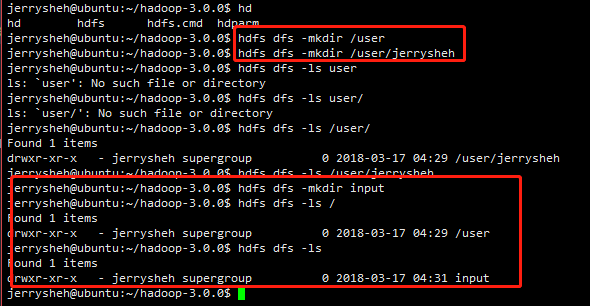
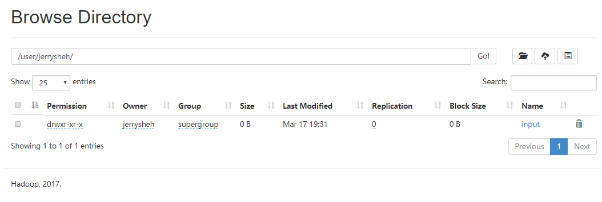

# 一、 Connection refused

根据官方文档 Hadoop 3.0 配置，在

```
sbin/start-dfs.sh
```
的时候报错，
```
pdsh@ubuntu: localhost: connect: Connection refused
```

原因是pdsh默认采用的是rsh登录，修改成ssh登录即可，在环境变量/etc/profile里加入：

```
export PDSH_RCMD_TYPE=ssh
```

然后`source /etc/profile` 之后重新sbin/start-dfs.sh

<!-- more -->

---

# 二、jps 没有 namenode 或者 datanode

每次开机都得重新格式化一下namenode才可以看到namenode

格式化了namenode，datanode又没有了

其实问题就出在tmp文件，默认的tmp文件每次重新开机会被清空，与此同时namenode的格式化信息就会丢失

于是我们得重新配置一个tmp文件目录


首先在home目录下建立一个hadoop_tmp目录
```
sudo mkdir ~/hadoop_tmp
```

然后修改hadoop-3.0.0/etc/hadoop目录里面的core-site.xml文件，加入以下节点：
```
<property>
    <name>hadoop.tmp.dir</name>
  <value>/home/jerrysheh/hadoop_tmp</value>
    <description>A base for other temporary directories.</description>
</property>
```

注意：我的用户是jerrysheh，所以目录是/home/jerrysheh/hadoop_tmp        

OK了，重新格式化Namenode
```
hadoop namenode -format
```

然后启动
```
hadoopstart-all.sh
```

然后输入 jps， namenode 和 datanode 应该都出来了

---

# 三、关于 HDFS 文件夹位置

根据 [官方文档](https://hadoop.apache.org/docs/r3.0.0/hadoop-project-dist/hadoop-common/SingleCluster.html)

第一次运行，启动 `start-dfs.sh` 之后，要先创建用户

```
bin/hdfs dfs -mkdir /user
bin/hdfs dfs -mkdir /user/<username>
```

然后创建一个 `input` 文件夹，用来放数据

```
bin/hdfs dfs -mkdir input
```



发现了吗？ -mkdir /user 和 -mkdir /user/\<username> 是在根目录下创建 user 文件夹，然后在 user 文件夹里创建 username 文件夹， 这没有问题。

但是创建 input 文件夹的时候， 前面没有 /

意味着，是在默认的 username 文件夹里面创建了这个 input ！

也就是， input 的实际位置在 /user/\<username>/input

打开 web UI ( 127.0.0.1:8088 )看一下



果然如此

另，
```
hdfs dfs -ls .   /*表示当前用户目录*/
hdfs dfs -ls /   /*表示根目录*/
```

* 使用 `hdfs dfs -ls .` 的时候， HDFS 上的 username 必须和你本地linux系统的 username 一致！否则会显示没有该目录或文件。

---

# 四、Windows 环境下 JAVA_HOME 路径不对

配置好环境以后，执行格式化

```
hdfs namenode -format
```

然后报错

```
Error: JAVA_HOME is incorrectly set.
       Please update F:\hadoop\conf\hadoop-env.cmd
```

原因是蛋疼的微软， Program Files文件夹有一个空格，导致不能被 Hadoop 识别。

解决办法：

* 方法1：用路径替代符
  ```
  C:\PROGRA~1\Java\jdk1.8.0_91
  ```

  `PROGRA~1`  ===== `C:\Program Files` 目录的dos文件名模式下的缩写
  长于8个字符的文件名和文件夹名，都被简化成前面6个有效字符，后面~1，有重名的就 ~2,~3,

* 方法2：用引号括起来
  ```
  "C:\Program Files"\Java\jdk1.8.0_91
  ```

---

# 五、IDEA 报 java.lang.ClassNotFoundException 问题

在 IDEA 本地环境运行 hadoop 程序时， IDEA报错
```
java.lang.ClassNotFoundException: org.apache.hadoop.conf.Configuration
```

原因：

在 maven 中， 把依赖项的 `provided` 标签删掉即可 。因为加上`provided`标签意味着 the scope tag tells Maven that you're using this dependency for building, but it indicates that the dependency will be provided during runtime, so you'll either need to remove this tag or ... (具体可到 [StackOverFlow](https://stackoverflow.com/questions/29092926/java-lang-classnotfoundexception-org-apache-hadoop-conf-configuration) 看)

感谢 StackOverFlow 解决困扰了我一天一夜的问题

```xml
<dependency>
    <groupId>org.apache.hadoop</groupId>
    <artifactId>hadoop-common</artifactId>
    <version>3.0.0</version>
     <!--<scope>provided</scope>-->
</dependency>
```

---


# 六、IDEA Hadoop程序 单机运行 和 在本地伪分布式 运行

## 单机运行

新建 Java Maven 工程，`pom.xml`添加依赖

```xml
<dependencies>
        <dependency>
            <groupId>org.apache.hadoop</groupId>
            <artifactId>hadoop-common</artifactId>
            <version>3.0.0</version>
             <!--<scope>provided</scope>-->
        </dependency>
        <dependency>
            <groupId>org.apache.hadoop</groupId>
            <artifactId>hadoop-client</artifactId>
            <version>3.0.0</version>
            <scope>provided</scope>
        </dependency>
        <dependency>
            <groupId>org.apache.hadoop</groupId>
            <artifactId>hadoop-mapreduce-client-core</artifactId>
            <version>3.0.0</version>
        </dependency>
        <dependency>
            <groupId>org.apache.hadoop</groupId>
            <artifactId>hadoop-mapreduce-client-common</artifactId>
            <version>3.0.0</version>
        </dependency>
        <dependency>
            <groupId>org.apache.hadoop</groupId>
            <artifactId>hadoop-hdfs</artifactId>
            <version>3.0.0</version>
        </dependency>
    </dependencies>
```

> 依赖去哪里找？ 有一个 mavenrepository 仓库，地址是：[mavenrepository](https://mvnrepository.com/)

> 然后在上面搜索 hadoop ，一些常见的依赖在上面，点击，选择版本，然后复制它的maven代码， 在`pom.xml`粘贴。 当然这里有坑！ 看上面第五！！


然后右下角 import， maven 会自动帮我们下载依赖包

点 Run -> Edit configuration， Program argument填入
```
input/ output/
```

Main class 填你的main程序所在的 class ，可以输入前几个字母然后 IDEA 会自动帮我们检索

然后在项目目录下，新建一个文件夹 input ， 往里面放你输入的数据（比如 mydata.log），可以放多个文件

然后运行即可

## 本地伪分布式运行

本地Hadoop环境先配起来，具体看这篇

http://blog.csdn.net/songhaifengshuaige/article/details/79575308

环境变量

HADOOP_HOME， 设置为 `C:\hadoop-3.0.0` （根据你的目录）
Path， 添加`%HADOOP_HOME%\bin` 和 `%HADOOP_HOME%\sbin`

然后先启动 `start-dfs.cmd` 和 `start-yarn.cmd`

输入`jps`命令，看看 datanode 和 namenode 启动没，确保集群环境启动了

然后把 `C:\hadoop-3.0.0\etc\hadoop\` 里面的配置文件 （几个dfs、core、mapred、yarn相关的 xml 文件），放到 项目 src/main/resource 里面

然后运行。DONE！


---

# 七、Spark standalone 模式集群配置

记得关防火墙

```
service iptables status
service iptables stop
```

有一个WARN，提示你本地ip是127.0.0.1，应该该到 172.x.x.x 或 192.x.x.x ，否则局域网机器访问不到。

```
cp ./conf/spark-env.sh.template ./conf/spark-env.sh
vim ./conf/spark-env.sh
```

添加

```
SPARK_LOCAL_IP=172.x.x.x
SPARK_MASTER_HOST=172.x.x.x
SPARK_EXECUTOR__MEMORY=16G
```
