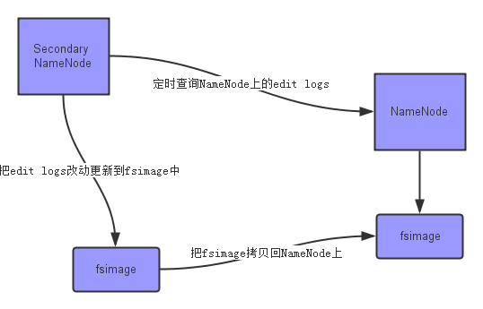
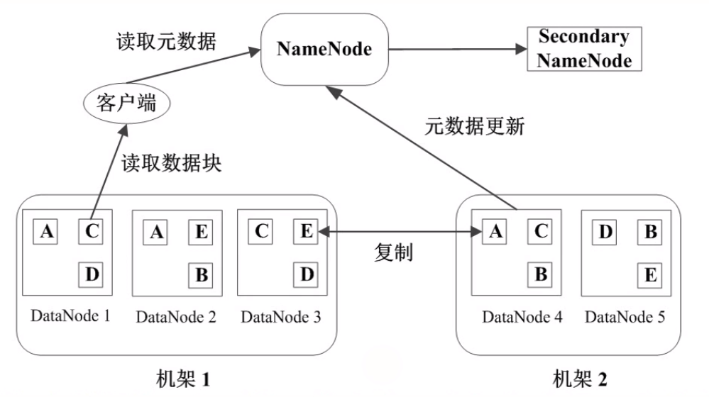
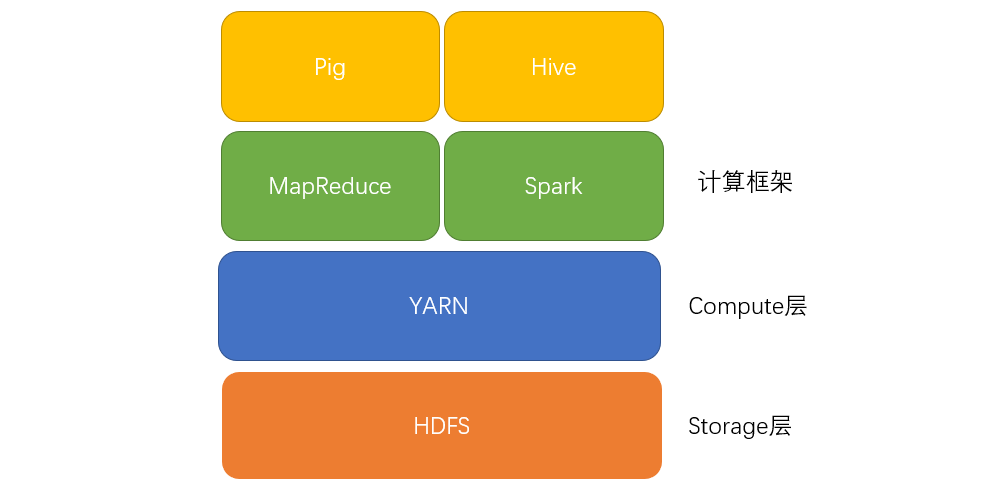

# 前言

当数据量变大的时候，一台机器完成一个问题要计算好久好久。这时候就需要多台机器并行运算。然而，每台机器不能用单台机器运行的算法，自己算自己的。而是要有不同的分工，联合起来共同算完这个问题。

Hadoop就是这样的一个大数据处理框架。其中包括很多开源的处理框架，比如：

* **文件存储**：Hadoop HDFS、Tachyon、KFS
* **离线计算**：Hadoop MapReduce、Spark
* **流式、实时计算**：Storm、Spark Streaming、S4、Heron
* **K-V、NOSQL数据库**：HBase、Redis、MongoDB
* **资源管理**：YARN、Mesos
* **日志收集**：Flume、Scribe、Logstash、Kibana
* **消息系统**：Kafka、StormMQ、ZeroMQ、RabbitMQ
* **查询分析**：Hive、Impala、Pig、Presto、Phoenix、SparkSQL、Drill、Flink、Kylin、Druid
* **分布式协调服务**：Zookeeper
* **集群管理与监控**：Ambari、Ganglia、Nagios、Cloudera Manager
* **数据挖掘、机器学习**：Mahout、Spark MLLib
* **数据同步**：Sqoop
* **任务调度**：Oozie

那这么多，要怎么学呢？吴军博士在《数学之美》中提到：

> 分治算法是计算机科学中最漂亮的工具之一，我称为“各个击破”法。

我们就来各个击破。当然，先挑重点的学习。

<!-- more -->

---

# MapReduce

假设我们要统计一本10000页的书里面，"apple"、"banana"、"orange"这三个单词出现的次数。由于规模很大，用一台机器来算，要算很久。我们能不能把规模缩小，交给多台机器去算呢？我们容易想到，可以拿4台服务器，假设为1，2，3，4，每台服务器计算2500页，各自算各自的。

好了，现在每台服务器把各自负责的2500页统计完了。但我们关心的是 10000 页这个总量里面单词出现的次数，而不是4个独立的2500页。这 4 个 2500 页的结果分别保存在1，2，3，4四台服务器上。我们现在要想办法合并结果。

于是我们找来另外三台服务器，假设为A，B，C：

- 让 A 计算在机器1，2，3，4上面 "apple" 单词出现的总次数。
- 让 B 计算在机器1，2，3，4上面 "banana" 单词出现的总次数。
- 让 C 计算在机器1，2，3，4上面 "orange" 单词出现的总次数。

这样，我们就知道每个单词出现的总次数了。

<!-- more -->

以上就是 Hadoop 简单的基本原理。我们称为 MapReduce模型。这个模型分为三个阶段：

- **Map阶段**：每台机器先处理本机上的数据。（对于机器1来说，就是计算前2500页"apple"出现的次数）
- **Shuffle阶段**：各个机器处理完自己的数据后，用另一批机器（或者还是这些机器）去收集某个数据的总和。（对于机器 A 来说，就是把 4 个 2500页 的"apple" 汇总。）
- **Reduce阶段**：把多个数据的总和规约、合并，出最终结果。（把汇总的“apple”、"banana"、"orange" 归并）

## MapReduce编程模型

首先，程序会先读取文件，交给 InputFormat 预处理。InputFormat主要做两件事：

1. **getSplits**：返回 InputSplit 数组，即对数据进行 split 分片，每片交给map操作一次
2. **getRecordReader**：返回 RecordReader 对象，对每个 split 分片进行转换为 key-value 键值对格式传递给map

实际上常用的是 TextInputFormat，就是将文件的内容按行分割（split），形成 K-V 对。key是偏移量，value是该行的值。使用的是hadoop内置的数据类型，比如longwritable、text等。

例如，原始文件为
```
hello hadoop
and hello spark
spark
```

TextInputFormat预处理后的结果为

```
<0，hello hadoop>
<13, hello spark>
<29, spark>
```

之后，将这个 K-V 对集合输入 mapper，进行业务处理过程，将其转换成需要的key-value再输出。

mapper后的结果为

```
<hello, 1>
<hadoop, 1>
<hello, 1>
<spark, 1>
<spark, 1>
```

之后，进行 shuffle(洗牌)操作，这个过程把 key 相同的value合并成list，作为reduce输入。

shuffle后的结果为

```
<hello, <1,1>>
<hadoop, 1>
<spark, <1,1>>
```

reduce的结果为

```
<hello, 2>
<hadoop, 1>
<spark, 2>
```

---

# Hadoop Distribute Filesystem (HDFS)

当数据集大小超过一台计算机的存储能力时，就有必要对它进行分区（partition）并存储到多台计算机上。管理网络中跨多台计算机存储的文件系统称为 **分布式文件系统（distribute filesystem）**。

Hadoop 自带一个分布式文件系统，称为 HDFS。

## HDFS 的设计

包括可存储超大文件、流式数据访问、用于商用硬件（指的是普通硬件而不是精密昂贵的硬件）、低时间延迟的数据访问、大量的小文件、单用户写入和只添加等设计特点。

### 数据块

HDFS上的文件被划分为多个分块（chunk），作为独立的存储单元。


### NameNode

HDFS 之所以可以存很大的文件，是因为每个文件都会被分成一些 data block，存在不同机器上。但是当我们操作 HDFS 时，并不需要关心数据是如何分布式存储在各个结点上的，HDFS 展现给我们的只是类似于普通 Linux 那样的文件系统。那么，数据怎么存，存在哪里，这些信息是谁管理的呢？这就需要 NameNode 了。

NameNode 主要是用来保存 HDFS 的元数据信息，比如命名空间信息，块信息等。当它运行的时候，这些信息存在内存中（也可以持久化到磁盘上）。**namenode 负责记录一个文件有哪些 data block，以及这些 data block 分别存放在哪些机器上**。

### SecondaryNameNode

在 HDFS 中，有这么两个文件

1. **fsimage**：它是在 NameNode 启动时对整个文件系统的快照
2. **edit logs**：它是在 NameNode 启动后，对文件系统的改动序列

只有在 NameNode 重启时，edit logs才会被合并到 fsimage 中，从而得到一个文件系统的最新快照。但是，在产品集群中，NameNode 是很少重启的，因此 edit logs 可能会变得非常大，导致下一次 NameNode 启动时要合并很多文件，启动时间非常久。

我们要做的事情是：如何在不重启 NameNode 的前提下，及时更新系统快照，减少edit logs文件的大小，得到一个最新的fsimage文件 ? SecondaryNameNode 就是负责做这件事的。其主要任务是 **合并 NameNode 的edit logs（修改过的日志）到 fsimage（系统快照） 文件中**。

 

### datanode

datanode是工作节点，**用于存储并检索数据块（data block）**。定期向 namenode 发心跳包。



### 当我们读取一个文件时发生了什么

1. HDFS client 联系 Name nodes，获取文件的 data blocks 组成、以及每个 data block 所在的机器以及具体存放位置；
2. HDFS client 联系 Data nodes, 进行具体的读写操作；

### 数据备份

分布式文件系统中，文件存储在多台机器上。如果其中某一台故障了，系统要确保依然能够正常运行。HDFS 是如何保证在机器故障情况下文件数据依然不丢失的呢？说白了，就是做数据备份，也就是多存几份。我们可以手动配置备份数量，HDFS默认是 3 份。

一般存储 HDFS 文件的机器都是在机架（Rack）上的，很多数据中心里的故障都是一整个 Rack 出问题。因此通常在同一个 Rack 上储存一份，然后在另一个 Rack 上储存另两份。这样就保证数据有更高的安全性。

HDFS client 写文件创建新的 block 时，NameNode 会为这个 block 创建一个唯一 ID， 并决定由哪些 dataNode 来存放。被选中的 dataNode 组成一个队列，client 只向队列第一个 dataNode 写，第一个 dataNode 存储完毕后，继续向队列第二个 dataNode 传递。

## HDFS 的基本操作

必须先启用 HDFS 之后才能进行操作。

```
./sbin/start-hdfs.sh
```

将本地文件上传到 hdfs 上（原路径只能是一个文件）
```
hdfs dfs -copyFromLocal /local/data /hdfs/data
```

和 copyFromLocal 区别是，put 原路径可以是文件夹等
```
hdfs dfs -put /tmp/ /hdfs/
```

查看根目录文件
```
hadoop fs -ls /
```

查看/tmp/data目录
```
hadoop fs -ls /tmp/data
```

查看 a.txt，与 -text 一样
```
hadoop fs -cat /tmp/a.txt
```

创建目录dir
```
hadoop fs -mkdir dir
```

删除目录dir
```
hadoop fs -rm -r dir
```

> 在 HDFS 中，就不要 cd 了， 用 ls + 目录

### Hadoop fs 和 hdfs dfs的区别

Hadoop fs：使用面最广，可以操作任何文件系统。

hadoop dfs与hdfs dfs：只能操作HDFS文件系统相关（包括与Local FS间的操作），前者已经Deprecated，一般使用后者。

---

# Yet Another Resource Negotiator (YARN)

YARN 是 Hadoop 的集群资源管理系统。 YARN 提供请求和使用集群资源的API。但很少用于用户代码，因为在 YARN 之上的如MapReduce、Spark等分布式计算框架向用户隐藏了资源管理的细节。

一般来说，HDFS在Storage底层、YARN在Compute中间层，往上的Application上层才是MapReduce、Spark等计算框架。（甚至Application之上还能再封装一层，如Pig、Hive等）



Hadoop有两类长期运行的守护进程：

* **资源管理器**：管理集群上资源的使用
* **节点管理器**：运行在集群中所有节点上切能够启动和监控容器的东西

 YARN 则是管理这两个守护进程的。

---

# Hive

hive是基于Hadoop的一个数据仓库工具，可以将结构化的数据文件映射为一张数据库表，并提供简单的sql查询功能，可以将sql语句转换为MapReduce任务进行运行。

 ---

# 小结

HDFS是Hadoop提供的分布式存储框架，它可以用来存储海量数据，MapReduce是Hadoop提供的分布式计算框架，它可以用来统计和分析HDFS上的海量数据，而Hive则是SQL On Hadoop，Hive提供了SQL接口，开发人员只需要编写简单易上手的SQL语句，Hive负责把SQL翻译成MapReduce，提交运行。
