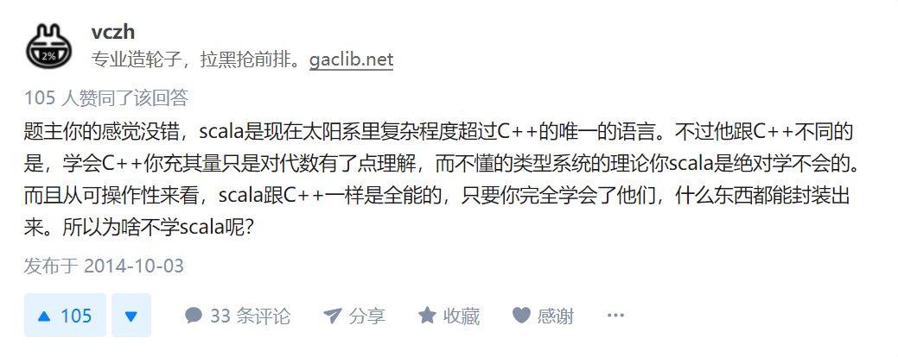

Scala是一门现代的多范式编程语言，平滑地集成了 **面向对象** 和 **函数式语言** 的特性，旨在以简练、优雅的方式来表达常用编程模式。

Scala运行于JVM上，并兼容现有的Java程序，Scala代码可以调用Java方法，访问Java字段，继承Java类和实现Java接口。

在面向对象方面，Scala是一门非常纯粹的面向对象编程语言，也就是说，在Scala中，**每个值都是对象，每个操作都是方法调用。** 在函数式方面，函数是一等公民，可以像操作其他数据类型那样操作函数。



<!-- more -->

---

# Scala与Java的区别

* 在Scala中声明 private 变量,Scala编译器会自动生成get,set方法
* 在Scala中变量需要初始化
* 在Scala中没有静态修饰符,在object下的成员全部都是静态的,如果在类中声明了与该类相同的名字的object则该object是该类的"伴生对象"
* 可以理解为Scala把类中的static集中放到了object对象中,伴生对象和类文件必须是同一个源文件,可以用伴生对象做一些初始化操作.
* 在Java中可以通过interface实现多继承,在Scala中可以通过`特征(trait)`实现多重继承,但是与Java不同的是,它可以定义自己的属性和实现方法体
* object不能提供构造器参数,也就是说object必须是无参的

---

# Scala中object与class的区别

* 在Scala中,类名可以和对象名为同一个名字,该对象称为该类的伴生对象,类和伴生对象可以相互访问他们的私有属性,但是它们必须在同一个源文件中
* **class只会被编译,不能直接执行，而object可以运行**,类的声明和主构造器在一起被声明,在一个类中,主构造器只有一个.
* 类和它的伴生对象可以相互访问其私有成员
* class和object的一个差别是,单例对象不带参数,而类可以.因为你不能用new关键字实例化一个单例对象,你没有机会传递给它参数
* 每个单例对象都被作为由一个静态变量指向的虚构类.
* 特别要指出的是,单例对象会在第一次被访问的时候初始化
* 不与伴生类共享名称的单例对象被称为孤立对象:standalone object

---

# 基本语法

## 基本数据类型

Scala的数据类型包括：Byte、Char、Short、Int、Long、Float、Double和Boolean

在Scala中，这些类型都是“类”，并且都是包scala中的成员

对于字符串，Scala用 java.lang.String 类来表示字符串

## 声明变量

### 不可变 val

```scala
val str = "hello world!"                //隐式声明
val str2 : String = "hello again"       //显式声明
val str3 : java.lang.String = "again and again"  //显式声明
```

> 事实上，在每个应用程序中，Scala都会自动添加一些引用，这样，就相当于在每个程序源文件的顶端都增加了一行下面的代码 `import java.lang._`，所以我们可以直接声明 str

### 可变 var

```scala
var myNum : Double = 6.66
myNum : Double = 9.99
```

允许对字面量直接执行方法
```scala
5.toString() //产生字符串"5"
"abc".intersect("bcd")  //输出"bc"
```

## Range

类似于 fori， Range可以支持创建不同数据类型的数值序列，包括Int、Long、Float、Double、Char、BigInt和BigDecimal等。

用法 ：

```scala
// 1-5的序列，包含5
1 to 5
1.to(5)

// 1-5的序列，不包含5
1 until 5

// 0.5-5.9的序列，步长0.8
0.5f to 5.9f by 0.8f
```


## 读写文件

- 用 PrintWriter 来写文件 （记得close）
- 用 Source 来读文件
- 用 for 来打印

```scala
import java.io.PrintWriter
import scala.io.Source

object Fun extends App{
  val out = new PrintWriter("test2.txt")
  for (i <- 1 to 5) out.println(i)
  out.close()

  val in = Source.fromFile("test.txt")
  val lines = in.getLines()
  for (line <- lines) print(line + "\t")
}
```

---

# 控制结构

## if语句

跟 Java 类似，但是声明变量的时候可以用 if 赋值给变量。

```scala
val x = 5
val a = if (x > 0) 1 else -1
```

## while 和 do-while

同 Java

## for循环

语法： `for (变量<-表达式) 语句块`

> “变量<-表达式”被称为“生成器（generator）

实例

```scala
for (i <- 1 to 5) println(i)            // 输出 1 2 3 4 5
for (i <- 1 to 5 by 2) println(i)       // 输出 1 3 5
for (i <- 1 to 5 if i%2==0) println(i)  // 输出 2 4
```

实例2

```scala
for (i <- 1 to 5; j <- 1 to 3) println(i*j)
```

### for推导式

```scala
for (i <- 1 to 5 if i%2==0) yield i
```

通过 for 循环遍历一个或多个集合，对集合中的元素进行“推导”，从而计算得到新的集合，用于后续的其他处理。

上面的语句会生成一个 IndexedSeq[Int] ， 内容为 Vector(2, 4)

> 针对每一次 for 循环的迭代, yield 会产生一个值，被循环记录下来 (内部实现上，像是一个缓冲区)。当循环结束后, 会返回所有 yield 的值组成的集合。返回集合的类型与被遍历的集合类型是一致的。

---

# 数据结构

## 数组

```scala
val intValueArr = Array(12,45,33)
val myStrArr = Array("BigData","Hadoop","Spark")
```

## 列表(list)

列表中的元素类型必须相同


### 构建列表

```scala
val intList = List(1,2,3)

// h 是一个 int，值为1
val h = intList.head

// t 是一个 List，值为 List(2,3)
val t = intList.tail

// anotherList是intList在前面添加0，值为 List(0,1,2,3)
val anotherList = 0::intList
```

### 构建列表另一种方法

```scala
val intList = 1::2::3::Nil

val intList1 = List(1,2)
val intList2 = List(3,4)
val intList3 = intList1:::intList2
```

- Nil表示空列表
- 可以用 `intList.sum` 对列表元素求和

### List的遍历

#### 使用 for 遍历

```scala
val list = List(1,3,5,7)
for (elem <- list) println(elem)
```

#### 使用 foreach 遍历

```scala
val list = List(1,3,5,7)
list.foreach(elem => println(elem))

// 可化简为：
list.foreach(println)
```

#### 使用 map 来遍历

```scala
val list = List(1,3,5,7)
var temp = list.map(x => x)
println(temp.mkString(","))
```

> mkString方法把一个 Iterator 转化为一个字符串


## 元组(tuple)

元组是 **值的聚集**。可以包含不同类型元素。

```scala
val tuple = ("BigData",2015,45.0)
```

- 当需要访问元组中的某个元素的值时，可以通过类似tuple.\_1、tuple.\_2、tuple.\_3这种方式实现。

## 集(set)

集(set)是 **不重复** 元素的集合。集包括可变集和不可变集，默认创建的是不可变集，通常我们使用不可变集。

```scala
var mySet = Set("Hadoop","Spark")
mySet += "Scala"  //向mySet中增加新的元素
println(mySet.contains("Scala")) //返回 true
```

> 虽然可变集和不可变集都有添加或删除元素的操作，但是，二者有很大的区别。对不可变集进行操作，会产生一个新的集，原来的集并不会发生变化。而对可变集进行操作，改变的是该集本身，

## 映射(Map)

映射(Map)是一系列键值对的集合，也就是，建立了键和值之间的对应关系。在映射中，所有的值，都可以通过键来获取。

映射包括可变和不可变两种，默认情况下创建的是不可变映射，如果需要创建可变映射，需要引入scala.collection.mutable.Map包。

### 不可变映射

```scala
val name = Map("J" -> "Jerry", "C" -> "Calm","S"->"Superman")
println(name("J")) // 返回 Jerry

val x = if (name.contains("J")) name("J") else 0
val y = if (name.contains("D")) name("D") else 0
println(x)  // 返回 Jerry
println(y)  // 返回 0
```

### 可变映射

```scala
import scala.collection.mutable.Map

name + = ("TJU"->"Tianjin University") //添加一个新元素
name + = ("SDU"->"Shandong University","WHU"->"Wuhan University") //同时添加两个新元素
```

### 遍历映射

语法：`for ((k,v) <- 映射) 语句块`

```scala
val name = Map("J" -> "Jerry", "C" -> "Calm","S"->"Superman")

// 输出 Jerry Calm Superman
for ( (k,v) <- name) println(v)
```

---

# 迭代器

迭代器（Iterator）不是一个集合，但是，提供了访问集合的一种方法。

当构建一个集合需要很大的开销时（比如把一个文件的所有行都读到内存），迭代器就可以发挥很好的作用。

迭代器包含两个基本操作：`next`和`hasNext`
- `next`可以返回迭代器的下一个元素
- `hasNext`用于检测是否还有下一个元素。

## while循环遍历迭代器

```scala
val iter = Iterator("Hadoop","Spark","Scala")
while (iter.hasNext) {
    println(iter.next())
}
```

2点注意
- `iter.next`和`iter.next()`都是可以的，但是，`hasNext`后面不能加括号
- 上述操作执行结束后，迭代器会移动到末尾，就不能再使用了

## for循环遍历迭代器

```scala
val iter = Iterator("Hadoop","Spark","Scala")
for (elem <- iter) {
    println(elem)
}
```

---

# 模式匹配

类似于 switch-case 语句

## 简单匹配

```scala
val colorNum = 1
val colorStr = colorNum match {
    case 1 => "red"
    case 2 => "green"
    case 3 => "yellow"
    case _ => "Not Allowed"
}
println(colorStr)
```

- 模式匹配中可以使用变量

## 类型匹配

```scala
for (elem <- List(9,12.3,"Spark","Hadoop",'Hello)){
    val str  = elem match{
        case i: Int => i + " is an int value."
        case d: Double => d + " is a double value."
        case "Spark"=> "Spark is found."
        case s: String => s + " is a string value."
        case _ => "This is an unexpected value."
    }
println(str)   
```

---

# 类和对象

- 见另一篇：[Scala中的类与对象](../post/230ce50d.html)

---


# 函数式编程

- 见另一篇：[Scala中的函数式编程](../post/bcfc34da.html)

---

# 执行Scala

## 使用shell命令

```shell
scala TestCounter.scala
```

## 使用Scala解释器

终端输入 scala 进入 Scala解释器

```
scala> :load /usr/local/scala/mycode/TestCounter.scala
```

- 用`:quit`退出 Scala 解释器


---

# 在 IntelliJ IDEA 中使用 Scala

1. 在插件中安装 Scala 插件 （Setting - Plugins - 搜索Scala）
2. 重启 IDEA
3. 新建一个 Scala Project
4. new 一个 Scala Class，kind 选择 Object
5. 输入helloworld代码，运行

```scala
object hello {
  def main(args: Array[String]): Unit = {
    val str = "Hello"
    println(str)
  }
}
```
