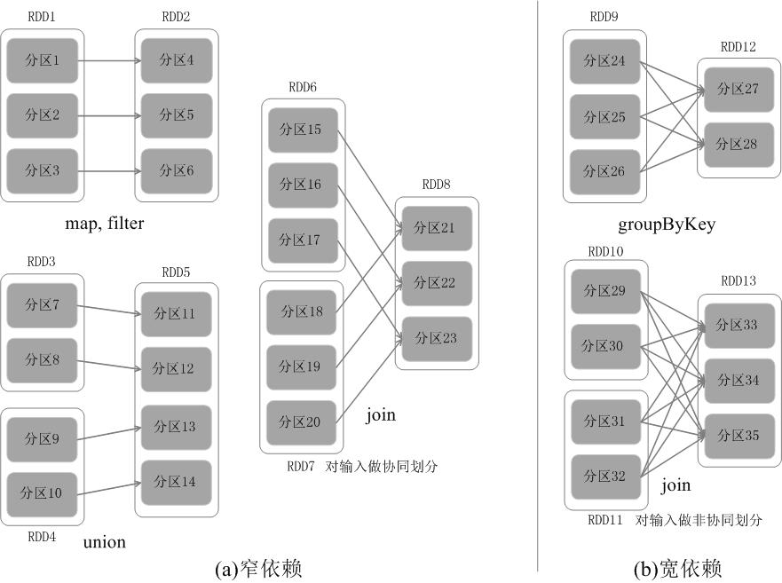
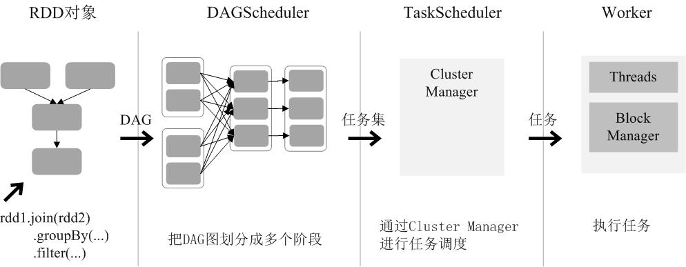

# RDD 简介

弹性分布式数据集（Resilient Distributed Dataset，RDD），是分布式内存的一个抽象概念，它提供了一种高度受限的内存模型。本质上，RDD是一个只读的分区记录集合。一个RDD可以分成多个分区，每个分区就是一个数据集片段。不同的分区可以保存在集群的不同节点上，从而可以进行并行计算。

<!-- more -->

RDD是只读的，不能直接修改。但是RDD提供了 **转换** 和 **行动** 两种操作。转换操作返回一个新的RDD，行动操作用于执行计算并指定输出，返回非RDD。

典型的RDD执行过程如下：
- RDD读入外部数据源（或内存中的集合），进行创建。
- RDD经过一系列的转换操作，每一次都产生不同的RDD，给下一次转换使用。
- 最后一个RDD经行动操作进行处理，输出到外部数据源。

需要注意的是，RDD采用了惰性调用，即转换操作并不会真的进行转换，只是记录。直到行动操作的时候，才从头开始进行一系列计算。

---

# RDD的依赖关系

RDD的依赖关系分为 **窄依赖（Narrow Dependency）** 与 **宽依赖（Wide Dependency）**。窄依赖即一个或多个父RDD的分区对应一个子RDD的分区，典型的例子有map、filter、union、join，而宽依赖则是一个父RDD的分区对应多个字RDD的分区，典型的例子有groupByKey、join。



## 为什么要这样设计依赖关系？

<font color="red">为了提高容错性</font>，以加快 Spark 的执行速度。因为 RDD 通过“血缘关系”记住了它是如何从其它 RDD 演变过来的，血缘关系记录的是粗颗粒度的转换操作行为，**当这个RDD的部分分区数据丢失时，它可以通过血缘关系获取足够的信息来重新运算和恢复丢失的数据分区**，由此带来了性能的提升。

---

# RDD运行过程

1. 创建RDD对象；
2. SparkContext负责计算 RDD 之间的依赖关系，构建 DAG；
3. DAGScheduler负责把 DAG 图分解成多个阶段，每个阶段中包含了多个任务，每个任务会被任务调度器分发给各个工作节点（Worker Node）上的Executor去执行。



---

# 编写 RDD 应用程序

首先新建一个 maven 工程

## 添加依赖

根据[官方文档](http://spark.apache.org/docs/latest/rdd-programming-guide.html)，添加 spark-core 的依赖 （如果要读写 HDFS, 还要添加 hadoop-client 的依赖）

pom.xml

```xml
<dependency>
    <groupId>org.apache.spark</groupId>
    <artifactId>spark-core_2.11</artifactId>
    <version>2.3.0</version>
</dependency>
```

## 初始化 Spark

RDDsample.java

```java
import org.apache.spark.api.java.JavaSparkContext;
import org.apache.spark.api.java.JavaRDD;
import org.apache.spark.SparkConf;

public class RDDsample {
    public static void main(String[] args) {
        SparkConf conf = new SparkConf().setAppName("RDD sample").setMaster("local[4]");
        JavaSparkContext sc = new JavaSparkContext(conf);
    }
}
```

- conf 的 `setMaster` 是设置集群（master is a Spark, Mesos or YARN cluster URL, or a special “local” string to run in local mode）这里以本地四个线程为例，写入 `local[4] `


## 创建 RDD

RDD可以通过两种方式创建：

- 第一种：读取一个外部数据集。比如，从本地文件加载数据集，或者从HDFS文件系统、HBase、Cassandra、Amazon S3等外部数据源中加载数据集。Spark可以支持文本文件、SequenceFile文件（Hadoop提供的 SequenceFile是一个由二进制序列化过的key/value的字节流组成的文本存储文件）和其他符合Hadoop InputFormat格式的文件。

```java
JavaRDD<String> lines = sc.textFile("file:///home/jerrysheh/data.txt");
```

lines是一个String类型的RDD，可以简单称为RDD[String]，也就是说，这个RDD[String]里面的元素都是String类型。

- 第二种：调用SparkContext的parallelize方法，在Driver中一个已经存在的集合（数组）上创建。


```java
List<Integer> data = Arrays.asList(1, 2, 3, 4, 5);
JavaRDD<Integer> distData = sc.parallelize(data);
```


## RDD 操作

RDD 支持两种操作：
* 转换（Transformations）： 基于现有的数据集创建一个新的数据集。
* 行动（Actions）：在数据集上进行运算，返回计算值。

### 转换

每一次转换操作都会产生不同的RDD，供给下一个“转换”使用。转换过程只是记录了转换的轨迹，并不会发生真正的计算。

常见的转换操作（Transformation API）：：
* `filter(func)`：筛选出满足函数func的元素，并返回一个新的数据集
* `map(func)`：将每个元素传递到函数func中，并将结果返回为一个新的数据集
* `flatMap(func)`：与map()相似，但每个输入元素都可以映射到0或多个输出结果
* `groupByKey()`：应用于(K,V)键值对的数据集时，返回一个新的(K, Iterable)形式的数据集
* `reduceByKey(func)`：应用于(K,V)键值对的数据集时，返回一个新的(K, V)形式的数据集，其中的每个值是将每个key传递到函数func中进行聚合。

### 行动

行动操作是真正触发计算的地方。**Spark程序执行到行动操作时，才会执行真正的计算**，包括从文件中加载数据，完成一次又一次转换操作，最终，完成行动操作得到结果。

常见的行动操作（Action API）：
* `count()`： 返回数据集中的元素个数
* `collect()`： 以数组的形式返回数据集中的所有元素
* `first()`： 返回数据集中的第一个元素
* `take(n)`： 以数组的形式返回数据集中的前n个元素
* `reduce(func)`： 通过函数func（输入两个参数并返回一个值）聚合数据集中的元素
* `foreach(func)`： 将数据集中的每个元素传递到函数func中运行

> 如果程序中多个地方触发行动操作，每个地方都会从头开始执行。可以用 `RDD.cache() `来缓存。这样第二次触发行动操作，会从缓存的地方开始计算。

## 键值对RDD （pair RDD）

我们前面创建的是 RDD[String]， 我们还可以创建 RDD[(String, Int)]

```java
JavaRDD<String> lines = sc.textFile("data.txt");
JavaPairRDD<String, Integer> pairs = lines.mapToPair(s -> new Tuple2(s, 1));
JavaPairRDD<String, Integer> counts = pairs.reduceByKey((a, b) -> a + b);
```

Java比较难理解的话，用 Python理解一遍

```python
lines = sc.textFile("data.txt")
pairs = lines.map(lambda s: (s, 1))
counts = pairs.reduceByKey(lambda a, b: a + b)
```

### 键值对转换

#### reduceByKey(func)

使用func函数合并具有相同键的值

比如：`reduceByKey((a,b) -> a+b)`

转换前
```
(“spark”,1)、(“spark”,2)、(“hadoop”,3)和(“hadoop”,5)
```

转换后
```
(“spark”,3)、(“hadoop”,8)
```

#### groupByKey()

对具有相同键的值进行分组

转换前
```
(“spark”,1)、(“spark”,2)、(“hadoop”,3)和(“hadoop”,5)
```

转换后
```
(“spark”,(1,2))，(“hadoop”,(3,5))
```

#### keys

把键值对RDD中的key返回形成一个新的RDD

转换前：四个键值对构成的RDD
```
(“spark”,1)、(“spark”,2)、(“hadoop”,3)和(“hadoop”,5)
```

转换后：一个RDD[Int]
```
{“spark”,”spark”,”hadoop”,”hadoop”}
```

#### values

把键值对RDD中的value返回形成一个新的RDD

转换前：四个键值对构成的RDD
```
(“spark”,1)、(“spark”,2)、(“hadoop”,3)和(“hadoop”,5)
```

转换后：一个RDD[Int]
```
{1,2,3,5}
```

#### sortByKey()

返回一个根据键排序的RDD

#### mapValues(func)`

只对键值对RDD的value部分进行处理，而不是同时对key和value进行处理。对键值对RDD中的每个value都应用一个函数，但是，key不会发生变化。

转换前
```
(“spark”,1)、(“spark”,2)、(“hadoop”,3)、(“hadoop”,5)
```

使用 `pairRDD.mapValues(x -> x+1)` 转换后

```
(“spark”,2)、(“spark”,3)、(“hadoop”,4)、(“hadoop”,6)。
```


#### join （内连接）

对于给定的两个输入数据集(K,V1)和(K,V2)，**只有在两个数据集中都存在的key才会被输出**，最终得到一个(K,(V1,V2))类型的数据集。

pairRDD1 （键值对集合）
```
{(“spark”,1)、(“spark”,2)、(“hadoop”,3)、(“hadoop”,5)}
```

pairRDD2 （键值对集合）
```
{(“spark”,”fast”)}
```

进行 `pairRDD1.join(pairRDD2)` 操作

转换后
```
{(“spark”,1,”fast”),(“spark”,2,”fast”)}
```


---

# 分区

RDD是弹性分布式数据集，通常RDD很大，会被分成很多个分区，分别保存在不同的节点上。RDD分区的一个分区原则是使得分区的个数尽量等于集群中的CPU核心（core）数目。
对于不同的Spark部署模式而言（本地模式、Standalone模式、YARN模式、Mesos模式），都可以通过设置`spark.default.parallelism`这个参数的值，来配置默认的分区数目。

一般而言：
* **本地模式**：默认为本地机器的CPU数目，若设置了local[N],则默认为N；
* **Apache Mesos**：默认的分区数为8；
* **Standalone 或 YARN**：在“集群中所有CPU核心数目总和”和“2”二者中取较大值作为默认值；

因此，在创建RDD的第二种方法中，`parallelize()`可以接收第二个参数（可选），表示多少个分区。如：

---

```java
JavaRDD<Integer> distData = sc.parallelize(data, 2); //设置2个分区
```

# 打印元素

本地模式：`rdd.foreach(println)`或者`rdd.map(println)`

集群模式：

- `rdd.collect().foreach(println)`（可能导致内存溢出）
- `rdd.take(100).foreach(println)`

---

# 共享变量和累加器

Spark在集群的多个不同节点的多个任务上并行运行一个函数时，它会把函数中涉及到的每个变量，在每个任务上都生成一个副本。但是我们有时候需要在多个任务之间，或者在任务（Task）和任务控制节点（Driver Program）之间共享变量。

Spark提供了两种类型的变量：`广播变量（broadcast variables）`和`累加器（accumulators）`。广播变量用来把变量在所有节点的内存之间进行共享。累加器则支持在所有不同节点之间进行累加计算（比如计数或者求和）。

- 使用`SparkContext.broadcast(v)`来从一个普通变量v中创建一个广播变量
- 一个数值型的累加器，可以通过调用`SparkContext.longAccumulator()`或者`SparkContext.doubleAccumulator()`来创建
---

参考：

- [厦门大学数据库实验室](http://dblab.xmu.edu.cn/blog/1312-2/)
