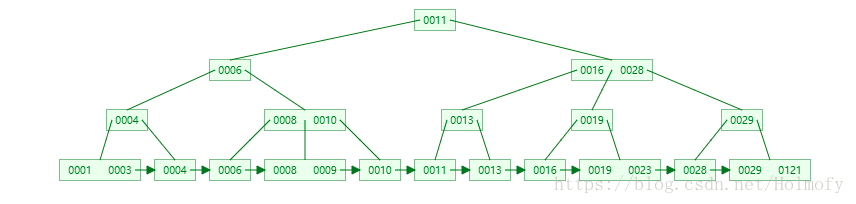
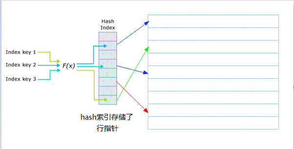
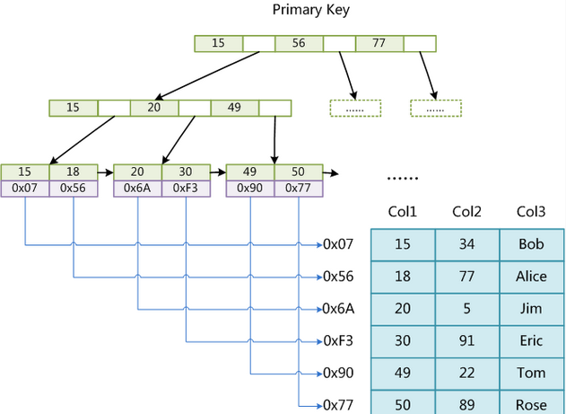
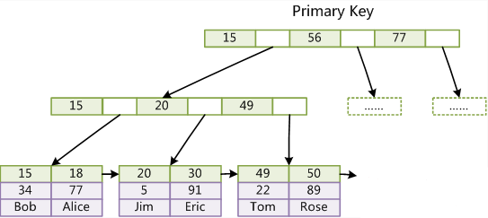

# 什么是索引？

索引是一个单独存储在磁盘上的数据结构，包含着对数据表里所有记录的引用指针。使用索引可以 **提高数据库特定数据的查询速度**。索引在存储引擎中实现，通常有 `BTree` 结构和 `Hash table` 结构，具体哪种和表的存储引擎有关。<font color="red">MyISAM 和 InnoDB 只支持 BTree </font>，MEMORY 同时支持 BTree 和 Hash table。

---

<!-- more -->

# 为什么要用索引？

优点：

1. 唯一索引可以保证数据库表中每行数据的唯一性
2. 减少服务器需要扫描的数据量，加快数据的查询速度
3. 加速表和表之间的连接
4. 在使用分组和排序子句进行数据检索时，同样可以显著减少查询中分组和排序的时间
5. 使用索引，可以在查询中使用优化隐藏器，提高系统的性能
6. 将随机IO变为顺序IO

缺点：

1. 创建索引和维护索引要耗费时间，并且随着数据量的增加耗费时间也增加
2. 索引需要占空间内存
3. 在对表中数据进行增、删、改的时候，索引也需要动态维护，这样降低了数据维护速度

---

# 索引的分类

## 按逻辑存储结构划分

按逻辑存储结构划分，索引可以分为：
1. B Tree索引
2. Hash索引
3. 空间(Spatial)索引
4. 全文(Fulltext)索引

### 1. BTree 索引



InnoDB 和 MyISAM 底层都是基于 B+Tree 索引的。适用于 BTree 索引的情况有：

1. **全值匹配**：索引可能有多个列，全值匹配就是匹配所有的列。例如，查找姓名列为 Allen，年龄列为 18 的人。
2. **匹配最左前缀**：匹配所有姓 Allen 的人。即只使用索引的第一列。
3. **匹配列前缀**：匹配某一列的值的开头部分。例如姓以 Al 开头的人。也只使用了索引的第一列。
4. **匹配范围值**：匹配查找姓在 Allen 和 Barrymore 之间的人。也只使用索引的第一列。
5. **精确匹配某一列并范围匹配另外一列**：查找所有姓为 Allen，并且名字是 K 开头的人。即第一列 last_name 全匹配，第二列 first_name 范围匹配。
6. **只访问索引的查询**：查询只需要访问索引，而无需访问数据行。（覆盖索引）

不适用于 B Tree 索引的情况：

1. **非最左**：不是按照索引的最左列开始查找，就无法使用索引。例如无法查找姓氏（姓氏是索引的第一列）不知道，但名字（名字是索引第二列）为 Bill 的人。也无法查找姓氏最后以 n 结尾的人，因为姓氏虽然是第一列，但最左值不知道。
2. **跳过列**：不能按索引查找姓氏为 “Smith”（第一列），名字（第二列）不知道，年龄为 18 （第三列）的人。如果非要这样查找，那MySQL只会用到第一列姓氏的索引。
3. **某个列存在范围**：例如，姓氏为“Smith”，名字以“J”开头，年龄为18的SQL语句`... WHERE last_name = 'Smith' AND first_name like 'J%' AND age = 18;`，这时索引只有第一列姓氏起作用。

### 2.Hash索引



Hash在理论上平均时间复杂度能达到O(1)，非常快，经常用在内存中。在数据库领域，数据更多的是放在磁盘中，Hash索引 跟 B tree索引 相比还是有一定的局限性，主要体现在：

1. Hash索引的无序性导致<font color="red">无法范围查找</font>，像 `>`、`<=`、`between` 等是无能为力的
2. 需要对完整的key计算Hash，因此<font color="red">不支持部分匹配</font>。像 `like 'jerr%'` 这样的前缀匹配无能为力
3. 无法实现索引覆盖
4. Hash碰撞冲突代价高


### 3.全文索引

简单地说，全文索引就是在一堆文字中，通过其中的某个关键字等信息，就能找到该字段所属的记录行。

- **注意**：全文索引只有在 MyISAM 引擎上才能使用，且只能在CHAR,VARCHAR,TEXT类型字段上使用。

### 4.空间索引

空间索引是对空间数据类型的字段建立的索引。

传统的索引不能很好的索引空间数据，我们需要一种方法能对空间数据进行索引，例如专门对地图上景点数据的索引，这就是空间索引。

MySQL中的空间数据类型有四种：
- GEOMETRY （几何体）
- POINT （点）
- LINESTRING （线）
- POLYGON （多边形）

在创建空间索引时，使用SPATIAL关键字。当引擎为MyISAM，创建空间索引的列，必须将其声明为 NOT NULL。


## 按功能或约束划分

### 普通（单列）索引

```sql
CREATE INDEX indexName ON mytable(username(length));
```

如果是CHAR，VARCHAR类型，length可以小于字段实际长度；如果是BLOB和TEXT类型，必须指定 length。

### 唯一索引

索引列的值必须唯一，但允许有空值。如果要禁止空值，则成为主键索引。

```sql
CREATE UNIQUE INDEX indexName ON mytable(username(length))
```

### 主键索引

主键索引是一种特殊的唯一索引，作用于主键。

特别注意：
- 主键索引的叶子节点存的是整行数据。在InnoDB里，主键索引也被称为聚簇索引（clustered index）。
- 非主键索引的叶子节点内容是主键的值。在InnoDB里，非主键索引也被称为二级索引（secondary index）。

#### 聚簇索引和二级索引的区别

假设有数据行：

| ID | name     | age |
| --- | -------- | ---|
| 500       | Jerry       | 18  |

age 列有普通索引，ID 列有主键索引

执行以下语句：

```sql
select * from T where age = 18;
```

首先会在 age 列索引找到 18，**普通索引存储的是主键值**，得到 ID 为 500
，在根据 ID = 500 找到这一数据行的全部数据，这个过程叫回表。

而直接执行：

```sql
select * from T where ID = 500;
```

直接通过聚簇索引找到 500 处，直接得到行数据。

### 组合索引（多列索引）

在表中的多个字段组合上创建的索引，只有在查询条件中使用了这些字段的左边字段时，索引才会被使用，使用组合索引时遵循最左前缀集合。

MySql会一直向右匹配直到遇到范围查询(>、<、between、like)就停止匹配，比如`a = 1 and b = 2 and c > 3 and d = 4` 如果建立(a,b,c,d)顺序的索引，d是用不到索引的，如果建立(a,b,d,c)的索引则都可以用到，a,b,d的顺序可以任意调整。

---

# 什么时候该创建索引？

1. **主键**：对于主键，会自动建立一个唯一索引，以保证值唯一
2. **频繁查询**：对于频繁查询的表或字段，建立索引无疑会提高查询效率
3. **查询中需要排序的字段**：使用索引去访问排序字段将大大提高排序速度
4. **查询中需要统计或者分组字段**

---

# 什么时候不该使用索引？

1. 表记录太少
2. 经常增删改的字段（因为修改字段的同时还要动态维护索引）
3. WHERE 条件用不到的字段不需要索引
4. 过滤性（选择性）不好的字段不适合使用索引，例如0/1，男/女

---

# 索引的底层实现

## MyISAM 索引实现

MyISAM 索引使用了 B+Tree 作为索引结构，叶子结点的 data 域<font color="red">存放的是数据记录的地址</font>。MyISAM中索引检索的算法为首先按照 B+Tree 搜索算法搜索索引，如果指定的Key存在，则取出其data域的值，然后以data域的值为地址，读取相应数据记录。主索引和辅助索引的存储结构没有任何区别。



## InnoDB 索引实现

虽然InnoDB也使用B+Tree作为索引结构，但具体实现方式却与MyISAM截然不同。

<font color="red">MyISAM索引文件和数据文件是分离的，索引文件仅保存数据记录的地址。而在InnoDB中，表数据文件本身就是按 B+Tree 组织的一个索引结构，这棵树的叶节点data域保存了完整的数据记录。 </font>

### 与 MyISAM 不同之处（聚簇索引）

第一个与 MyISAM 不同的是 InnoDB 的数据文件本身就是索引文件。数据行放在索引的叶子叶，这种索引叫做聚簇索引。“聚簇”的意思是，数据行和相邻的键值紧凑地存储在一起。



第二个与 MyISAM 的不同是 InnoDB 的二级索引 data 域存储相应记录主键的值而不是地址。换句话说，InnoDB的所有辅助索引都引用主键作为data域。

因为 InnoDB 的数据文件本身要按主键聚集，所以 InnoDB 要求表必须有主键（MyISAM可以没有）。通常，InnoDB 被索引的列是主键列，因为 InnoDB 通过主键来聚集数据。如果没有定义主键，InnoDB会选择一个唯一的非空索引替代，如果表中没有这样的列，InnoDB 会隐式出定义一个主键来作为聚簇索引。

---

# 为什么聚簇索引要用 B+ 树，而不是B树？

1. B+树由于只在叶子节点有 data，单一节点比B树可以存储更多的元素，树更“矮胖”，查询的IO次数更少。
2. 所有叶子节点形成有序链表，便于范围查询。

- 参考：[MySQL性能优化[理论篇]-B树索引与hash索引](https://blog.csdn.net/holmofy/article/details/80013034)

---

# 选择合适的主键

## 自增主键

由于聚簇索引底层由B+树组织，建议使用连续递增的数值作为主键（AUTO_INCREMENT是最好的）。相反，如果用无序的 UUID 作为主键，性能将非常糟糕。一个原因是UUID插入时不是在末尾追加的，需要维护树的结构，另一个原因是二级索引存放的是主键，主键长度越小，普通索引的叶子节点就越小，普通索引占用的空间也就越小。UUID显然比数字主键要大。

在分布式情况下，常用 Twitter 开源的 Snowflake 雪花算法，在应用层生成主键。

## 业务主键

只有一个索引，且该索引必须是唯一索引的业务场景下，可以使用业务主键。（K-V场景）


---

# 什么时候索引会失效？

索引可以包含多个列的值，但是列的顺序十分重要，MySQL只能高效地使用索引的最左前缀列。

1. WHERE 条件有 不等于号
2. WHERE 条件使用了表达式或函数，如`SELECT actor_id FROM sakila.actor WHERE actor_id + 1 = 5;`
3. JOIN中，MySQL只有在 **主键和外键的数据类型相同** 时才能使用索引，否则无效
4. `LIKE ‘abc%’`，MYSQL将使用索引；但 `LIKE ‘%abc’`，MySQL将不使用索引。
5. 使用 OR 一般会使索引失效
6. 如果列类型是字符串，那一定要在条件中将数据使用引号引用起来，否则不使用索引。
