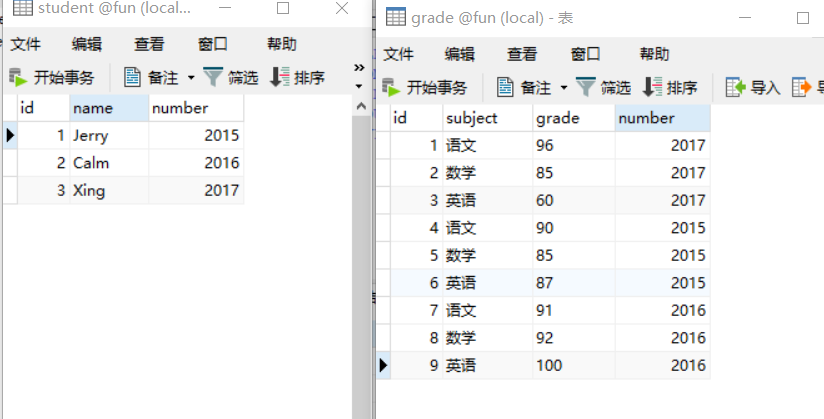

# SQL简介

SQL （Structured Query Language，结构化查询语言）是一种大小写不敏感的标准语言，用于帮助我们访问数据库。

SQL 包含两大部分 DML 和 DDL 两部分。

<!--more-->

## DML（data manipulation language，数据操作语言）

DML包括：
- **SELECT**：从数据库表中获取数据
- **UPDATE**： 更新数据库表中的数据
- **DELETE**：从数据库表中删除数据
- **INSERT INTO**：向数据库表中插入数据
- ...

## DDL（data definition language，数据定义语言）。

DDL包括：
- **CREATE DATABASE**：创建新数据库
- **ALTER DATABASE**：修改数据库
- **CREATE TABLE**：创建新表
- **ALTER TABLE**：变更数据库表
- **DROP TABLE**：删除数据库表
- **CREATE INDEX**：创建索引
- **DROP INDEX**：删除索引
- **TRUNCATE TABLE**：清空表

## RDBMS

`RDBMS（Relational Database Management System，关系型数据库管理系统）`是将数据组织为相关的行和列的系统，其数据存储在被称为`表（tables）`的数据库对象中。表是相关的数据项的集合，由`列（column）`和`行（row）`组成。常见的RDBMS有 MS SQL Server、MySQL、Oracle 等。

---


---

# SQL的单表操作

## SELECT

从表里选择列

```SQL
SELECT column FROM table

SELECT LastName,Address FROM Persons
```

---

## DISTINCT

从表里选择列（不出现重复值）

```SQL
SELECT DISTINCT column FROM table
```

多列 DISTINCT

```SQL
SELECT DISTINCT column1, column2, column3 FROM table
```

这里的 DISTINCT 是 column1, column2, column3 组合起来的去重，相当于：

```sql
SELECT column1, column2, column3 FROM table group by column1, column2, column3
```

---

## WHERE

从表里中选择 city 列等于 Beijing 的所有行

```SQL
SELECT * FROM Persons WHERE city = 'Beijing'
```

WHERE 语句中，`<>`或`!=`都可表示不等于，除了`=`、`>`、`<`、`>=`、`<=`之外，还可以用 `BETWEEN`（表示某个范围） 和 `LIKE`（搜索某种模式）。

**注意**：这里是使用 **单引号**，但是大部分数据库也接受双引号。如果是数值类型，不要加引号！

---

## AND、OR

从表里中选择 FirstName 是'Thomas' 并且 LastName 是 'Carter' 的行
```SQL
SELECT * FROM Persons WHERE FirstName = 'Thomas' AND LastName='Carter'
```

**注意**：当既有 AND 又有 OR 的时候，SQL 默认先执行 AND，如果要让 OR 先执行，用括号括起来即可。

```SQL
SELECT * FROM product WHERE (id > 3000 OR id < 1000 ) AND price > 50;
```

---

## ORDER BY 排列

* ASC 升序（小→大）（默认）
* DESC 降序（大→小）

例1：

优先以 Company 升序排列，然后以 OrderNumber 升序排列
```SQL
SELECT Company, OrderNumber FROM Orders ORDER BY Company,OrderNumber
```
假设这是一个记录公司订购了多少数量的物品的表，Google公司订购了两次，先以 A - G - I 升序排列，然后在相同值Google的两次订购中以数字升序排列

Company|OrderNumber
---|---
**A** pple|4698
**G** oogle|**2356**
**G** oogle|**6953**
**I** BM|3552

例2：

从商品表中根据id倒序取出前2个

```SQL
SELECT * FROM product ORDER BY id DESC LIMIT 2
```

- MySql 是没有 top 关键字的，用 LIMIT 来完成相同功能。

---

## INSERT INTO

### 顺序依次插入

往 Person 表的1、2、3、4列依次填入值
```SQL
INSERT INTO Persons VALUES('Jerry',"Sheh","Guangdong","China")
```

那么在 Persons 表的最后一行会新增如下

Firstname|LastName|Province|Country
---|---|---|---
Jerry|Sheh|Guangdong|China

### 指定列插入

往 Person 表的 LastName 列插入 Wilson，Age列插入 18

```SQL
INSERT INTO Persons(LastName, Age) VALUES ('Wilson', 18)
```

Firstname|LastName|Province|Country|Age
---|---|---|---|---|---
 | |Wilson| | |18

---

## UPDATE

修改 Persons表 中 LastName 是 Wilson 的 Address列 和 City列

```SQL
UPDATE Persons
SET Address='Xueyuan Road',City='Zhongshan'
WHERE LastName='Wilson'
```

---

## INSERT INTO ... ON DUPLICATE KEY UPDATE

尝试插入，如果有冲突（唯一键冲突、主键冲突）则更新。

```SQL
INSERT INTO Persons(LastName, Age)
VALUES ('Wilson', 18)
ON DUPLICATE KEY UPDATE Address='Xueyuan Road',
                        City='Zhongshan'
```

---

## DELETE

删除某行

```SQL
DELETE FROM Persons
WHERE LastName='Wilson'
```

删除所有行（表并没有被删除，结构、属性、索引都是完整的）

```SQL
DELETE * FROM table;
```

清空

```SQL
TRUNCATE TABLE t;
```

---

## TOP / LIMIT

显示前多少条

```SQL
# 显示前 2 条
SELECT TOP 2 * FROM Persons

# 显示前50%，PERCENT表示百分比
SELECT TOP 50 PERCENT * FROM Persons
```

* SQL Server 可用 TOP ，但 MySQL 不行，用 limit 代替。

```sql
# 显示前 2 条
SELECT * FROM Persons
LIMIT 2

# 从第 6+1 行开始，显示 2 条
SELECT * FROM Persons
LIMIT 6,2

# 从第 6+1 行开始，显示 2 条
SELECT * FROM Persons
LIMIT 2 offset 6
```

- **注意**：LIMIT 用 逗号 和 用 offset 是相反的。
---

## LIKE

在 WHERE 子句中搜索列中的指定模式

```SQL
SELECT * FROM Persons
WHERE city
LIKE '%N'
```

同理，`NOT LIKE`是不包含

符号 `%` 定义了通配符：`N%`表示以N开头， `%g`表示以g结尾，`%lon%`表示包含lon

模糊查询例子：

选出商品表中，标签包含 “爱情” 的

```SQL
SELECT * FROM product
WHERE tags
like '%爱情%'
```

### SQL 通配符

* **`%`** ：代替一个或多个字符
* **`_`** ：代替一个字符
* **[charlist]** ：字符列中的任何单一字符
* **[^charlist]** 或 **[!charlist]** ：非字符列中的任何单一字符

选取 c 开头，然后一个任意字符，然后 r，然后任意字符，最后 er
```SQL
SELECT * FROM Persons
Where LastName
LIKE `c_r_er`
```

选取以 A 或者 L 或者 N 开头
```SQL
SELECT * FROM Persons
Where LastName
LIKE `[ALN]%`
```
---

## IN

在 Persons 表中选取姓氏为 Adams 和 Carter 的人

```sql
SELECT * FROM Persons
Where LastName
IN ('Adams','Carter')
```

---

## BETWEEN

选取介于两个值之间的数据范围 （数值、文本、日期）
```sql
SELECT * FROM Persons
Where LastName
BETWEEN 'Adams' AND 'Carter'
```

* `NOT BETWEEN`，不在某范围内
* 不同数据库 BETWEEN...AND... 包括的范围可能不一样。**在 MySQL 中包含两边边界值**。

---

# 多表操作

## ALIAS （AS）

ALIAS 用于给列名或表名指定“别名”，方便阅读。

```SQL
SELECT o.OrderId, p.LastName
FROM Persons AS p,
     Orders AS o
WHERE p.LastName = "Adams"
```

---

## JOIN

将 Persons表 和 Orders表 的 Id_p 列关联起来

```sql
SELECT Persons.LastName, Persons.FirstName, Orders.OrderNo
FROM Persons
INNER JOIN Orders
ON Person.Id_p = Orders.Id_p
ORDER BY Person.LastName
```

```sql
SELECT p.FirstName, p.LastName, a.City, a.State
FROM Person as p
LEFT JOIN Address as a
ON p.PersonId = a.PersonId
```

* **JOIN** 或 **INNER JOIN**：有匹配时才显示
* **LEFT JOIN**：即使右表没有匹配，也从左表返回所有行
* **RIGHT JOIN**：即使左表没有匹配，也从右表返回所有行
* **FULL JOIN** ：返回左右表中所有的行，即使另一边没有匹配

注意：MySQL不支持 FULL JOIN，可以用 `UNION` 联合 LEFT JOIN 和 RIGHT JOIN，如果需要重复行，用 `UNION ALL`

```sql
SELECT p.FirstName, p.LastName, o.OrderNo
FROM persons AS p
LEFT JOIN Orders AS o
ON p.Id_p = o.Id_p
UNION
SELECT p.FirstName, p.LastName, o.OrderNo
FROM persons AS p
RIGHT JOIN Orders AS o
ON p.Id_p = o.Id_p
```

---

## UNION

合并两个或多个 SELECT 语句的结果集

合并两个表的员工名字，如果名字一样，只出现一次（UNION有去重功能，不想去重，可以用 `UNION ALL`）

```SQL
SELECT E_Name FROM Employees_China
UNION
SELECT E_Name FROM Employees_USA
```

---

# GROUP BY

根据一个或多个列对结果集进行分组

```SQL
SELECT Customer,SUM(OrderPrice) FROM Orders
GROUP BY Customer
```

有了 GROUP BY 之后 ，SUM 是以 Customer 分组，对每一组的OrderPrice记录进行计算，而不是表中全部的OrderPrice记录。

---

# HAVING

HAVING 通常与 GROUP BY 和 函数 一起使用。

找出成绩全部大于80分的学生学号

```sql
SELECT number FROM grade
GROUP BY number
HAVING MIN(grade.grade > 80)
```

---

## SELECT INTO等

从一张表选择数据，然后插入到另一张表里（常用于创建表的备份附件，或者用于对记录进行存档）

```SQL
SELECT * INTO new_table FROM old_table
```

* 可结合 `WHERE` 或者 `JOIN` 使用

---

## 分组排序取第一条

Oracle 的 `row_number` 语法。 MySQL 需 8.0 以上版本支持。

```sql
    select r.*
    from (select t.user_id,
                 t.user_name,
                 t.user_age,
                 t.least_time,
                 row_number() over( partition by t.user_id order by t.least_time ) rn
        from user_info t
        where t.status=0
     )r
    where r.rn=1
```

---


# 数据库操作

## CREATE DATABASE

创建数据库

```SQL
CREATE DATABASE mydb
```

- 在 MYSQL 中， 也可以用 `CREATE SCHEMA mydb`

摘自MYSQL 5.0官方文档：

> CREATE DATABASE creates a database with the given name.
To use this statement, you need the CREATE privilege for the database.
CREATE SCHEMA is a synonym for CREATE DATABASE as of MySQL 5.0.2.

## CREATE TABLE

创建表
```SQL
CREATE TABLE Persons
(
  id_p int NOT NULL AUTO_INCREMENT,
  last_name varchar(255),
  first_name varchar(255),
  address Varchar(255),
  primary key(id_p)
  UNIQUE INDEX ix_first_name(first_name)
) DEFAULT CHARSET=utf8;
```

* **NOT NULL**: 不接受NULL值
* **UNIQUE**:为列或者列集合提供唯一性保证
* **PRIMARY KEY**：主键

---

## 创建/删除索引

创建

```sql
ALTER TABLE table_name ADD INDEX index_name (column_list);
ALTER TABLE table_name ADD UNIQUE (column_list);
```

删除

```SQL
ALTER TABLE table_name DROP INDEX index_name;
```

## ALTER 在已有表 添加/修改/删除 列

```sql
ALTER TABLE table_name ADD column_name datatype;
```

---

# 实战一

有两张表，学生表和成绩表。



找出所有科目成绩都大于 80 分的学生名字

方法一：用 HAVING + 函数

1. 先用 join 把两张表连起来
2. 用 group by 分组，分组条件是 分数大于 80
```SQL
SELECT s.name
FROM student AS s
JOIN grade AS g ON s.number = g.number
GROUP BY s.`name`
HAVING MIN(grade) > 80
```

方法二：用 WHERE + NOT IN

```SQL
SELECT DISTINCT s.name
FROM student AS s
JOIN grade AS g
ON s.number = g.number
WHERE s.number
NOT IN
(SELECT g.number
FROM grade AS g
WHERE g.grade < 80)
```

求所有人成绩的平均分

```SQL
SELECT s.name AS name, AVG(g.grade) AS avg
FROM student AS s
JOIN grade AS g
ON s.number = g.number
GROUP BY s.name
```

---

# 实战二

查找表中多余的重复记录，重复记录是根据单个字段（peopleId）来判断

```sql
SELECT * FROM people
WHERE peopleId IN (SELECT  peopleId  FROM  people  GROUP  BY      
                  peopleId  HAVING  count(peopleId) > 1)
```

---

# 实战三

JOIN 两张表，右表只取一条记录

```sql
SELECT a.name b.num
FROM lefttable as a
JOIN (SELECT num FROM righttable GROUP BY num) as b
ON a.name = b.num
```
