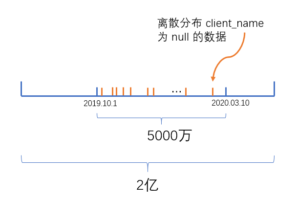
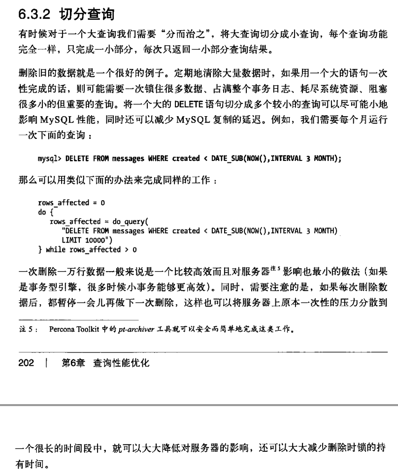

# 问题的来源

一张2亿数据的 MySQL InnoDB大表，现要对 `c_date` 时间字段的的某时间区间内，将 `client_name` 为 `null` 的数据进行删除。`c_date` 已建索引。




<!-- more -->

# 分析

显然，最简单的方式是写一个大的 DELETE 语句，类似这样：

```sql
DELETE FROM table
WHERE c_date between '2019-10-01' and '2020-03-10'
AND client_name is NULL
```

但这种方式是不建议的，因为会对 MySQL 服务器造成一定影响，参考《高性能MySQL》：



书中给我们的建议是，每次删除1万条数据：

```sql
DELETE FROM table
WHERE c_date between '2019-10-01' and '2020-03-10'
AND client_name is NULL
LIMIT 10000
```

我们在应用层JDBC循环删除：

```java
for (int i= 0;i < 1000000 ;i++ ) {
  delCount = prepareStatement.executeUpdate();
  if (delCount <= 0) {
    break;
  }
}
```

这种方式看似没毛病，但经过实践我们发现，MySQL越删越慢，到最后删了24个小时都没删完。究其原因，是 MySQL 每次执行 DELETE 时，总要先去查一遍：

```sql
SELECT id FROM table
WHERE c_date between '2019-10-01' and '2020-03-10'
AND client_name is NULL
LIMIT 10000
```

这就导致一个问题，由于 InnoDB 是以 B+树 数据结构存放数据的，在 c_date 上建立索引，MySQL可以很快定位到 c_date = `2019-10-01` 的第一条数据，之后往右边逐条检索，直到凑足1万条符合条件的数据再返回。随着 for 循环的进行，越往后要凑满1万条需要检索的数据就越多（因为前面符合的已经在前几次循环删除了）。

# 改进

找到删除慢的根源后，优化思路如下：

1.先查出每一天、每一小时大概有多少数据，我这边查询大概一小时在1万-5万不等

```sql
SELECT count(*) c, t.date
FROM
  (SELECT date_format(c_date, '%Y-%m-%d %H') date
   FROM table
   WHERE c_date between '2019-10-01' and '2020-03-10'
   AND client_name is NULL) t
GROUP BY t.date
```

2.按每一小时递进删除，每次删1万，直至该小时全部删完，再继续删除下一小时

```java
final long ONE_HOUR = 60 * 60 * 1000
TimeStamp start = getStart(); // 2019-10-01 00:00:00
TimeStamp end = getStart() + ONE_HOUR;
TimeStamp finish = getFinish(); // 2020-03-10 23:59:59

for (long i = start.getTime(); i< finish.getTime() ;i = i + ONE_HOUR ) {

  prepareStatement.setTimeStamp(1, start);
  prepareStatement.setTimeStamp(2, end);

  // 只要该小时内还有需要删除的数据，则重复做删除动作
  do {
    int delCount = prepareStatement.executeUpdate();
  } while (delCount > 0);

  // 设置下一个小时
  start = end.getTime();
  end = start.getTime() + ONE_HOUR;

}
```

DB 层如下:

```sql
DELETE FROM table
WHERE c_date between ? and ?
AND client_name is NULL
LIMIT 10000
```
