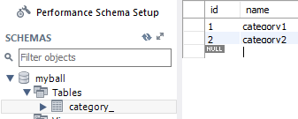

在 [Java简明笔记（十三）JDBC](../post/f07211ef.html) 中，使用 JDBC 来操作数据库，并把查询到的数据库信息进行 java 对象的映射（ORM），但是 JDBC 除了需要自己写SQL之外，还必须操作Connection, Statment, ResultSet，显得繁琐和枯燥。于是我们对 JDBC 进行封装，以简化数据库操作。mybatis就是这样的一个框架。

以下简介摘自[官方文档](http://www.mybatis.org/mybatis-3/zh/index.html)：

> MyBatis是一款优秀的持久层框架，它支持定制化 SQL、存储过程以及高级映射。MyBatis 避免了几乎所有的 JDBC 代码和手动设置参数以及获取结果集。MyBatis 可以使用简单的 XML 或注解来配置和映射原生信息，将接口和 Java 的 POJOs(Plain Old Java Objects,普通的 Java对象)映射成数据库中的记录。

<!--more-->

---

# IDEA 实战

## 创建数据库和表

使用 MYSQL ：
- 创建数据库，库名: myball
- 创建表，表名：category_
- 表分为 id 列 和 name 列， name 列填充category1 和 category2



## 新建工程

使用 IDEA 新建一个 maven 工程，在 pom.xml 中写入依赖

pom.xml
```xml
<dependencies>
    <dependency>
        <groupId>org.mybatis</groupId>
        <artifactId>mybatis</artifactId>
        <version>3.4.6</version>
    </dependency>
    <!-- https://mvnrepository.com/artifact/mysql/mysql-connector-java -->
    <dependency>
        <groupId>mysql</groupId>
        <artifactId>mysql-connector-java</artifactId>
        <version>8.0.9-rc</version>
    </dependency>
</dependencies>
```

- mybatis依赖从[官方文档](http://www.mybatis.org/mybatis-3/zh/index.html)中找，版本信息从 [github](https://github.com/mybatis/mybatis-3/releases) 找
- mysql依赖从 [mvn 仓库](http://mvnrepository.com/artifact/mysql/mysql-connector-java/8.0.9-rc)找

## 准备实体类 Category

这个类用来映射数据库信息为java对象（数据库 category_ 表 -> java 的 category对象）

注意：java对象要和数据库信息对应上。比如表category_有 `id` 和 `name`，对象category就要有 `int id` 和 `String name`。

src/main/java/com.jerrysheh.pojo/Category.java
```java
public class Category {
    private Long id;
    private String name;
    // 省略 getter setter
}
```

## 创建配置文件 mybatis-config.xml

在 src/main/java 目录下 创建 mybatis-config.xml，填入以下内容： （SpringBoot 免此配置）

```xml
<?xml version="1.0" encoding="UTF-8" ?>
<!DOCTYPE configuration
        PUBLIC "-//mybatis.org//DTD Config 3.0//EN"
        "http://mybatis.org/dtd/mybatis-3-config.dtd">
<configuration>
    <typeAliases>
        <package name="com.jerrysheh.pojo"/>
    </typeAliases>
    <environments default="development">
        <environment id="development">
            <transactionManager type="JDBC"/>
            <dataSource type="POOLED">
                <property name="driver" value="com.mysql.cj.jdbc.Driver"/>
                <property name="url" value="jdbc:mysql://localhost:3306/myball?characterEncoding=UTF-8&amp;serverTimezone=GMT%2B8&amp;useSSL=false"/>
                <property name="username" value="root"/>
                <property name="password" value="123456"/>
            </dataSource>
        </environment>
    </environments>
    <mappers>
        <mapper resource="com/jerrysheh/pojo/Category.xml"/>
    </mappers>
</configuration>
```

- `<dataSource>`主要提供连接数据库用的驱动，数据库名称，编码方式，账号密码以及别名
- `<typeAliases>` 写明包后，就会自动扫描这个包下面的类型
- `<mappers>`是映射

## 创建配置文件 Category.xml

在包 com.jerrysheh.pojo 下创建 Category.xml

```xml
<?xml version="1.0" encoding="UTF-8"?>
<!DOCTYPE mapper
        PUBLIC "-//mybatis.org//DTD Mapper 3.0//EN"
        "http://mybatis.org/dtd/mybatis-3-mapper.dtd">

<mapper namespace="com.jerrysheh.pojo">
    <select id="listCategory" resultType="Category">
            select * from category_
        </select>
</mapper>
```

- `namespace`指明哪个包
- `resultType`指映射出来的java对象类型，因为在上一个配置文件已经在`<typeAliases>`写明包名，所以这里不用给出全名（com.jerrysheh.pojo.Category）

## 测试类 Test

Test.java
```java
public class Test {
    public static void main(String[] args) throws IOException {
        String resource = "mybatis-config.xml";
        InputStream inputStream = Resources.getResourceAsStream(resource);
        SqlSessionFactory sqlSessionFactory = new SqlSessionFactoryBuilder().build(inputStream);
        SqlSession session = sqlSessionFactory.openSession();

        List<Category> cs = session.selectList("listCategory");
        for (Category c : cs) {
            System.out.println(c.getName());
        }
    }
}
```

事实上，Mybatis 做了以下几件事:

1. 应用程序找 Mybatis 要数据
2. Mybatis从数据库中找来数据(通过 mybatis-config.xml 定位哪个数据库，通过 Category.xml 执行对应的select语句)
3. 基于 Category.xml 把返回的数据库记录封装在 Category 对象中
4. 把多个 Category 对象装在一个 Category 集合中
5. 返回一个 Category 对象的集合

---

# 使用 mybatis 增删查改

修改 Category.xml 文件，添加增删查改的SQL语句。

```xml
<?xml version="1.0" encoding="UTF-8"?>
<!DOCTYPE mapper
        PUBLIC "-//mybatis.org//DTD Mapper 3.0//EN"
        "http://mybatis.org/dtd/mybatis-3-mapper.dtd">

<mapper namespace="com.jerrysheh.pojo">
    <insert id="addCategory" parameterType="Category" >
        insert into category_ ( name ) values (#{name})
    </insert>

    <delete id="deleteCategory" parameterType="Category" >
        delete from category_ where id= #{id}
    </delete>

    <select id="getCategory" parameterType="_int" resultType="Category">
        select * from   category_  where id= #{id}
    </select>

    <update id="updateCategory" parameterType="Category" >
        update category_ set name=#{name} where id=#{id}
    </update>

    <select id="listCategory" resultType="Category">
        select * from   category_
    </select>
</mapper>
```

## 增

在测试类Test中通过session将对象映射为数据库信息，插入表

```java
// 这四句是固定写法
String resource = "mybatis-config.xml";
InputStream inputStream = Resources.getResourceAsStream(resource);
SqlSessionFactory sqlSessionFactory = new SqlSessionFactoryBuilder().build(inputStream);
SqlSession session = sqlSessionFactory.openSession();

// 实例化一个Category对象
Category c = new Category();
c.setName("category3");

//通过session，将该对象映射为数据库信息，插入到表中
//第一个参数是 Category.xml 中的 id
session.insert("addCategory",c);
```

## 删

删除 id 号为 2 的category

```java
// 实例化一个Category对象
Category c = new Category();
c.setId(2);

//通过session，将该对象映射为数据库信息，从表中删除
session.delete("deleteCategory", c);
```

## 改

```java
// 通过session.selectOne取出一个Category对象
// 第二个参数是 Category.xml 的  getCategory 行的 parameterType，这里对应 int ，也就是 id 号
Category c= session.selectOne("getCategory",3);

//修改对象
c.setName("修改了的Category名稱");

//通过session，将该对象映射为数据库信息，从表中更新
session.update("updateCategory",c);
```

## 查

```java
listAll(session);

// 提交和关闭 session
session.commit();
session.close();

private static void listAll(SqlSession session) {
    List<Category> cs = session.selectList("listCategory");
    for (Category c : cs) {
        System.out.println(c.getName());
    }
}
```

---

# 模糊查询

在 Category.xml 中添加模糊查询语句：

```xml
<select id="listCategoryByName"  parameterType="string" resultType="Category">
    select * from   category_  where name like concat('%',#{0},'%')
</select>
```

> concat是一个 SQL 函数，表示字符串连接。在这个例子中，concat('%',#{0},'%') 表示 [零个或多个字符] + 参数{0} + [零个或多个字符]， 比如参数{0}是 cat，可以匹配 hellocatWTF

在 测试类 Test.java 中

```java
listbyName(session,"gory");

private static void listbyName(SqlSession session, String param) {
    List<Category> cs = session.selectList("listCategoryByName", param);
    for (Category c : cs) {
        System.out.println(c.getName());
    }
}
```

- `session.selectList()`提供第二个参数，这个参数就是Category.xml 中的 param `#{0}`

---

# 多条件查询

在 Category.xml 中添加多条件查询语句：

查询 id 号大于某个参数的

```xml
<select id="listCategoryByIdAndName"  parameterType="map" resultType="Category">
    select * from   category_  where id> #{id}  and name like concat('%',#{name},'%')
</select>
```

因为是多个参数，而selectList方法又只接受一个参数对象，所以需要把多个参数放在Map里，然后把这个Map对象作为参数传递进去

```java
Map<String,Object> params = new HashMap<>();
// id号大于 4 的
params.put("id", 4);
// name 包含 cat的
params.put("name", "cat");
listbyIdAndName(session,params);

private static void listbyIdAndName(SqlSession session, Map<String,Object> param) {
    List<Category> cs = session.selectList("listCategoryByIdAndName", param);
    for (Category c : cs) {
        System.out.println(c.getName());
    }
}
```

---

# 动态SQL

## if

我们前面提供了 listCategory 全部查询 和 listCategoryByName 模糊查询 两种方式。要写两个 SQL 语句。可以看到 `session.selectList()` 既能接受一个参数，也能接受两个参数。

那么可不可以，只写一个 SQL 语句， 当`session.selectList()`只有一个参数的时候，进行全部查询，提供第二个参数的时候，提供模糊查询呢？答案是肯定的。

假如我们要查询的表是 Product_ 表，对应的java对象类为 Product 类。

Product.xml 修改前：

```xml
<?xml version="1.0" encoding="UTF-8"?>
<!DOCTYPE mapper
    PUBLIC "-//mybatis.org//DTD Mapper 3.0//EN"
    "http://mybatis.org/dtd/mybatis-3-mapper.dtd">
    <mapper namespace="com.how2java.pojo">

        <select id="listProduct" resultType="Product">
            select * from product_         
        </select>

        <select id="listProductByName" resultType="Product">
            select * from product_  where name like concat('%',#{name},'%')        
        </select>

    </mapper>
```

Product.xml 修改后：

```xml
<?xml version="1.0" encoding="UTF-8"?>
<!DOCTYPE mapper
    PUBLIC "-//mybatis.org//DTD Mapper 3.0//EN"
    "http://mybatis.org/dtd/mybatis-3-mapper.dtd">
    <mapper namespace="com.how2java.pojo">

        <select id="listProduct" resultType="Product">
            select * from product_
            <if test="name!=null">
                where name like concat('%',#{name},'%')
            </if>        
        </select>

    </mapper>
```

## 其他动态SQL语句

除了 if 以外，还有 where、choose、foreach、bind等动态SQL语句，具体用法可以到网上查找。
