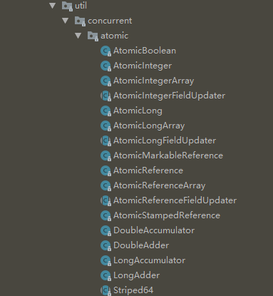

Java自带的平台类库（java.util.concurrent）里面包含了很多有用的工具，来帮助我们更好地处理并发问题。这一篇主要介绍一下几类工具：

1. **atomic原子类**：AtomicLong
2. **同步容器类**：Vector、Hashtable
3. **并发容器类**：concurrentHashMap、ConcurrentLinkedQueue、BlockingQueue（阻塞队列）
4. **并发工具类**：闭锁（Latch）、栅栏（Barrier）、信号量（Semaphore）

<!-- more -->

# atomic原子类

## 为什么要用atomic原子类

像 `i++` 这样的操作并不是原子操作，多线程访问可能出现问题，在 [Java并发编程之安全性](../post/b4ed848b.html) 就提到可以用 `java.util.concurrent.atomic` 包的 atomic原子类 来将 `i++` 封装成原子操作。



## 原理

非阻塞并发算法。典型的算法有compare-and-swap（CAS），即一个线程在修改一个变量时，先将当前值（当前内存地址值）跟预期值进行比较，如果一致，则进行修改，如果不一致，说明这个变量被其他线程改了，就不进行修改。

但是 CAS 也不是完美的，比如经典的ABA问题：一个变量 V 初次读取的时候是 A值，之后被其他线程修改为 B，然后又修改为 A，那 CAS 会认为它从来没有变过。

参考：http://tutorials.jenkov.com/java-concurrency/compare-and-swap.html

## 原子类的更新问题

用 Atomiclong 的 `incrementAndGet()` 方法或者 `set()` 方法更新值。

```java
private Atomiclong count = new AtomicLong(10);
count.incrementAndGet(); // 11

long value = 2L;
count.set(value);  // 2
```

当 value 是一个方法的返回值时，如`Math.max(count.get(), observed)` (选择两者中比较大的)，这个操作也并不安全。

正确的做法是用`compareAndSet(old, new)`方法：

```java
do{
    oldValue = count.get();
    newValue = Math.max(count.get(), observed);
} while(!count.compareAndSet(oldValue,newValue))
```

在Java 8中，上述样板代码可以简化为：

```java
count.updateAndGet(x->Math.max(count.get(), observed));
// or
count.accumulateAndGet(observed, Math::max);
```

## 用 LongAdder 优化高并发性能问题

如果在高并发情况下 Atomiclong 的 CAS 乐观锁需要太多次重试，这会带来一定的性能下降。Java 8 提供了 LongAdder 类。其思想跟JDK 1.7的 concurrenthashmap类似，采用分段的思想。LongAdder 内部包含多个值，每个线程只更新其中的一个，然后返回所有值的和。

LongAdder 适用于统计求和计数的场景，例如计算qps。在高并发场景下，qps这个值会被多个线程频繁更新的，所以 LongAdder 很适合。但 LongAdder 并不能替代 Atomiclong。

```java
final LongAdder adder = new LongAdder();
// thread 1
adder.increment();

// thread 2
adder.increment();

// main thread
adder.sum();
```

LongAccumulator 将这种思想推广到任意的累加操作，而不仅仅是+1

---

# 同步容器类

同步容器类包括 Vector 和 Hashtable。

它们实现线程安全的方式十分简单粗暴：**对每个公有方法进行同步，使得每次只有一个线程能够访问容器的状态**。这种线程安全方式对于容器自身来说是安全的，但在调用方可能会出现问题，因此使用时要注意调用方可能需要做一些额外的协调。例如：

```java
// 获取 Vector 最后一个元素
public static Object getLast(Vector list){
  int lastIndex = list.size() - 1;
  return list.get(lastIndex);
}

// 删除 Vector 最后一个元素
public static void deleteLast(Vector list){
  int lastIndex = list.size() - 1;
  list.remove(lastIndex);
}
```

从 Vector 的角度，无论你用多少个线程调用多少次`deleteLast()`方法，都不会让 Vector 内部出问题。然而，从调用者的角度，线程A调用getLast，线程A先观察到size为10，然后时间片切换到线程B调用deleteLast，B也观察到size为10，然后B删除了最后一个元素，然后A获取最后一个元素，发现这个元素不存在，于是抛出`ArrayIndexOutOfBoundsException`。

另一个例子是，用一个 for 循环迭代 Vector，循环到一半时，另一个线程删除了后面某些元素，迭代到后面时就会找不到元素抛出`ArrayIndexOutOfBoundsException`。

```java
// 如果迭代到一半，另一个线程删除了后面的元素，导致 get(i) 取不到
for (int i=0; i < vector.size() ;i++ ) {
  doSomething(vector.get(i));
}
```

我们通常会用 Iterator 可以对集合进行遍历，但是却 **不能在遍历过程对原集合做增、删、改**，会抛出 `ConcurrentModificationException`。这是 Java 的一种并发预警警示器，叫 fail-fast。告知我们集合在遍历过程中被修改了。

有时候，我们看起来好像没有迭代，但仍然抛出了`ConcurrentModificationException`。是因为有些方法隐式地进行了迭代，如打印一个Hashset，事实上会调用 toString 方法，这个方法不断调用 StringBuilder.append 把各个元素转为字符串，这其实就是迭代了。同理，hashCode方法、equals方法、containAll、removeAll、retainAll等方法都是如此。

<font color="red">因此，使用同步容器类时，需要在调用方加 synchronized 同步。</font>

---

# 并发容器类

同步容器简单粗暴地对公有方法加同步，实际上是强行将对容器状态的访问串行化了，这对并发性能带来了很大影响。在 Java 5 之后，增加了如 ConcurrentHashMap、ConcurrentLinkedQueue 这样的并发容器，天生为并发程序设计。**在多线程中应该尽可能用并发容器，而不是同步容器**。

## ConcurrentHashMap

ConcurrentHashMap 采用了细粒度的加锁机制，称为分段锁（Lock Striping）。分段锁的原理是，容器内部有多个锁，每一把锁只锁住容器内一部分数据。在 JDK 1.7 里，一个 ConcurrentHashMap 内部是一个 Segment 数组， Segment 数组每个元素都是一个 Entry 数组，Entry 数组每个元素都是 Entry 链表对象。加锁时，不是加锁整个 ConcurrentHashMap，而是加锁 Segment 数组上的每个 Segment 对象。


**但是在JDK 1.8中，取消了基于 Segment 的分段锁思想，改用 CAS + synchronized 控制并发操作**。

ConcurrentHashMap 迭代时不会抛出 `ConcurrentModificationException`，是 fail-safe 的。它实现了 ConcurrentMap 接口，如下：

```java
public interface ConcurrentMap<K, V> extends Map<K, V> {

    // 仅当 K 没有相应的映射值时才插入
    V putIfAbsent(K key, V value);

    // 仅当 K 被映射到 value 时才插入
    boolean remove(Object key, Object value);

    // 仅当 K 被映射到 oldValue 时才替换为 newValue
    boolean replace(K key, V oldValue, V newValue);

    // 仅当 K 被映射到某个值时才替换为 newValue
    V replace(K key, V value);
}
```

concurrentHashMap有两个带参构造器

```java
// initialCapacity - 初始容量（默认16）
concurrentHashMap<K, V>(int initialCapacity);

// loadactor - 如果每一个桶的平均负载超过这个值，会重新调整大小（默认0.75）
// concurrencyLevel - 并发写线程的估计数
concurrentHashMap<K, V>(int initialCapacity, float loadactor, int concurrencyLevel)
```

### 使用 concurrentHashMap 做词频统计的例子

考虑下面的例子，我们需要在每次访问时将 map 里面的值+1，虽然 concurrentHashMap 内部是线程安全的，但是这段代码并非线程安全，另一个线程可能也正在更新数值。

```java
ConcurrentHashMap<String,Long> map = new ConcurrentHashMap();
long oldValue = map.get(word);
long newValue = oldValue == null ? 1 : oldValue+1;
map.put(word, newValue);
```

一般的改进如下，用到了CAS的思想，使用 replace 方法，如果替换不成功就不断尝试。

```java
do {
    oldValue = map.get(word);
    newValue = oldValue == null ? 1 : oldValue+1;
} while (!map.replace(word, oldValue, newValue));
```

但是我们太讨厌这样的样板代码了，进一步改进如下：

```java
// 把 Long 换成了 LongAdder
ConcurrentHashMap<String,LongAdder> map = new ConcurrentHashMap();

// 如果为空，新建
map.putIfAbsent(word, new LongAdder());

// 获取再+1，实际上是把 do while 封装到 increment() 里面
map.get(word).increment();

// 上面两句可以合并为一句
map.putIfAbsent(word, new LongAdder()).increment();
```

但如果我不是想 +1，而想做其他计算，就无法用 `increment()` 了。Java 8 中，compute 方法传入一个 key 和一个计算新值的函数，用于完成原子更新，推荐使用：

```java
map.compute(word, (k,v)-> v == null? 1:v+1);
```

## CopyOnWriteArrayList

这是一个写入时复制（Copy-On-Write）并发容器，用于替代SynchronizedList。在每次修改时，都会创建并重新发布一个新的容器副本。迭代器不会抛出`ConcurrentModificationException`，是 fail-safe 的。当迭代操作远远多于修改操作时，应该考虑使用Copy-On-Write容器。例如事件监听系统，接收事件通知的操作远远多于注册或注销监听器的操作。

类似的，有`CopyOnWriteArraySet`。

## BlockingQueue（生产者消费者模式）

BlockingQueue 是一个阻塞队列接口。其 put 方法将一个元素放进队列头端，如果队列已满，就一直阻塞，直到队列空出位置。同理，take 方法将从队列尾端取出一个元素，如果队列未空，就一直阻塞，直到队列有元素。


BlockingQueue非常适合用来做生产者-消费者模式。其优点是，将生产数据的过程与使用数据的过程解耦。

BlockingQueue 也提供了一个 offer 方法，如果数据不能添加进队列，返回一个失败状态。offer 方法可以带时间参数，表示在一段时间内尝试添加元素。poll 同理。

```java
boolean success = queue.offer(x, 100, TimeUnit.MILLSECONDS);
```

BlockingQueue 的实现类有 LinkedBlockingQueue 和 ArrayBlockingQueue，以及按优先级排序的 PriorityBlockingQueue。还有一个比较特殊的 SynchronousQueue，它没有存储空间，只是维护一组线程。例如，一个线程 put 会被阻塞，直到另一个线程 take，才算成功交付。

方法|正常动作|特殊情况动作
---|---|---
add|添加元素|队列满抛出 IllegalStateException
offer|添加元素并返回true|队列满返回false
put|添加元素|队列满阻塞
element|返回队列头元素|队列空抛出NoSuchElementException
peek|返回队列的头元素|队列空返回null
poll|移出并返回队列头元素|队列空返回null
remove|移出并返回队列头元素|队列空抛出NoSuchElementException
take|移出并返回队列头元素|队列空阻塞

---

# 同步工具类

BlockingQueue 阻塞队列不仅能作为保存对象的容器，而且能根据其自身的状态来协调线程的控制流。所以它既是并发容器，也是一个同步工具。我们把能 **根据其自身的状态来协调线程的控制流的工具称为同步工具**。

同步工具类的特点是：封装了一些状态，这些状态决定执行同步工具类的线程是继续执行还是等待，此外还提供一些方法对状态进行操作。常见的同步工具类有：闭锁（Latch）、栅栏（Barrier）、信号量（Semaphore）。

## 闭锁（Latch）

闭锁相当于一个门，且有一个开门的条件。未开门前，所有线程都不能通过，当门打开后才允许所有线程通过。闭锁打开之后将不能再关上。使用闭锁的场景有：

- 确保某个计算在其需要的所有资源都被初始化后才继续执行。
- 确保某个服务在其依赖的其他服务都被启动之后才启动。
- 等待某个操作的参与者都就绪再继续执行（多人在线游戏）。

CountDownLatch 是一种闭锁的实现。包括一个计数器，一开始为正数，表示需要等待的事件数量。以及 countDown 方法，每当一个等待的事件发生了，计数器就减一。直到为零闭锁打开。如果计数器不为零，那 await 会一直阻塞直到计数器为零，或者等待中的线程中断，或者等待超时。

## 栅栏（Barrier）

栅栏跟闭锁类似，不同点在于，所有线程必须同时到达栅栏位置，才能继续执行。**闭锁用于等待事件，而栅栏用于等待其他线程**，当所有线程到达 `barrier.await();` 的位置，栅栏放开。

```java
// param 1 参与的线程数量 ， param 2 栅栏放开后执行的 runnable
CyclicBarrier barrier = new CyclicBarrier(2, myRunnable);
```

CyclicBarrier 与 CountDownLatch 的区别在于 CyclicBarrier 是可以重用的。 CyclicBarrier 可以使一定数据的参与方反复地在栅栏位置汇集，通常用于并行迭代算法。

## 信号量（Semaphore）

计数信号量（Counting Semaphore）用来控制同时访问某个特定资源的操作数量，或者同时执行某个指定操作的数量。

Semaphore 与 CountDownLatch 的区别在于 Semaphore 的计数器减少之后，还可以再增加，表示可用的资源数量。Semaphore 可以用来实现资源池，如数据库连接池。

```java
Semaphore semaphore = new Semaphore(1);

//资源被使用代码

semaphore.acquire(); // 资源被获取

// 资源使用完毕代码

semaphore.release(); // 资源被释放
```

## 显式锁

### 可重入锁（ReentrantLock）

ReentrantLock 是 Lock 接口的默认实现。实现了锁的基本功能。作用跟 `Synchronized` 一样，都是用于线程同步的。但 ReentrantLock 多了三个高级特性：

1. **等待可中断**：如果持有锁的线程长期不释放锁，正在等待的线程可以放弃等待，改为处理别的事情。
2. **可实现公平锁**：公平锁是指按照申请锁的时间顺序依次获得锁，而非随机获得。可以通过带 boolean 值的构造函数要求使用公平锁。
3. **锁可以绑定多个条件**：一个 ReentrantLock对象可以绑定多个 Condition 对象。

### 可重入读写锁（ReentrantReadWriteLock）

ReentrantReadWriteLock 是 ReadWriteLock 接口的默认实现。实际上是结合了可重入锁和读写锁的特性。内部维护了两个锁，ReadLock 和 WriteLock，其中
ReadLock 是线程共享的，而 WriteLock 是独占的。

可重入读写锁有一个小弊端，就是在“写”操作的时候，其它线程不能写也不能读。我们称这种现象为“写饥饿”。

### StampedLock

StampedLock 是 JDK 1.8 才发布的，作者依然是 Doug Lea。功能跟 ReentrantReadWriteLock 一样，但是性能更高，且不会发现写饥饿。其原理是，**在读的时候如果发生了写，应该通过重试的方式来获取新的值，而不应该阻塞写操作。这种模式也就是典型的无锁编程思想，和CAS自旋的思想一样**。这种操作方式决定了StampedLock在读线程非常多而写线程非常少的场景下非常适用，同时还避免了写饥饿情况的发生。

StampedLock的性能非常优异，基本上可以取代ReentrantReadWriteLock的作用。

---

参考：

- 《Java并发编程实战》
- [第十四章 锁接口和类](http://concurrent.redspider.group/article/03/14.html)
