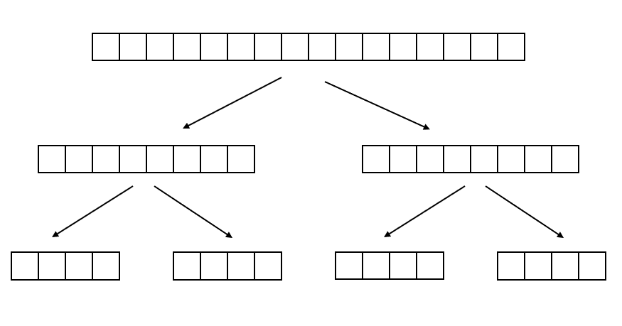

有时候，我们想在主线程之外执行一些异步任务，不难想到，可以开一个新线程专门去处理某个任务。

<!-- more -->

# 最简单的异步任务执行

## Runnable

Runnable 用于一个异步执行的任务，没有参数和返回值。实现 Runnable 接口，把我们想要执行的任务写在 run 方法里，即可表示任务内容。

```java
package java.lang;
@FunctionalInterface
public interface Runnable {
    public abstract void run();
}
```


## Callable

Callable 与 Runnable 类似，区别是，Callable有返回值，且可以抛出异常。

```java
package java.util.concurrent;
@FunctionalInterface
public interface Callable<V> {
    V call() throws Exception;
}
```

## 一个简易Web服务器例子

无论是 Runnable 还是 Callable，想要放到独立的线程中去运行，都是需要借助 Thread 类的。

```java
new Thread(runnable).start();
new Thread(callable).start();
```

我们可以编写一个简易的Web服务器，当一个请求进来时，新建一个线程去服务这个请求。（不要在生产环境使用这种方式）

```java
public static void main(String[] args) throws IOException {
    ServerSocket socket = new ServerSocket(80);
    for (;;){
        final Socket conn = socket.accept();
        Runnable task = () -> handleRequest(conn);
        new Thread(task).start();
    }
}

private static void handleRequest(Socket conn){
    // do something
}
```

由我们手动去 new 线程执行任务，有一些缺点：

- 随着新任务一个个的到来，旧任务一个个结束，线程不断创建销毁，开销很大；
- 线程数量不可控，如果一下子有大量任务到来，将无限制创建线程，即使没有OOM，也会因线程数量太多而导致性能降低（CPU在线程之间切换也是有开销）

所以通常我们不会手动去 new 线程执行任务，而是借助 `Executor` 接口帮助我们执行。

---

# Executor 接口

`Executor` 接口用来执行一个 Runnable：

```java
public interface Executor {
    void execute(Runnable command);
}
```

为什么要把线程放到 `Executor` 里面执行呢？

- Executor 提供了一种标准的方法将任务的 **提交过程** 和 **执行过程** 解耦。这是一种生产者-消费者模式。
- 我们可以在 Executor 的实现类里，添加一些方法，用于 **管理生命周期和做其他监控**，便于我们调度异步任务（jdk正是这么做的，见`ExecutorService`接口）。

> 不仅应该尽量不要编写自己的工作队列，而且还应该尽量不直接使用线程。 ——《Effective Java》

## 借助 Executor 的简易Web服务器

这一次，我们不再 new 线程，而是把 task 放到 Executor 里面去执行。

```java
public class ExecutorExample {
    private static final int THREAD_NUMBER = 100;
    private static final Executor exec = Executors.newFixedThreadPool(THREAD_NUMBER);

    public static void main(String[] args) throws IOException {
        ServerSocket socket = new ServerSocket(80);
        for (;;){
            final Socket conn = socket.accept();
            Runnable task = () -> handleRequest(conn);
            exec.execute(task);
        }
    }

    private static void handleRequest(Socket conn){
        // do something
    }

}
```

## Executors 工具类

Executor 的实现类多种多样，我们可以把 Executor 实现为单线程，或者实现为跟每次都自己 new 线程一样，也可以实现为限制最大线程数量等。通常情况下不同的实现类参数复杂，状态较多，所以我们通常不自己 new Executor，而是借助工具类 Executors 帮助我们创建 Executor。

```java
// 单线程执行器，如果该线程异常，将创建另一个来替代
Executor exec1 = Executors.newSingleThreadExecutor();

// 固定线程数量，提交一个任务就创建一个，直至最大值
Executor exec2 = Executors.newFixedThreadPool(10);

// 多线程调度执行器
Executor exec3 = Executors.newScheduledThreadPool(10);
```

## ExecutorService 接口

事实上，我们用 `Executors` 创建出来的执行器是其子接口 `ExecutorService`。既然已经有了 `Executor` 了，为什么还要 `ExecutorService` 呢？前面说到，**我们不只是把任务丢到线程里让他去执行就完了，有时候，我们还想获取异步任务的状态，以及管理 Executor 本身的生命周期等**。

因此，`ExecutorService` 继承了 `Executor` ，再添加几个方法，包括两部分：

1. 获取异步任务的状态的
2. 管理 Executor 的生命周期（见下面生命周期部分）

### 获取异步任务的状态的

这部分主要是 `submit` 方法，用于向线程提交异步任务，然后返回一个 Future，我们再用 Future 来判断异步任务结束没有，或者获取结果。

```java
public interface ExecutorService extends Executor {
    <T> Future<T> submit(Callable<T> task);
    <T> Future<T> submit(Runnable task, T result);
    Future<?> submit(Runnable task);
    // ... 其他方法见下面生命周期部分
}
```

ExecutorService 接口的默认实现是 `ThreadPoolExecutor`，用于启动一个线程池，另一个实现是 Fork/Join 框架（JDK1.7）。

#### submit 和 execute 的区别

`execute()` 是 Executor 接口的方法，表示执行一个 Runnable， `submit()` 是 `ExecutorService` 接口的方法，内部调用了 `execute()` ，但还会返回一个异步计算结果 `Future` 对象（也意味着可以做异常处理）。

## ScheduledExecutorService 接口

看起来已经够用了，JUC的设计者Doug Lea大佬觉得哪里还不太够，于是劈里啪啦又写了一个 `ScheduledExecutorService` 接口，继承 `ExecutorService` 接口，再添加几个 schedule 方法：

```java
public ScheduledFuture<?> schedule(Runnable command, long delay, TimeUnit unit);
public <V> ScheduledFuture<V> schedule(Callable<V> callable, long delay, TimeUnit unit);
```

ScheduledExecutorService 的功能和 Timer/TimerTask 类似，解决那些需要任务重复执行的问题。这包括延迟时间一次性执行、延迟时间周期性执行以及固定延迟时间周期性执行等。

---

# Executor 生命周期

既然 ThreadPoolExecutor 是 ExecutorService 的实现，而 ExecutorService 又继承 Executor 接口。所以，线程池的生命周期即是 Executor 的生命周期啦。

```java
public interface ExecutorService extends Executor {
    // 用于提交异步任务和获取结果
    <T> Future<T> submit(Callable<T> task);
    <T> Future<T> submit(Runnable task, T result);
    Future<?> submit(Runnable task);

    // 用于管理执行器本身
    void shutdown();
    List<Runnable> shutdownNow();
    boolean isShutdown();
    boolean isTerminated();
    boolean awaitTermination(long timeout, TimeUnit unit) throws InterruptedException;
}
```

## CREATE & RUNNING

当我们 new 一个 Executor 或者通过 Executors 静态工厂构造一个 Executor，线程池即进入了 RUNNING 状态，在此之前是 CREATE 状态。严格意义上讲线程池构造完成后并没有线程被立即启动，只有进行“预启动”或者接收到任务的时候才会启动线程。但是无论如何，构造完后，线程池已经在运行，随时准备接受任务来执行。

## SHUTDOWN & STOP

通过`shutdown()`和`shutdownNow()`来将线程关闭。

- `shutdown()`平缓关闭，线程池停止接受新的任务，同时等待已经提交的任务执行完毕，包括那些进入队列还没有开始的任务，这时候线程池处于SHUTDOWN状态。
- `shutdownNow()`是一个立即关闭过程，线程池停止接受新的任务，同时尝试取消所有正在执行的任务和已经进入队列但是还没有执行的任务，这时候线程池处于STOP状态。

## TERMINATED

一旦`shutdown()`或者`shutdownNow()`执行完毕，线程池就进入TERMINATED状态，此时线程池就结束了。

- `isTerminating()`描述的是SHUTDOWN和STOP两种状态。
- `isShutdown()`描述的是非RUNNING状态，也就是SHUTDOWN/STOP/TERMINATED三种状态。
- 可以调用 `awaitTermination()` 来等待 `ExecutorService` 到达 TERMINATED 状态。

---

# Future

Callable 的 `call()` 方法可以执行一个异步任务并获取一个返回值，但假设异步任务要执行很久，调用方就会阻塞。这就失去了异步的意义。

```java
AsyncTask task1 = new MyTask(64);

// 调用即阻塞
long result1 = (Long) task1.call();
```

**Future是一个接口，用来判断异步计算是否已完成以及帮助我们获取异步计算的结果**，或者说，Future 相当于一个占位符，代表一个操作未来的结果。

在没有Future之前我们检测一个线程是否执行完毕通常使用`Thread.join()`或者用一个死循环加状态位来描述线程执行完毕。Future是一种更好的方法，能够阻塞线程，检测任务执行完毕，甚至取消执行中或者未开始执行的任务。

```java
public interface Future<V> {
    boolean cancel(boolean mayInterruptIfRunning);
    boolean isCancelled();
    boolean isDone();

    // 调用 get 时，如果还没计算完，将阻塞
    V get() throws InterruptedException, ExecutionException;

    // 如果过了设定的时间还没计算完，抛出超时异常
    V get(long timeout, TimeUnit unit)
        throws InterruptedException, ExecutionException, TimeoutException;
}
```

`RunnableFuture<V>` 是一个继承了 `Runnable` 和 `Future<V>` 的接口，再添加一个 `run()` 方法。而 `FutureTask<V>` 是它的实现，包含以下四个field：

```java
/** The underlying callable; nulled out after running */
private Callable<V> callable;
/** The result to return or exception to throw from get() */
private Object outcome; // non-volatile, protected by state reads/writes
/** The thread running the callable; CASed during run() */
private volatile Thread runner;
/** Treiber stack of waiting threads */
private volatile WaitNode waiters;
```

其构造器传入一个Callable，所以，当我们有一个异步任务 Callable ，可通过 `FutureTask<V>` 来获取返回值，如：

```java
FutureTask<Long> future = new FutureTask<Long>( () -> {
    Thread.sleep(1000);
    return 5L;
});

new Thread(future).start();

// 此时主线程可以去做别的事
// ...

// 执行get时，若异步任务还未结束，主线程将阻塞
Long result = future.get();
System.out.println(result);
```

`ExecutorService` 的 `submit()` 方法，就是返回一个 future。所以，一般我们都是 `FutureTask` 和 `Executor` 结合起来用：

```java
ExecutorService executor = Executors.newFixedThreadPool(4);
// MyTask implements Callable
Callable<String> mytask = new MyTask();
// 提交任务,同时获得一个 Future 对象:
Future<String> future = executor.submit(task);
// 从 Future 获取异步执行返回的结果:
String result = future.get(); // 可能阻塞
```

## 任务中断

有时候，我们用 `Executor` 提交了一个任务，但运行过程中想中断这个任务，可以利用 `Future` 抛出 `TimeoutException` 或 `InterruptedException`。

```java
Future<String> future = executor.submit(task);

try{
    String result = future.get(); // 可能阻塞
} catch(TimeoutException | InterruptedException e) {
    // 处理中断策略
} finally {
    future.cancel(true);
}
```

其原理是，`Future` 的 `get()` 方法会阻塞，此时会维护一个状态机，无限去获取任务的状态，当执行任务的线程被置为中断或超时状态时，`get()` 方法将抛出异常。

---

# CompletableFuture

Future 其实还不够好，因为主线程迟早要主动去调用 `future.get()` 来获取结果的。我们希望异步任务结束后，主动回调，而不是主线程去`isDone()`或`get()` 。

JDK 1.8 引入了 CompletableFuture，用法如下：

```java
// 定义一个异步任务
Supplier<String> myTask = () -> {
    try {
        Thread.sleep(3000);
    } catch (InterruptedException e) {
        e.printStackTrace();
    }
    return "hello world";
};

// 定义 CompletableFuture
CompletableFuture<String> myTaskFuture = CompletableFuture.supplyAsync(myTask);

// 设置 CompletableFuture 执行结束时做什么
myTaskFuture.thenAccept(System.out::println);

// 设置 CompletableFuture 抛出异常时做什么
myTaskFuture.exceptionally( e -> {
    e.printStackTrace();
    return null;
});

// 主线程可以做其他事
// ...
```

使用 CompletableFuture 的好处是异步任务结束或异常时，会自动回调某个对象的方法，且主线程设置好回调后，不再关心异步任务的执行。

## 多个 CompletableFuture 串行执行

```java
// 定义任务 f1
CompletableFuture<String> f1 = CompletableFuture.supplyAsync(myTaskHello);
f1.thenAccept(System.out::println);

// 定义任务 f2 为 f1 执行完后执行，第一个任务的结果会作为第二个任务的参数
// 所以 thenApplyAsync 接收的是一个 Function<T,T>
CompletableFuture<String> f2 = f1.thenApplyAsync(myTaskName);
f2.thenAccept(System.out::println);

// 主线程可以做其他事
// ..
```

## 多个 CompletableFuture 并行执行

用 `anyOf()` 或 `allOf()` 可以将两个 CompletableFuture 合并为一个新的 CompletableFuture ，实现并行执行。

- anyOf()：只要有一个成功
- allOf()：需所有的都成功

想象一个场景：需要一个人搬砖，用异步任务呼叫 jerry 和 calm 两个人，只要任意一个人回应了，就由他去搬砖。

```java
// f1： 呼叫 jerry
// f2： 呼叫 calm
// f3： 搬砖

CompletableFuture<String> f1 = CompletableFuture.supplyAsync( () -> callSomebody("jerry"));
CompletableFuture<String> f2 = CompletableFuture.supplyAsync( () -> callSomebody("calm"));

// 用anyOf合并为一个新的CompletableFuture:
CompletableFuture<Object> f3 = CompletableFuture.anyOf(f1, f2);

f3.thenAccept( r -> System.out.println(String.format("%s去搬砖", r)));

// 主线程可以做其他事
// ..
```

## CompletableFuture 方法概览

|  行为   | 对应的函数式接口  | then | both | either
|  ----  | ----  | ---- | ---- | ----
| apply  | Function | thenApply | thenCombine | applyToEither
| accept  | Consumer | thenAccept | thenAcceptBoth | acceptEither 
| run  | Runnable | thenRun | runAfterBoth | runAfterEither

此外，还有一个常用的方法是 `thenCompose()`，它跟 `thenApply()` 很像，但返回的是一个 Future，而非嵌套的Future。

> `thenApply()` 就像函数式编程里的 `map`，而  `thenCompose()` 更像 `flapMap`

---

# Fork/Join

前面提到 `ExecutorService` 接口的默认实现是 `ThreadPoolExecutor`，用于启动一个线程池，另一个实现是 Fork/Join ，Fork/Join 用来将一个大的任务分解成多个小的任务，并行执行。其原理跟排序算法的归并排序类似。

例如，要计算一个超大数据的和，可以把数组拆成两个中等组数，两个中等数组又分别拆成两个小数组，现在我们有4个小数组了，可以用4个线程并行执行求和。最后再汇总。



使用方法：

```java
public static void main(String[] args) {
    long[] largeArrays = getLargeArrays();
    ForkJoinTask<Long> calculateSumTask = new SumTask(largeArrays,0, largeArrays.length);
    Long result = ForkJoinPool.commonPool().invoke(calculateSumTask);
}
```

其中，SumTask 的实现如下，继承`RecursiveTask<Long>`，并重写`compute()`方法，在`compute()`里面，判断如果任务足够小，就直接计算，否则一分为二。

```java

class SumTask extends RecursiveTask<Long> {
    static final int THRESHOLD = 500;
    long[] array;
    int start;
    int end;

    SumTask(long[] array, int start, int end) {
        this.array = array;
        this.start = start;
        this.end = end;
    }

    @Override
    protected Long compute() {
        // 如果任务足够小,直接计算:
        if (end - start <= THRESHOLD) {
            long sum = 0;
            for (int i = start; i < end; i++) {
                sum += this.array[i];
                // 故意放慢计算速度:
                try {
                    Thread.sleep(1);
                } catch (InterruptedException e) {
                }
            }
            return sum;
        }

        // 任务太大,一分为二:
        int middle = (end + start) / 2;
        System.out.println(String.format("split %d~%d ==> %d~%d, %d~%d", start, end, start, middle, middle, end));
        SumTask subtask1 = new SumTask(this.array, start, middle);
        SumTask subtask2 = new SumTask(this.array, middle, end);

        // invokeAll会并行运行两个子任务:
        invokeAll(subtask1, subtask2);

        Long subresult1 = subtask1.join();
        Long subresult2 = subtask2.join();

        Long result = subresult1 + subresult2;
        System.out.println("result = " + subresult1 + " + " + subresult2 + " ==> " + result);
        return result;
    }
}
```

---

参考：
- 《Java并发编程实战》
