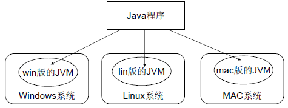

# 什么是Java虚拟机

Java的理念是“一次编译，到处运行”。我们平时编写的 Java 代码，经过Java编译器编译后会生成一种 .class 文件，称为字节码文件。**Java虚拟机（Java Virtual Machine，JVM）** 就是负责将字节码文件翻译成特定平台下的机器码然后运行的软件，其本身是由C/C++编写。

<!-- more -->


## JVM 如何让 Java 程序跨平台？

JVM 将字节码翻译成机器码然后运行，也就是说，只要在不同平台上安装对应的 JVM，就可以运行字节码文件，运行我们编写的 Java 程序。

而这个过程，我们编写的 Java 程序没有任何改变，仅仅是通过 JVM 这一 “中间层” ，就能在不同平台上运行，真正实现了 “一次编译，到处运行” 的目的。 <font color="red"> 需要注意的是，JVM 本身是用 C/C++ 开发的，是编译后的机器码，不能跨平台，不同平台下需要安装不同版本的 JVM。</font>



## JVM的“无关性”

JVM 是 **平台无关的**，即不同的操作系统安装的是不同的JVM，但作用一样。JVM 还是 **语言无关的**。Java 源代码通过javac编译器编译成 .class 文件，之后 JVM 执行 .class 文件从而程序开始运行。也就是说，JVM 只认识 .class 文件，而不管何种语言生成了 .class 文件，只要 class 文件符合 JVM 的规范就能运行。因此，除了 Java 之外，像 Scala、Kotlin、Jython 等语言也能够运行在 JVM 上。

---

# JVM的组成

JVM由四个部分组成：

- **类加载器**：负责在 JVM 启动时或者类运行时将需要的类加载到 JVM 中
- **内存区域**：将内存划分为几个区域，模拟实际机器上的存储、记录和调度
- **执行引擎**：执行字节码指令，相当于实际机器上的 CPU
- **本地方法调用**：调用 C/C++ 实现的本地方法


---

# 类加载器

## 类加载器的作用

编译器生成的许多 .class 字节码文件，其实就是一个个的 Java 类。类加载器负责读取这些字节码，加载进JVM的方法区，并在内存中生成 java.lang.Class 类的一个实例对象作为外界访问这个类的接口。每个这样的实例用来表示一个 Java 类。通过此实例的 newInstance() 方法就可以创建出该类的一个对象。实际的情况可能更加复杂，比如 Java 字节代码可能是通过工具动态生成的，也可能是通过网络下载的。

> 在 JDK 6 中，java.lang.Class 类的实例对象是放在方法区的，但是在 JDK 7 和 8 中放在堆里面。

## 类加载器如何加载 class 文件？（即把一个类装入JVM）

ClassLoader 把一个类装入JVM的步骤如下：


### 加载

1. **获取二进制字节流**：根据一个类的全限定名来获取其定义的二进制字节流（找到对应的 .class 文件）
2. **转换数据结构**：将二进制字节流所代表的静态存储结构转化为方法区的运行时数据结构。同时进行初步校验（cafebabe、常量池、文件长度、是否有父类等）
3. **生成Class类对象**：在内存中生成一个代表这个类的 `java.lang.Class` 对象实例，作为这个类的访问入口

在加载阶段，开发人员既可以使用系统提供的类加载器来完成加载，也可以自定义自己的类加载器来完成加载。加载阶段完成后，虚拟机外部的二进制字节流就按照虚拟机所需的格式存储在方法区之中，而且在 Java 内存中也创建一个 `java.lang.Class` 类的对象，这样便可以通过该对象访问方法区中的这些数据。


#### 什么时候加载？

在Java中，类加载是在程序运行期间完成的。

#### 从哪里加载？

一般二进制字节流都是从已经编译好的本地 .class 文件中读取，但其实还可以从 .jar / .war / JSP动态生成的class类 / 数据库 或 网络 中读取。

#### 类加载 和 数组加载 过程有什么区别？

当我们声明一个数组，例如：

```java
String[] str = new String[10];
```

这个数组也是有类型的，称为数组类型。在 Java 层面，我们说这个数组的类型是 String[]， 但在 JVM 层面，类型是`[Ljava.lang.String` (二维数组是 `[[Ljava.lang.String` ) ，而 java.lang.String 只是数组里面元素的类型。

当程序在运行过程中遇到 new 关键字创建一个数组时，由 JVM 直接创建数组类，再由类加载器创建数组中的元素类。而普通类的加载由类加载器完成，既可以使用系统提供的引导类加载器，也可以使用用户自定义的类加载器。

### 链接

在这个阶段，JVM需要完成三件事：

1. **校验**：检查载入的Class文件正确性，包含文件格式验证、元数据验证、字节码验证和符号引用验证。
2. **准备**：给类的 <font color="red">静态变量</font> 分配内存并设置零值（此时还未赋值）。但被 final 修饰的除外。
3. **解析**：将符号引用（Symbolic References）转化成直接引用。（符号引用就是一组符号来描述目标，可以是任何字面量。直接引用就是直接指向目标的指针、相对偏移量或一个间接定位到目标的句柄。）

#### 准备阶段静态变量

我们在 java 中编写：

```java
// 在准备阶段， str1 是 null， str2 是 "zxc"
public static str1 = "jerry";
public static final str2 = "zxc";
```

在准备阶段， str1 会先被赋初值 null，此时还没有被赋予 `jerry` 这个值。但假如是 final 修饰，在编译阶段就会将初始值存入 constantValue 属性中，在准备阶段就将 constantValue 的值赋给该字段，所以此时str2已经是 `zxc` 了 ，而不是 null 。

### 初始化

对类的静态变量和静态代码块进行赋值。例如我们在程序中编写：

```java
// 在初始化阶段，str1 被赋值为 jerry
public static str1 = "jerry";
```

在链接阶段， str1 还是 null， 在初始化阶段，str1 就被赋值为 `jerry` 了。

#### 初始化的步骤

1. 假如这个类还没有被加载和链接，则程序先加载并链接该类
2. **假如该类的直接父类还没有被初始化，则先初始化其直接父类**
3. 假如类中有静态初始化语句，则系统依次执行这些初始化语句

#### 什么时候初始化？(初始化的条件)

1. 在运行过程中遇到 `new`、`getstatic`、`putstatic`、`invokestatic` 这四个字节码指令时，如果类尚未初始化，那就要进行初始化。`getstatic` 和 `putstatic` 用于读取、设置一个类的静态成员变量(不包括final修饰的静态变量)，`invokestatic`用于调用一个类的静态成员函数。
2. 使用 `java.lang.reflect` 进行反射调用的时候，如果类没有初始化，那就需要初始化；
3. 当初始化一个类的时候，若其父类尚未初始化，那就先要让其父类初始化，然后再初始化本类；
4. 当虚拟机启动时，虚拟机会首先初始化带有main方法的类，即主类；

直接满足初始化的这4个条件的情况叫做**主动引用**；间接满足上述初始化过程的情况叫做**被动引用**。下文有举例。

## 双亲（父类）委派模型

在 JDK 8 和之前的版本中，类加载器可分为三层：

1. **BootStrap ClassLoader**：启动类加载器，由C++实现，属于JVM一部分，负责加载 `<JAVA_HOME>/lib` 目录下的类，如 rt.jar、tools.jar
2. **Extensioon ClassLoader**：扩展类加载器，由Java实现，负责加载 `<JAVA_HOME>/lib/ext` 目录下的类，如 javax.XXX  
3. **Application ClassLoader**：应用类加载器，由Java实现，负责加载用户类路径（Classpath）下的所有类库。


虚拟机装载类时，使用了双亲委派机制：

- **全盘负责**：当一个 ClassLoader 加载一个类时，除非显式地使用另一个ClassLoader，否则该类所依赖及引用的类也由当前 ClassLoader 负责加载。
- **双亲委派**：加载一个类时，先委托父类装载器寻找目标类，找不到时才从自己的类路径找。

举个栗子，像 java.lang.Object 这些存放在 rt.jar 中的类，无论使用哪个类加载器加载，最终都会委派给最顶端的 RootClassLoader 加载，从而使得不同加载器加载的 Object 类都是同一个。之所以这样设计，是从安全角度考虑的，试想如果有人恶意编写了一个 java.lang.String 类并装载到 JVM 中，我们使用 String 的时候就可能执行了恶意的 String 而不是 Java 提供的 Stirng。有了全盘负责委托机制，java.lang.String 永远是由 RootClassLoader 来加载，避免了上述安全隐患。

### 双亲委派过程

1. 首先检查类是否被加载；
2. 若未加载，则调用父类加载器的 loadClass 方法；
3. 若该方法抛出 ClassNotFoundException 异常，则表示父类加载器无法加载，则当前类加载器调用 findClass 加载类；
4. 若父类加载器可以加载，则直接返回Class对象；

## 类加载器如何判断两个 Java 类是相同的  ？

Java 虚拟机不仅要看类的全名是否相同，还要看加载此类的类加载器是否一样。只有两者都相同的情况，才认为两个类是相同的。即便是同样的字节代码，被不同的类加载器加载之后所得到的类，也是不同的。

## 什么时候需要自定义类加载器？

1. 需要隔离加载类的时候。在某些框架中，应用和中间件依赖的jar包要隔离开来，用不同的类加载器确保不会互相影响。
2. 需要修改类的加载方式时
3. 需要扩展加载源时，例如从网络、数据库等地方加载
4. 防止源码泄露，用自己的类加载器还原加密的字节码

---

# 主动引用与被动引用

直接满足初始化4个条件的情况叫做**主动引用**；间接满足上述初始化过程的情况叫做**被动引用**。

## 被动引用的例子

### 示例一

```java
public class Father{
    public static String name = "jerry";

    static{
        System.out.println("父类被初始化！");
    }
}

public class Son extends Father{
    static{
        System.out.println("子类被初始化！");
    }
}

public static void main(String[] args){
    System.out.println(Son.name);
}
```

输出结果：

```
父类被初始化！
jerry
```

在这个例子中，似乎满足初始化条件的第一条：**读取、设置一个类的静态成员变量**。那为什么调用的是子类的name，子类却没有被初始化呢？ 原因是：这个静态成员变量属于父类，子类只是间接调用，因此属于被动引用，JVM只会初始化父类。

### 示例二

修改 main 方法，new 一个父类数组

```java
public static void main(String[] args){
    Father[] fArr = new Father[10];
}
```

执行结果并没有输出`父类被初始化！`。在这个例子中，也似乎满足第一条：**遇到 new 指令新建对象**，那为什么父类没有被初始化呢？原因是：现在通过 new 要创建的是一个数组对象，而非父类对象，因此也属于间接引用，不会初始化父类。

### 示例三

修改 Father 类，用 final 修饰 name

```java
public class Father{
    public static final String name = "jerry";

    static{
        System.out.println("父类被初始化！");
    }
}


public class Go{
    public static void main(String[] args){
        System.out.println(Father.name);
    }
}
```

输出：

```
jerry
```

这个例子中，只输出了 jerry，却并没有初始化父类。原因是：Father.name 被 `final` 修饰。被 `final` 修饰的已经是一个常量，在 Java 代码编译的过程中就会被放入它被引用的class文件的常量池中(这里是Go类的常量池)。所以程序在运行期间如果需要调用这个常量，直接去当前类的常量池中取，而不需要初始化这个类。

---

参考：
- [深入理解JVM(十)——类加载器](https://blog.csdn.net/u010425776/article/details/58145910)
- [Java 面试知识点解析(三)——JVM篇](https://www.jianshu.com/p/bfb876565a1e)
