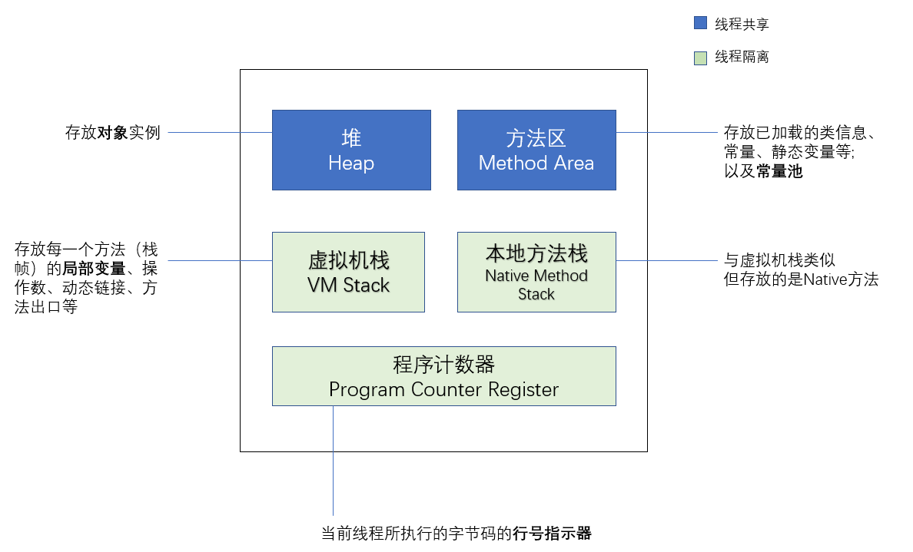
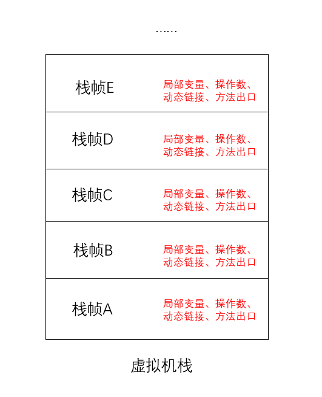
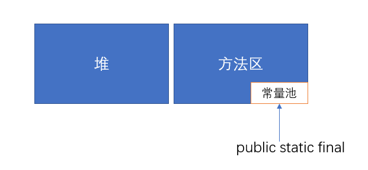
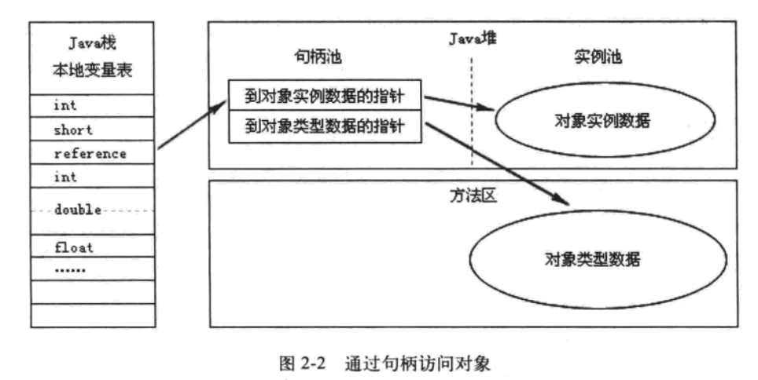
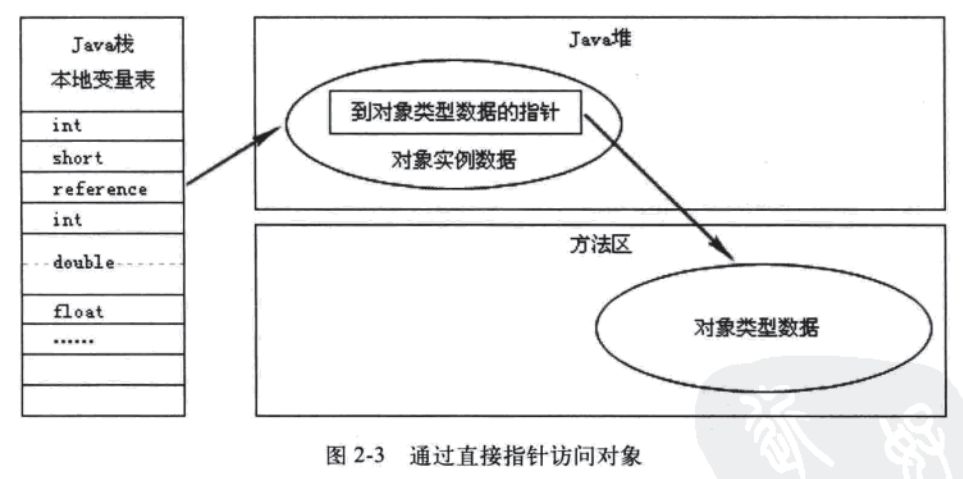

# 运行时数据区域

Java 程序执行的过程中，虚拟机所管理的内存划分为如下几个不同的数据区域：



<!-- more -->

---

# 程序计数器（线程隔离）

类似于操作系统里的 PC 计数器，程序计数器可以看做是当前线程所执行的字节码的行号指示器。

如果线程正在执行的是一个 Java 方法，这个计数器 **记录的是正在执行的虚拟机字节码指令的地址**；如果正在执行的是 Native 方法，这个计数器值则为空（Undefined）。

##  程序计数器的作用

1. 字节码解释器通过改变程序计数器来依次读取指令，从而实现代码的流程控制，如：顺序执行、选择、循环、异常处理。
2. 在多线程中，程序计数器用于记录当前线程执行的位置，当线程被切换回来的时候能够知道该线程上次运行到哪儿了。

##  程序计数器的特点

1. 此内存区域是唯一一个在 Java 虚拟机规范中没有规定任何 OutOfMemoryError 情况的区域；
2. 是一块较小的存储空间；
3. 线程私有；
4. 生命周期随着线程的创建而创建，随着线程的结束而死亡。

## 为什么每个线程都要有一个程序计数器，不能多个线程共享一个吗？

JVM的多线程是通过线程轮流切换、分配处理器时间片的方式实现。一个时刻处理器只会执行一条指定。为了线程切换后能恢复到上次的位置，每条线程都需要有一个单独的程序计数器。

---

# 虚拟机栈（栈内存）（线程隔离）

虚拟机栈描述的是 Java 方法执行的内存模型。

虚拟机栈是由一个个栈帧组成。每个 Java 方法即将执行的时候，JVM都会创建一个栈帧用于存储该方法的 **局部变量表、操作数、动态链接、方法出口等信息**。 每个方法调用都对应了一个栈帧在虚拟机栈中入栈到出栈的过程。一个方法被调用了，即创建了一个“栈帧”，一个方法返回了，“栈帧”出栈，释放内存。



## 虚拟机栈的组成

### 1. 局部变量表(Local Variable Table)

存储方法参数、局部变量（基本数据类型 + 引用对象指针）、方法返回地址。**局部变量表所需的内存空间在编译期就完全确定**。

### 2. 操作数栈(Operand Stack)

进行运算的地方

### 3. 动态链接

.Class文件中有很多符号引用，一部分在类加载的时候转化为直接引用（称为静态链接），另一部分在每一次运行期间转化为直接引用，这部分被称为动态链接。

#### 什么是符号引用和直接引用？

符号引用是无歧义的可以定位到这个目标的字面量。在编译时，java类并不知道所引用的类的实际地址，因此只能使用符号引用来代替。而直接引用可以理解为直接指向目标的指针。

在类加载的链接（的解析）阶段，符号引用被转换为直接引用。

### 4. 方法出口

当一个方法执行的时候，只有两种可以退出方法的方法。第一种是JVM碰到任意一个方法返回的字节码指令，被称为正常完成出口。另一种是在执行方法中抛出异常并且未对异常进行处理，被称为异常完成出口。方法退出的时候相当于把栈帧出栈。

##  虚拟机栈的特点

1. 局部变量表随着栈帧的创建而创建，其大小在编译时期就已确定，创建时直接分配该大小的空间。方法运行过程中，局部变量表大小并不会改变；
2. 每个线程都有各自的Java虚拟机栈。生命周期随着线程的创建而创建，随着线程的结束而死亡。

## StackOverFlowError 和 OutOfMemoryError

虚拟机栈会抛出两种异常：

- **StackOverFlowError**： 表示当前线程申请的栈超过了事先定好的栈的最大深度，但内存空间可能还有很多。
- **OutOfMemoryError**： 当线程申请栈时发现栈已经满了，而且内存也全都用光了。

---

# 本地方法栈（线程隔离）

和Java虚拟机栈的作用类似，区别是：该区域服务的是 native 方法，而不是 Java 方法。

## 什么是本地方法？（Native方法）

Native 方法指的是 java 代码调用非 java 代码的接口。在 Java 中，被 `native` 关键字修饰的方法称为 Native 方法，Native 方法只在 Java 中声明，而具体实现是由其他编程语言实现的（比如C/C++）。

## JVM 如何让 Native 方法跑起来？

我们知道，当一个类第一次被使用到时，这个类的字节码会被加载到内存，并且只会加载一次。在这个被加载的字节码的入口维持着一个该类所有方法描述符的list，这些方法描述符包含这样一些信息：方法代码存于何处，它有哪些参数，方法的描述符（public之类）等等。

如果一个方法描述符内有 `native` ，这个描述符块将有一个指向该方法的实现的指针。这些实现在一些DLL文件内，但是它们会被操作系统加载到 java 程序的地址空间。当一个带有本地方法的类被加载时，其相关的DLL并未被加载，因此指向方法实现的指针并不会被设置。当本地方法被调用之前，这些DLL才会被加载，这是通过调用 `java.system.loadLibrary()` 实现的。

---

# 堆内存（线程共享）

堆是用来存放对象的内存空间，几乎所有的对象都存储在堆中。

从回收内存的角度看，堆内存还可以进一步细分为：新生代、老年代。新生代又可被分为：Eden、From Survior、To Survior。不同的区域存放具有不同生命周期的对象。这样可以根据不同的区域使用不同的垃圾回收算法，从而更具有针对性，更高效。《深入理解Java虚拟机》第三版提到，堆内存中的无论哪个区域，存放的都只能是对象的实例，将堆内存细分的目的只是为了更好地回收或分配内存。

## 堆的特点

1. 堆内存是垃圾收集器管理的主要区域；
2. 堆内存是所有线程共享的；
3. 在虚拟机启动时创建；
4. 堆的大小既可以固定也可以扩展，但主流的虚拟机堆的大小是可扩展的，因此当线程请求分配内存，但堆已满，且内存已满无法再扩展时，就抛出 OutOfMemoryError。

---

# 方法区（线程共享）

方法区用于 **存储虚拟机加载的类信息、常量、静态变量、即时编译器编译后的代码**。虽然 Java 虚拟机规范把方法区描述为堆的一个逻辑部分，但是它却又一个别名叫做 Non-Heap（非堆），目的是与 Java 堆区分开来。

方法区中的信息一般需要长期存在，而且它又是堆的逻辑分区，因此以前人们用堆的划分方法，喜欢把方法区称为永久代，但是永久代和方法区其实并不等价。只不过说为了方便像管理堆内存一样管理方法区，HotSpot虚拟机采用了永久代的方式来实现方法区。

到了 JDK 8 ，永久代的概念被放弃了。以前放在永久代的字符串常量池、静态变量等，被搬运到了在本地内存中实现的元空间（meta space）里面。

总的来说，方法区是Java虚拟机规范里的一个概念定义，而永久代和元空间是两种具体实现方式。

## 方法区的特点

1. 所有线程共享；
2. 内存回收效率低：方法区中的信息一般需要长期存在，回收一遍内存之后可能只有少量信息无效。对方法区的内存回收的主要目标是： **对常量池的回收** 和 **对类型的卸载**。

## 运行时常量池

运行时常量池是方法区的一部分。方法区就是借助运行时常量池来存储常量的。

一般我们声明常量的方式是：

```java
public class A{
  public static final double PI = 3.1415926;

  //...
}
```

这个类被编译后便生成class文件，这个类的所有信息都存储在这个class文件中。**当这个类被Java虚拟机加载后，class文件中的常量就存放在方法区的运行时常量池中**。



而且在运行期间，可以向常量池中添加新的常量。如：String类的 intern() 方法就能在运行期间向常量池中添加字符串常量。当运行时常量池中的某些常量没有被对象引用，同时也没有被变量引用，那么就需要垃圾收集器回收。

---

# 直接内存

直接内存是除Java虚拟机之外的内存，但也有可能被Java使用。

在NIO中引入了一种基于通道和缓冲的IO方式。它可以通过调用本地方法直接分配Java虚拟机之外的内存，然后通过一个存储在Java堆中的DirectByteBuffer对象直接操作该内存，而无需先将外面内存中的数据复制到堆中再操作，从而提升了数据操作的效率。

直接内存的大小不受Java虚拟机控制，但既然是内存，当内存不足时就会抛出 OutOfMemoryError

---

# 对象的创建过程

当虚拟机遇到 new 指令时，就会创建一个对象。创建的过程大致为：检查常量池 - 检查类是否被加载 - 准备内存大小 - 划分空间 - 初始化

## 1.检查静态常量池

静态常量池(constant_pool)指的是在编译期被确定，并被保存在已编译的 .class文件 中的一些数据。它包括了类、方法、接口等中的常量、字符串常量、符号引用。

虚拟机遇到 new 指令时，首先会检查常量池是否有表示该类的符号引用，若没有说明还没被classloader加载，则先进行类的加载、链接、初始化。

## 2.检查是否已经被JVM加载

找到符号引用后，虚拟机检查该符号引用所代表的类是否已经被类加载器加载。若还没有，先将该类的 .class 文件加载进方法区。

## 3.准备所需的内存大小

JVM在一个类被加载进方法区的时候，就知道该类生产的每一个对象所需要的内存大小。JVM将准备这个对象所需的内存。

### 为什么类加载完毕后就可以确定该类对象的大小？

不同的虚拟机，对象在内存中的布局略有不同。以 HotSpot虚拟机为例，对象在内存中可以分为三部分：**对象头（Obejct Header）**、**实例数据（Instance Data）**、**对齐填充（Padding）**。

对象头官方叫做 Mark Word，用于存储对象自身的运行时数据（hashcode、GC age等）和指向方法区对象类型数据的指针（如果是数组还有数组大小）。为了节省空间，这个对象头（32bit或64bit）的存储空间是复用的。它有一个标志位，01时表示未锁定，存储hashcode、GC age等，00时表示轻量级锁定，10时表示重量级锁定，11是GC标记，01时是可偏向。不同标志位下这 32bit 存储的东西也都不一样。

实例数据就是我们程序代码中定义的各种类型字段。一般从父类继承的变量会出现在子类之前，相同宽度（如long和double）的会出现在一起。

对齐填充没有实际意义。因为 HotSpot 虚拟机的自动内存管理系统规定对象的起始地址必须是 8 字节的整倍数，所以当没有对齐时，就用对齐填充来补上。

从对象的内存布局中可以看到，一个对象所需的所有数据，都是完全可以被统计的，因而类加载完毕后，虚拟机也就知道了该类对象所需的内存空间了。

## 4. 划分空间

知道应该为这个类划分多少内存空间后，虚拟机于是从堆中划分一块对应大小的内存空间给新的对象。划分的方式有 **指针碰撞** 和 **空闲列表** 两种。

如果堆是规整的，一边是分配过的内存，一边是空闲内存，那只要在中间用一个指针隔开，为新对象分配内存时，指针往后移动相应的空间距离即可。这种划分方式叫指针碰撞。


如果堆不是规整的，虚拟机就必须维护一个列表，记录堆中哪些空间是可用的。这种划分方式叫空闲列表。

虚拟机采用哪种划分方式取决于堆是否规整，堆是否规整又取决于垃圾回收算器是否带有压缩整理功能。

## 5. 初始化

划分完内存空间之后，虚拟机会为对象中的成员变量赋上初始零值（例如 int 初始化为 0）。之后，为对象设置其对象头中的信息（对象是哪个类的实例、对象的hashcode、对象的GC分代年龄等）。

至此，站在虚拟机的角度，new指令已经执行完毕，一个新的对象已经产生。但是站在程序员的角度，对象创建才刚刚开始。因为<init>方法还没有执行，所有字段都还为零。紧接着new指令之后，通常会执行<init>方法，即调用对象的构造函数，根据程序员的需要，进行应用程序角度的初始化。

---

# 引用类型如何访问对象

Java程序通常都是在方法中声明一个引用类型（引用存放在Java方法栈上），然后通过引用来操作堆内存里的具体对象。引用可以有两种访问对象的方式。

## 句柄访问方式

堆中需要有一块叫做“句柄池”的内存空间，用于存放两个指针，一个指针指向堆中对象实例数据，另一个指针指向方法区中对象类型数据。

引用先找到句柄，再根据句柄中对象指针所指的地址再去访问对象。



## 直接指针访问方式

引用直接存放对象的地址。这种方式省去了句柄“转发”。但堆中必须有一种方式，让我们能够去访问方法区的中对象类型数据。



## HotSpot虚拟机采用什么方式

HotSpot采用直接指针方式访问对象。因为它只需一次寻址操作，从而性能比句柄访问方式快一倍。但它需要额外的策略存储对象在方法区中类信息的地址。
