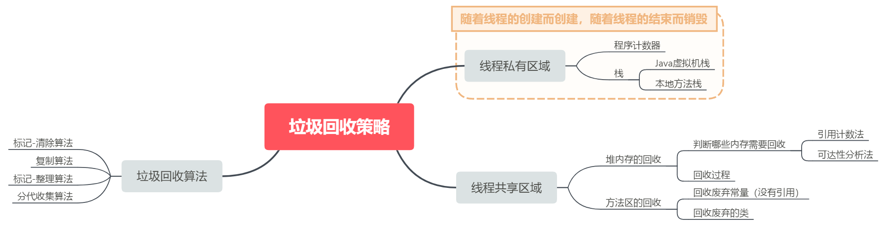
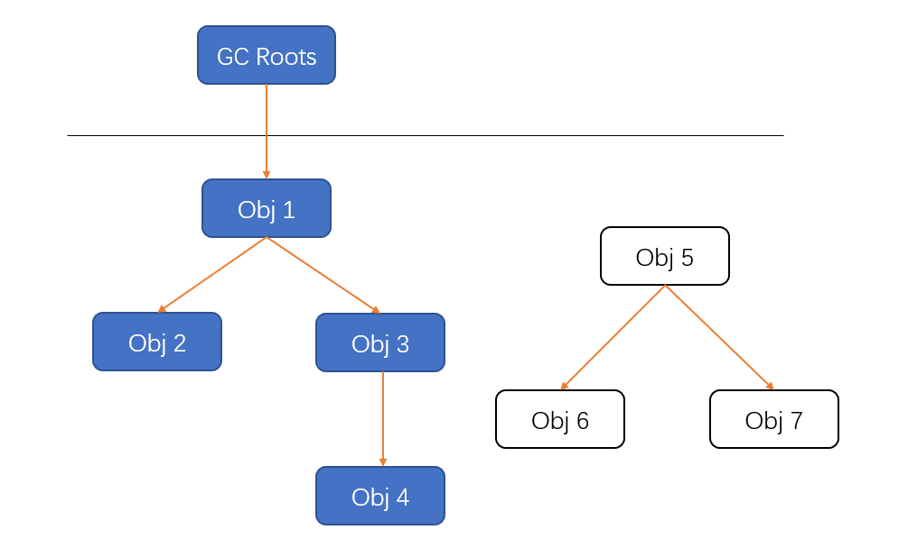

在 [Java虚拟机（二）内存模型和对象创建](../post/7a1af8ce.html) 这一篇中，我们知道 Java 虚拟机的内存模型包含五个部分：程序计数器、Java虚拟机栈、本地方法栈、堆、方法区。这五个区域也叫运行时数据区域（Runtime Data Area），他们是数据的存储空间。既然是存储空间，那就有可能达到存满的时候，因此，JVM必须配备一个垃圾回收器（Garbage Collection, GC），用于不定期地回收不再需要的内存空间。

<!-- more -->

事实上，Java的动态内存分配和回收技术已经相当成熟，作为开发者的我们无需手动去分配和释放内存，一切都交给Java虚拟机。那为什么我们还要去了解 GC 和 内存放配呢？原因是：当需要排查各种内存溢出、泄露等问题，或当垃圾收集称为系统达到更高并发量的瓶颈时，我们有必要对这些“自动化”的技术进行监控和调节。


---

# 线程私有区域

程序计数器、Java虚拟机栈、本地方法栈都是线程私有的，这三个区域会随着线程的创建而创建，随着线程的结束而销毁。

此外，Java虚拟机栈、本地方法栈中的栈帧会随着方法的开始而入栈，随着方法的结束而出栈，每个栈帧中的本地变量表都是在类被加载的时候就确定的。

正是因为这些确定性，垃圾回收器能够清楚地知道何时该回收这部分内存空间。

---

# 线程共享区域

堆和方法区是所有线程共享的，并且都在JVM启动时创建，一直运行到JVM停止。

堆中存放JVM运行期间的所有对象，虽然每个对象的内存大小在加载该对象所属类的时候就确定了，但究竟创建多少个对象实例只有在程序运行期间才能确定。

方法区中存放类信息、静态成员变量、常量。类的加载是在程序运行过程中，当需要创建这个类的对象时才会加载这个类。因此，JVM究竟要加载多少个类也需要在程序运行期间确定。

因此，堆和方法区的内存回收具有不确定性，因此垃圾收集器在回收堆和方法区内存的时候就不那么容易了。

---

# 堆内存的回收

## 判断哪些对象需要回收

一个对象不被任何对象或变量引用，那么就是无效对象，就需要被回收。可以用 **引用计数法** 和 **可达性分析法** 来找到无效对象。

### 引用计数法（Reference Counting）

每个对象都有一个计数器，每当有一个地方引用了它，计数器加一；若引用失效，计数器减一。当计数器为 0 时，就认为该对象是无效对象。这个方法虽然简单，但存在一个严重的问题：**无法解决循环引用的问题**。

在下面的例子中，虽然把 objA 和 objB 都置为 null ，但其两者内部某个属性还持有对方的引用，因此采用引用计数法不会被回收。

```java
Ref objA = new Ref();
Ref objB = new Ref();
objA.instance = objB;
objB.instance = objA;

objA = null;
objB = null;
```

因此，目前主流语言均使用可达性分析方法来判断对象是否有效。

### 可达性分析法(Reachability Analysis)

GC把以下几种对象称为 GC-Roots：

1. Java虚拟机栈所引用的对象(栈帧中局部变量表中引用类型的变量所引用的对象)
2. 本地方法栈JNI(Native)所引用的对象
3. 方法区中 静态属性 和 常量 引用的对象

可达性分析法的规则是：所有和 GC Roots 直接或间接关联的对象都是有效对象，和 GC Roots 没有关联的对象就是无效对象。



GC Roots并不包括堆中对象所引用的对象！这样就不会出现循环引用。

无论采用上述哪种方法，都与引用相关。关于引用的定义，在JDK1.2之后分为 **强引用**、**软引用**、**弱引用**、**虚引用** 四种引用类型，参考：[refjava](../post/ae9388fa.html)

## 如何回收

可达性分析法中，不可达的对象并不是“非死不可”，他还有最后一次机会：finalize() 方法可以复活。

### finalize() 方法

Object 类中定义的方法，Java 中允许使用 `finalize()` 方法在垃圾收集器将对象从内存中清除出去之前做必要的清理工作。这个方法是由垃圾收集器在销毁对象时调用的，通过重写 `finalize()` 方法可以整理系统资源或者执行其他清理工作。

这个方法一个对象只能执行一次，只能在第一次进入被回收的队列，而且对象所属于的类重写了finalize方法才会被执行。第二次进入回收队列的时候，不会再执行其finalize方法，而是直接被二次标记，在下一次GC的时候被杀死。

### 回收过程

1. 判断该对象是否 Override 了 `finalize()` 方法，若有 Override，将 `finalize()` 扔进F-Queue队列中；若无 Override，直接释放对象内存；
2. 执行F-Queue队列中的 `finalize()` 方法；
3. 如果在执行 `finalize()` 方法时，将 this 赋给了某一个引用，那么该对象就重生了。如果没有，那么就会被垃圾收集器清除。

### 使用建议

1. 一般不要使用 finalize，最主要的用途是回收特殊渠道申请的内存。Java程序有垃圾回收器，所以一般情况下内存问题不用程序员操心。但有一种JNI(Java Native Interface)调用non-Java程序（C或C++），finalize()的工作就是回收这部分的内存。

2. 强烈不建议使用 finalize() 函数进行任何操作！如果需要释放资源，请使用try-finally。因为 finalize() 不确定性大，开销大，无法保证顺利执行。


---

# 方法区的回收

方法区中主要清除两种垃圾：
1. 废弃常量
2. 无用的类

## 如何判断一个常量是否废弃？

清除废弃的常量和清除对象类似，只要常量池中的常量不被任何变量或对象引用，那么这些常量就会被清除掉。举个例子，常量池中有"abc"这个常量，但是当前系统已经没有任何引用指向 "abc" 了，这时候如果发生 GC 且有必要，"abc" 这个方法区中的常量就会被回收。

## 如何判断一个类是否无用？

1. 该类的所有对象都已被清除（堆中已经没有该类的对象）
2. 该类的 java.lang.Class 对象没有在任何地方被引用（无法通过反射访问该类的方法）
3. 加载该类的 ClassLoader 已经被回收

---

# 垃圾回收算法

## 1. 标记-清除（Mark-Sweep）算法

首先判断需要清除哪些数据，并给它们做上标记，然后清除被标记的数据。这种方法虽然简单，但是效率比较低，而且清除完后存在大量碎片空间，导致后续无法存储大对象，降低了空间利用率。

## 2. 复制算法（针对新生代）

将内存分成两份，只将数据存储在其中一块上。当需要回收垃圾时，也是首先标记出废弃的数据，然后将有用的数据复制到另一块内存上，最后将第一块内存全部清除。这种算法避免了碎片空间，但内存被缩小了一半。而且每次都需要将有用的数据全部复制到另一片内存上去，效率不高。

### 复制算法如何解决空间利用率问题？

在新生代中，由于大量的对象都是“朝生夕死”（98%），也就是一次垃圾收集后只有少量对象存活，因此我们可以将内存划分成三块：Eden、Survior1、Survior2，内存大小分别是8:1:1。分配内存时，只使用Eden和一块Survior1。当发现 Eden+Survior1 的内存即将满时，JVM会发起一次GC，将所有存活下来的对象复制到另一块Survior2中，然后清除掉整个 Eden+Survior1。那么，接下来就使用 Survior2+Eden 进行内存分配。

通过这种方式，只需要浪费10%的内存空间即可实现带有压缩功能的垃圾收集方法，避免了内存碎片的问题。

但是，当一个对象要申请内存空间时，发现Eden+Survior中剩下的空间无法放置该对象，此时需要进行Minor GC，如果 Minor GC 过后空闲出来的内存空间仍然无法放置该对象，此时需要将 Eden+Survior 中的所有对象都转移到老年代中，然后再将新对象存入Eden区。这个过程称为“分配担保”。

## 3. 标记-整理（Mark-Compact）算法（针对老年代）

在回收垃圾前，首先将所有废弃的对象做上标记，然后将所有未被标记的对象移到一边，最后清空另一边区域即可。这是一种针对老年代的算法，因为老年代中的对象一般寿命比较长，因此每次垃圾回收会有大量对象存活。其清空的是标记的废弃对象区域。

标记-整理和标记-清除的区别在于，标记-清除是直接清除掉需要需要回收的对象，而标记-整理是先将存活的对象往一端移动，然后清除端边界以外的内存。

## 4. 分代收集算法

将内存划分为老年代和新生代。老年代中存放寿命较长的对象，新生代中存放“朝生夕死”的对象。然后在不同的区域使用不同的垃圾收集算法。

---

# Minor GC 和 Full GC

Minor指的是发生在新生代的垃圾收集，因对Java对象大多具有“朝生夕死”的特征，所以 Minor 发生得非常频繁，回收速度也快。Full GC 也叫做 Major GC，指的是发生在老年代的垃圾收集，一次 Full GC 通常伴随一次 Minor GC（非绝对），Full GC的回收速度一般比 Minor GC 慢 10 倍以上。

---

参考：

- [深入理解JVM(三)——垃圾收集策略详解](https://blog.csdn.net/u010425776/article/details/51189318)
- Java中跟垃圾回收密切相关的就是引用的类型了，这一部分之前专门有写了一篇 [Java中的引用类型](../post/ae9388fa.html)，现在回过头来看，好像又加深了一些理解。
- 周志明，《深入理解Java虚拟机》
