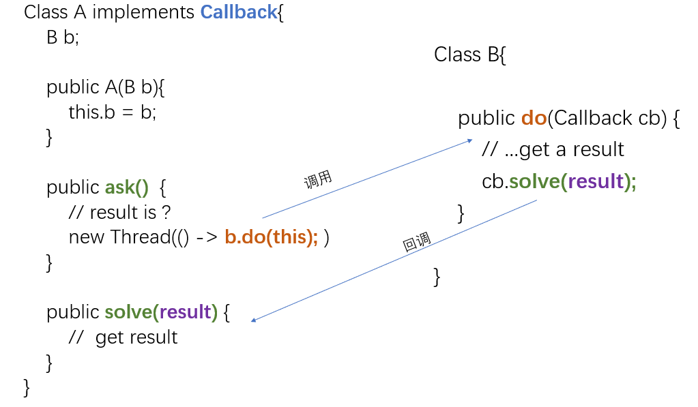

什么是回调（CallBack）呢？有一个经典的打电话例子。

> 有一天小王遇到一个很难的问题，问题是“1 + 1 = ?”，就打电话问小李，小李一下子也不知道，就跟小王说，等我办完手上的事情，就去想想答案，小王也不会傻傻的拿着电话去等小李的答案吧，于是小王就对小李说，我还要去逛街，你知道了答案就打我电话告诉我，于是挂了电话，自己办自己的事情，过了一个小时，小李打了小王的电话，告诉他答案是2

所谓回调：就是A类中调用B类中的某个方法C，然后B类中反过来调用A类中的方法D，D这个方法就叫回调方法。

回调让模块与模块之间解耦，也实现了异步调用。

<!-- more -->

---

# 异步回调

首先定义一个回调接口

```java
public interface Callback {

    public void solve();

}
```

1. A 类实现了回调接口，并持有B类的引用
2. A 类去调用 B 类的方法来处理 A类 自身的问题
3. B 类处理A类的问题，并通过回调把结果告知A类



---

# Android 中的回调

在 Android 中，我们开启一个 AsyncTask 获取网络数据， 然后在 `onPostExecute()` 方法中进行视图绑定。

由于 AsyncTask 可能造成的内存泄漏问题，因此我们一般都用静态内部类来规避这个问题。但是静态内部类又不能持有外部类的成员，因此我们可以用`回调函数(Callback Function)`来解决。

## 定义回调接口

首先定义一个回调接口

```java
public interface OnDataFinishedListener {
    public void onDataSuccessfully(String data);
    public void onDataFailed();
}
```

## AsyncTask 内部类

在 AsyncTask 里面实例化，并添加一个方法用来传引用

```java
OnDataFinishedListener onDataFinishedListener;
       public void setOnDataFinishedListener(OnDataFinishedListener onDataFinishedListener) {
           this.onDataFinishedListener = onDataFinishedListener;
       }
```

然后在 `onPostExecute()` 方法里面，根据`doInBackground()`返回的内容不同，选择合适的回调方法。

```java
@Override
protected void onPostExecute(String respResults) {
    if (respResults != null) {
        onDataFinishedListener.onDataSuccessfully(respResults);
    } else {
        onDataFinishedListener.onDataFailed();
    }
}
```

## 外部类

在外部类中调用内部类的`setOnDataFinishedListener()`方法，重写接口。

```java
getDetailTask.setOnDataFinishedListener(new OnDataFinishedListener() {

     @Override
     public void onDataSuccessfully(String json) {
         // do something
     }

     @Override
     public void onDataFailed() {
         // do something
     }
 });
```

这样就实现了内部类AsyncTask执行结束后，异步把结果传回外部类。

---

 未完待续
