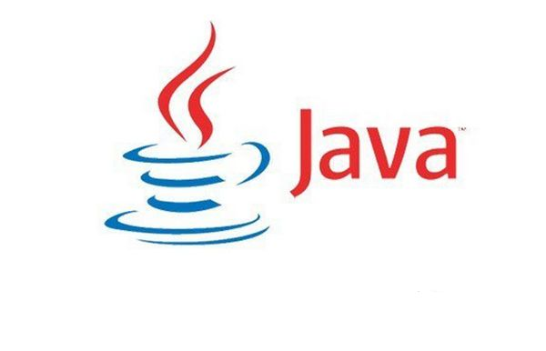

# Java 与 C++ 的区别

1. C++支持多重继承，Java不支持，但可以实现多接口。（引申：多重继承菱形问题）
2. 自动内存管理
3. java不支持goto语句
4. **引用与指针**：在Java中不可能直接操作对象本身，所有的对象都由一个引用指向，必须通过这个引用才能访问对象本身，包括获取成员变量的值，改变对象的成员变量，调用对象的方法等。而在 C++ 中存在引用，对象和指针三个东西，这三个东西都可以访问对象。其实，Java中的引用和C++中的指针在概念上是相似的，他们都是存放的对象在内存中的地址值，只是在Java中，引用丧失了部分灵活性，比如 Java 中的引用不能像 C++ 中的指针那样进行加减运算。

<!-- more -->

---

# 数据类型

在 Java 中，数据类型分为两类：**基本数据类型（primitive type）** 和 **引用类型（reference type）**。

## 八（九）种基本数据类型

基本类型	|大小(字节)	|默认值	|封装类
---|---|---|---
byte|	1|	(byte)0|	Byte
short|	2|	(short)0	|Short
int|	4	|0	|Integer
long|	8	|0L|	Long
float|	4|	0.0f	|Float
double|	8|	0.0d	|Double
boolean|	-	|false	|Boolean
char|	2|	\u0000(null)	|Character
void	|-	|-	|Void

- 在数字后面加 L 后缀即表示long类型（如 `400000000L`），在数字前面类型转换即可表示Byte或short类型 （如 `(byte)127`）
- 在浮点数后面加 f 后缀表示 float，否则默认为double
- 关于 void，有些书认为不属于基本数据类型，虽然 Java api 中并未说明，但有些书籍如《Thinking in Java》将其也划进去。

## 数据类型转换

数据类型转换分为 **自动转换** 和 **强制转换**。

### 自动转换

程序在执行过程中 “悄然” 进行的转换，不需要用户提前声明，<font color="red">一般是从位数低的类型向位数高的类型转换。</font>

Java中的 byte，short，char 进行计算时都会提升为 int 类型。

int < long < float < double， 如果有一个操作数是 double 型，计算结果是double型。

```java
byte b = 1;
short s = 2;
int i = b + s; // b 和 s 会自动转换为 int

double d = i + 3.0; // i 会被自动转换为 double
```

### 强制转换

必须在代码中声明，转换顺序不受限制。使用 括号（） 来声明要转换的类型。

```java
Person p = new Student();
Student s = (Student) p;
```

## 基本数据类型的 ++ 操作

```java
public static void main(String[] args) {
    int i = 0;
    int j = i++;
    System.out.println("i: " + i);
    System.out.println("j: "+ j);

    int m = 0;
    int n = ++m;
    System.out.println("m: " + m);
    System.out.println("n: "+ n);
}
```

输出：
```
i: 1
j: 0
m: 1
n: 1
```

这个例子中，`i++` 先把 i 的值赋给 j，然后 i 自增。

`++m`，先把 m + 1 的值赋给 n， 然后 m 自增。

也就是说，无论是 `i++` 还是 `++i` ，都是先赋值，后自增。

## 左移右移

- `<<`表示左移位
- `>>`表示带符号右移位
- `>>>`表示无符号右移
- 没有 `<<<` 运算符

右移要特别注意一下，由于计算机数据位以补码表示，正数符号位位0，负数符号位位1，因此，正数的右移（>>）前面补0，负数的右移（>>）前面补1（称为算术右移）。但是，如果是无符号右移（>>>），符号位失去特权，一律补0（称为逻辑右移）。

<!-- more -->

---

# 拆箱和装箱

## 什么是装箱？

一般我们要创建一个类的对象实例的时候，我们会这样：
```java
Class a = new Class(parameter);
```

当我们创建一个Integer对象时，却可以这样：
 ```java
 Integer i = 100; //(注意：不是 int i = 100; )
 ```

实际上，执行上面那句代码的时候，系统为我们执行了：

```java
Integer i = Integer.valueOf(100);
```

这就是基本数据类型的`自动装箱`功能。

同理，拆箱就是把基本数据类型从 Integer 对象取出的过程。

考虑下面这个例子：

```java
int i02 = 59;
Integer i04 = new Integer(59);

System.out.println(i02 == i04); // 输出 true
```

输出 true 是因为，虽然 i04 是对象，但是跟基本数据类型比较时，会自动拆箱。

### 数据类型 -> Object

可以把任何一种数据类型的变量赋给 Object 类型的变量。<font color="red">基本类型也是可以的，会自动装箱。</font>

基本数据类型的包装类，即 Integer、Double、Float 等，都继承于 Number 类。

## 基本数据类型及其包装类的区别

1.java是面向对象语言，但基本数据类型不是对象，为了让基本数据类型有对象的特征，java设计了一套包装类。基本数据类型没有可调用的方法，而包装类型有方法调用。比如：

```java
int t = 1;    // t. 后面没有方法
Integer u = 1;// u. 后面就有很多方法可以调用了
```

2.基本数据类型初始化值为0（char为\u0000）,if 判断时要用 `if(i == 0)`，而包装类要用 `if(i==null)`

3.当需要往ArrayList，HashMap中放东西时，基本类型是放不进去的，因为容器都是装object的，包装类可以。

```java
List<Integer> list = new ArrayList<Integer>();
```

---

# equals() 和 "=="

- **equals()**：比较的是两个对象的值（内容）是否相同。
- **==**：比较的是两个引用所指的对象（或者说内存地址）是否相同，<font color="red">也用来比较两个基本数据类型的变量值是否相等。</font>

```java
public static void main(String[] args) {
    int i = 5;
    long j = 5L;
    // 虽然类型不一样，但基本数据类型是可以比较的，返回 true
    System.out.println( i == j );

    Integer ii = 5;
    Long jj = 5L;
    // 编译错误，类型不一样，无法比较
    System.out.println( ii == jj );

    // 类型不一样，返回 false
    System.out.println( ii.equals(jj));

}
```


前面说过，int 的自动装箱，是系统执行了 `Integer.valueOf(int i)`，看看Integer.java的源码（在IDEA中，按住Ctrl键，鼠标点击 Integer）：

```java
public static Integer valueOf(int i) {
    // 没有设置的话，IngegerCache.high 默认是127
    if(i >= -128 && i <= IntegerCache.high)　　
        return IntegerCache.cache[i + 128];
    else
        return new Integer(i);
}
```

对于–128到127（默认是127）之间的值，`Integer.valueOf(int i)` 返回的是 **缓存的Integer对象！！！**


所以下面的现象也就不难理解了：

```java
//在-128~127 之外的数
Integer i1 = 200;  
Integer i2 = 200;          
System.out.println("i1==i2: "+(i1==i2));   // 输出 false


// 在-128~127 之内的数
Integer i3 = 100;  
Integer i4 = 100;  
System.out.println("i3==i4: "+(i3==i4));  // 输出 true
```


《阿里巴巴Java开发手册》中提到，对于 `Integer var =?` 在 -128 至 127 之间的赋值， Integer 对象是在IntegerCache.cache 产生，会复用已有对象，这个区间内的 Integer 值可以直接使用 == 进行判断，但是这个区间之外的所有数据，都会在堆上产生，并不会复用已有对象，这是一个大坑，因此<font color="red">推荐使用 equals 方法进行判断</font>。

---

# 增强 for 循环 (forEach)

两个例子：

如果 `numbers` 是一个 int[] 数组列表，则使用 forEach 输出所有int
```Java
int sum = 0;
for ( int n : numbers){
  sum += 0;
}
```

如果 `friends` 是一个 String[] 数组列表，则使用 forEach 输出所有String
```java
for (String name : friends) {
  System.out.println(name);
}
```

## foreach与正常for循环效率对比

- 循环ArrayList时，普通for循环比foreach循环花费的时间要少一点；
- 循环LinkList时，普通for循环比foreach循环花费的时间要多很多。

当将循环次数提升到一百万次的时候，循环ArrayList，普通for循环还是比foreach要快一点；但是普通for循环在循环LinkList时，程序直接卡死。

结论：

- 需要循环数组结构的数据时，建议使用普通for循环，因为for循环采用下标访问，对于数组结构的数据来说，采用下标访问比较好。
- 需要循环链表结构的数据时，一定不要使用普通for循环，这种做法很糟糕，数据量大的时候有可能会导致系统崩溃。

原因：**foreach使用的是迭代器**

---

# 零碎知识

## 数学运算相关

1. 最小整数：`Integer.MIN_VALUE`
2. 最大整数：`Integer.MAX_VALUE`
3. long不够用，用 BigInteger 类
4. 1_000_000 = 1000000，编译器会自动删掉下划线（方便阅读）
5. `Double.POSITIVE_INFINITY`表示无穷大，`Double.NEGATIVE_INFINITY`表示负无穷大
6. `Double.NaN`表示非数值
7. 用 `if (Double.isNaN(x))`来检查 `x` 是否为 NaN，但不可以用`if (x == Double.NaN)`，因为NaN都是彼此不同的
8. 浮点数不适合金融计算，用 BigDecimal 类，**且要用它的 String 参数构造器**，否则还是会发生精度丢失的问题。
9. `BigDecimal.ValueOf(n,e);`，其中n是一个整数数，e是小数位，如(588888,3)，就是 588.888
10. 17/5 的结果是3， 而 17.0/5 的结果是3.4
11. 整数除以零会导致异常，浮点数除以零会产生无限值或NaN
12. 负数慎用 %
13. Math类让算数运算更安全（p15）
14. `Math.round`方法获得数字四舍五入的整数，`int n = (int) Math.round(x)`，若x=3.75，则n=4
15. `( n!=0 && s+(100-s) / n ) < 50`，第二个条件除数等于零可能会报错，但第一个条件排除了这种可能性，所以第一个条件满足时，第二个条件不予评估，也就不会发生错误
16. `time < 12 ? "am" : "pm"`， 若time<12，结果为am，否则为pm
17. ` n & 0xF`的结果为n的最低四位
18.  在 32 位的 int 类型中，1<<35 的结果跟 1<<3 相同
19.  Java不允许对象直接使用加减乘除等操作符，所以 BigDecimal 和 BigInteer 类需要用方法

 ```Java
 BigDecimal next = bd.multiply(bd.add(BigDecimal.valueOf("l")));
 ```

## 变量相关

* 最好每个变量名都有各自单独的声明
* 变量名建议用驼峰式命名，如 countOfInvalidInputs
* 刚好正在首次需要变量的前一刻声明
* 常量用大写字母，如`DAYS_PRE_WEEK = 7;`
* 在其他类中使用 Calendar 类的常量，只需要前面加上类名，如`Calendar.DAYS_PRE_WEEK`

---

# 格式化输出

## 使用 %0.0 输出浮点数

%8.2f指明输出的浮点数宽度为8，精度为小数点后两位。

```java
// 输出：333.33
System.out.printf("%8.2f", 1000.0 / 3.0);
```

## 使用 %s 输出字符串，%d 输出纯数字

```java
System.out.printf("Hello, %s. Next year you will be %d.", name, age);
String.format("Hello, %s. Next year you will be %d.", name, age);
```

---

# 类型转换

## String 转 其他

```java
Integer.parseInt(Str);
```

## 其他 转 String

```java
//取数字的值，转换为字符串，比如 3.10 转换为 "3.1"
//如果要格式化为 "3.10"，应该用下面的 DecimalFormat 类
String n = String.ValueOf(num);

// Integer 转 String
String s = Integer.toString(num);
```

## 使用 DecimalFormat 类

将数字格式化为字符串

```java
double d = 3.1;

// 预定格式
DecimalFormat df = new DecimalFormat("0.00");

// 把 3.10 格式化，返回 String，s = "3.10"
String s = df.format(d);
```

---

# 数组

## 声明数组

```java
//声明一个有100个元素的字符串数组
String[] names = new String[100];
```

使用 new 构造数组时的默认值：数字（0）， Boolean（flase）, 对象（空引用）

## 遍历数组

```java
// 使用 stream 遍历
Arrays.stream(names).forEach(System.out::println);
```

## 数组元素比较

== 和 != 比较的是对象引用，而不是对象的内容。所以比较数组不同下标元素内容是否相同时，不要用 == 应该用 **equals**。

```java
// DON'T
if (numbers.get(i) == numbers.get(j));

// DO
if (numbers.get(i).equals(numbers.get(j)));
```


## 使用 ArrayList 代替数组

构造数组时，需要知道数组的长度，一旦构造出来长度便不能改变。在许多实际应用中很不方便。所以需要 Java.util 包中的 ArrayList 类来根据需求随时增长或者缩减数组的长度。ArrayList是泛型类。

```Java
ArrayList<String> friends;
friend = new ArrayList<>();
friend.add("Peter");
friend.add("Paul");
friend.remove(1);

String first = friends.get(0);
friends.set(1, "Mary");
```

## 二维数组

在 Java 中，二维数组的每一个元素都是一个一维数组。

当我们声明一个二维数组：

```java
Integer[][] num = new Integer[2][3];
```

也就声明了这个二维数组里面有 2 个一维数组，这 2 个一维数组里面每个一维数组都有 3 个元素。

```java
// 初始化二维数组
Integer[][] num = new Integer[2][3];

// 另一种初始化
int[][] numbers = {
        {1,2,3},
        {4,5,6}
};

// 遍历 fori 二维数组
for (int i = 0; i <numbers.length ; i++) {
    for (int j = 0; j <numbers[i].length ; j++) {
        System.out.print(numbers[i][j] + " ");
    }
    System.out.println();
}

// 使用 foreach 遍历二维数组
for (int[] number : numbers) {
    for (int aNumber : number) {
        System.out.print(aNumber + " ");
    }
    System.out.println();
}
```

遍历结果输出：

```
1 2 3
4 5 6
```

**注意**：二维数组的声明中， [][] 其中第一个括号必须有值。代表的是在该二维数组中有多少个一维数组。

---

# 可变长参数

## 使用 ... 声明可变长参数

```Java
public static double average(double... values) {
  double sum = 0;
  for(double v: values) sum+= v;
  return values.length == 0 ? 0 : sum / values.length;
}
```

**注意**：可变参数必须是方法的最后一个参数
