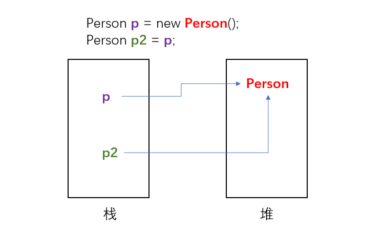

# Java 创建对象的过程

当我们实例化一个对象时，例如：

```java
Person p = new Person();
```

Java首先会在堆中开辟一块内存空间用来存放这个新的 Person 对象，然后在栈中创建一个引用 p ， p 指向堆中的 Person 对象。这样，我们通过 p 就能找到 Person 的内存地址。

之后，我们执行：

```java
Person p2 = p;
```

我们创建了一个新的引用 p2， p2 跟 p 一样，都是保存在栈中，也指向了 Person 对象。当我们改变 p2 的状态， p 也会跟着改变，因为他们指向同一个对象。

<!-- more -->



---

# 类块加载顺序

在一个类中，可能存在：

- **静态块**：用 static{ } 声明，JVM 加载类时执行，仅执行一次（**注意**：如果在静态块中声明了变量，如 `int a = 1;`, 它是一个局部变量，在该静态块执行结束后就会失效）
- **构造块**：类中直接用 { } 定义，每一次创建对象时执行

在有继承关系的类中，加载顺序如下：
1. 父类静态块
2. 子类静态块
3. 父类构造块
4. 父类构造方法
5. 子类构造块
6. 子类构造方法

注意：如果 main 在该类下，JVM 先加载类，然后才会执行 main() 方法

## 示例一

```java
public class Go {

    {
        System.out.println("blockA");
    }

    static {
        System.out.println("blockB");
    }

    public static void main(String[] args) {

    }
}
```

输出结果：

```
blockB
```

main方法什么都不做，但是当我们执行时这个空的main方法，Go类会被JVM加载，因此输出静态块 `blockB`。

## 示例二

```java
public class Go {

    public static Go t1 = new Go();

    {
        System.out.println("blockA");
    }

    static {
        System.out.println("blockB");
    }

    public static void main(String[] args) {

    }
}
```

输出:
```
blockA
blockB
```

main()依然什么都不做，但是在JVM加载Go类时（只会加载一次），第一行 new 一个新的 Go 对象，new 的时候调用了构造快，因此输出 `blockA`，之后，Go类继续加载，执行静态块，输出 `blockB`。

## 示例三

```java
public class Go {

    public static Go t1 = new Go();

    {
        System.out.println("blockA");
    }

    static {
        System.out.println("blockB");
    }

    public static void main(String[] args) {
        Go t2 = new Go();
    }
}
```

输出：
```
blockA
blockB
blockA
```

JVM 加载 Go类 时（只会加载一次），第一行 new 一个新的 Go 对象，new 的时候调用了构造快，因此输出 `blockA`，之后，Go类继续加载，执行静态块，输出 `blockB`。

然后 main 方法执行，new 一个 Go，调用构造块，再次输出`blockA`。

---


# 面向对象的三个特征

面向对象的三个特征分别是：**封装**、**继承**、**多态**，如果还有的话，**抽象** 也算一个。

## 封装

所谓封装，就是将 **数据项** 与 **相关的操作** 结合为一个整体，并将其从外部可见性划分为若干级别（private、protected、public），从而 **将数据结构的外部特性与其内部实现相分离**，提供一致且标准的对外接口，隐藏内部的实现细节。

封装不仅仅是 private + getter/setter ，使用封装可以对 setter 进行更深层次的定制，例如你可以对执行方法的对象做规定，也可以对数据做一定的要求，还可以做类型转换等等。

### 为什么要使用封装？

1. 使用封装不仅仅安全，更可以简化操作。
2. 封装还有一个重要的意义，那就是我们可以对程序的正确性进行分析，并且将无意中破坏设计约束的条件变得更难。（《Java并发编程实战》p33）

## 继承

当子类继承父类后，子类是一种特殊的父类，能直接或间接获得父类里的成员。

### 为什么要使用继承 ？

实现软件复用和扩展。

## 多态

多态就是 **事物在运行过程中存在不同的状态**

### 多态的三个前提

1. 有继承关系
2. 子类要重写父类的方法
3. 父类引用指向子类对象

### 多态的例子

例如有 Cat 类继承了 Animal 类 ，并重写了 `eat()`、`sleep()` 方法(sleep是静态方法，不属于重写，但我们假设 Cat类 也定义了这个方法)，并增加了一个 Animal 没有的 `CatchMouse()` 方法。

在测试类中实例化：

```java
// 这个语句在堆内存中开辟了子类(Cat)的对象，并把栈内存中的父类(Animal)引用指向了这个 Cat 对象
Animal am = new Cat();

//调用实例方法，调的是 Cat 的方法
am.eat();

//调用静态方法，调的是 Animal 的方法
am.sleep(); // 不建议

Animal.sleep(); // 建议
```

可以发现，实例方法 `am.eat()` 输出的是 Cat 类重写后的方法，而静态方法`am.sleep()` 输出的是 Animal 类的方法（尽管 Cat 也写了同名的 sleep 方法，但这不算 Override，运行时不被识别）

**扩展**：有趣的是，当我们用对象实例去调用静态方法，如`am.sleep();`，IDEA会给我们一个提示：Static member 'Test.Animal.sleep()' accessed via instance reference 。意思是说，建议我们使用 `Animal.sleep()` 来调用静态方法而不要用 `am.sleep()`。此外，使用静态变量也应如此。

### 多态的弊端

假如我们要执行父类没有而子类特有的`CatchMouse()`方法。

```java
Animal am = new Cat();
am.CatchMouse();
```

结果却编译报错了。

可见，多态 **不能使用子类特有的成员属性和子类特有的成员方法。**

那怎么办呢？ 这时候就要用到`向下转型`。可以使用`instanceof`操作符判断是不是我们需要的引用类型。

```java
Animal am = new Cat();

//如果 am 可以向下转型为 Cat 类，则类型转换
if (am instanceof Cat) {
    Cat ca = (Cat) am;
    ca.CatchMouse();
}
```

### 为什么要使用多态？

当把不同的子类对象都当作父类类型来看，可以屏蔽不同子类对象之间的实现差异，从而写出通用的代码达到通用编程，以适应需求的不断变化。

- 关于继承和多态，见另一篇：[Java简明笔记（四） 继承](../post/2fJava80.html)

---

# public、protected、private

- **public**：所有类可以访问
- **protected**： 同一个包可以访问 + 子类可以访问（无论是不是在同一个包中）
- **private**： 只有自己能访问
- **不修饰(friendly)**：同一个包内可访问

---

# 对象和方法

##  Mutator 方法 和 Accessor 方法

如果一个方法改变了调用它的对象，我们就说这是一个`Mutator`方法（更改器），反之如果不改变调用自己的对象，它就是`Accessor`方法 （访问器）。比如 plusDays 方法如果改变 Date对象 的状态，不返回结果，就是`Mutator`方法，如果 plusDays 不改变 Date对象，而是返回一个新构造的 LocalDate对象，就是`Accessor`方法。

## 其他

* Java中，变量只能持有对象的引用。引用是与实现相关的一种定位对象的方式。
* 在类的实例上运行的方法称为`实例方法`。
* Java中，所有没有被声明为`static`的方法都是实例方法。

---

# 局部变量和类变量

类中的变量可以不用初始化，使用相应类型的默认值即可，方法中的定义的局部变量必须初始化，否则调用的时候，会导致编译不通过。

```java
public class Main {
    // 有默认值 0 和 0.0
    public int i;
    public static double d;

    public static void main(String[] args) {
        // 类中定义的变量可以直接使用
        System.out.println(Main.d);
        Main m = new Main();
        System.out.println(m.i);

        // 方法中定义的变量，必须赋初值，否则调用时编译报错
        int k;   // 这一步是允许的
        System.out.println(k); // 报错
    }
}
```

---

# this

## 用于表示实例变量

在对象上调用方法时，this引用 指向该对象。this 清晰地区分了局部变量和实例变量。带有this的是实例对象。

```Java
public void raiseSalary(double byPercent){
  double raise = this.salary * byPercent / 100;
  this.salary += raise;
}
```

不想给参数起不同的名称时，也可使用this

```Java
public void setSalary(double salary){
  this.salary = salary;
}
```

## 用于构造函数

一个类可以有多个构造函数。一个构造函数可以调用另一个构造函数，用this。且只能写在第一行。

```java
public Employee (double salary){
    // 调用另一个构造器
    this("", salary);
    // ...
}
```

---

# 值传递

* 当你将对象传递给方法，方法获得该对象引用的拷贝。
* Java中，所有参数，对象引用以及基本类型值都是值传递。

下面的例子无法工作，因为sales被复制进x,然后x增加，然而x只是局部变量，这并不更改sales

```Java
// 无法工作
public void increaseRandomly(double x){
  double amount = x * generator.nextDouble();
  x += amount;
}

boss.increaseRandomly(sales);
```

同样的，不可能写出一个方法将对象引用修改成其他东西。下面的例子中，引用fred被复制进变量e，在e被设置成不同的引用之前是会影响 fred 的，因为他们指向同一个内存区域，**但是，在e设置成不同的引用之后就不再影响 fred** 。

```Java
public class EvilManager{

  // e 其实是 fred 的拷贝
  public void replaceWithZombie(Employee e){
    // 现在，e的 name 属性被设为 angle， fred的angle也会被设为angle
    // 因为 e 和 fred 虽然是不同的引用，但是他们指向了同一个内存区域
    e.setName("angle");

    // e现在指向了一个新的 Employee ，跟 fred 没有任何关系了
    // e 往后的改变都不会影响 fred
    e = new Employee("",0);
    e.setName("evil");
  }
}

// 将 fred 传给方法
boss.replaceWithZombie(fred);
```

---

# 构造函数

* 构造函数的名称与类名称相同。并且不返回任何类型！
* 构造函数没有返回类型，如果你不小心加了void，那这是一个名称跟类名相同的方法，不是构造函数。
* 构造函数可以重载。
* 如果有多个构造函数，将共有代码放在其中一个构造函数里，然后在其他构造函数可以调用另一个构造函数，这时候调用要使用this。且只能作为构造函数方法体的第一条语句。
- 构造函数不能被static、final、synchronized、abstract、native修饰，但可以被public、private、protected修饰；

```Java
public Employee (double salary){
  this ("", salary);  //调用构造函数 Employee (String, salary)
  //...                 //其他内容
}
```

* 如果构造函数中没有设置实例变量的值，系统会自动设定：数字为0，boolean为False, 对象引用为null。
* **尽量不要忘记给对象引用初始化**。假设我们没有在构造函数中将变量name设置为空字符串，那么当有人调用`getName`方法，如`if (e.getName().equals("Jerry"))`，就会导致空指针异常。
- **在调用子类构造器之前，会先调用父类构造器**。当子类构造器中没有使用"super(参数或无参数)"指定调用父类构造器时，是默认调用父类的无参构造器，如果父类中包含有参构造器，却没有无参构造器，则在子类构造器中一定要使用“super(参数)”指定调用父类的有参构造器，不然就会报错。

---

# static

## static方法

如果将方法声明为static，该方法就是静态方法，即可以不用运行在对象上的方法。**静态方法没有 this 指针**。

静态方法要调用实例方法前必须先 new 对象，但静态方法可以直接调用其他静态方法（包括其他类的静态方法）。

## static变量（类变量）

如果在类中将变量声明为static，那么该变量属于类，而不是属于对象，它在所有的实例中的值是一样的。<font color="red">注意：static静态变量只能在类主体中定义，不能在方法里面定义(无论是静态方法还是实例方法)</font>

像下面这样是错误的：
```java
public static void main(String[] args) {
    // 错误，static不能用在方法里面
    // 无论是静态方法还是实例方法都不可以
    static int a = 10;
}
```

## 静态变量和实例变量的区别

实例变量属于某个对象的属性，必须创建了实例对象，其中的实例变量才会被分配空间，才能使用这个实例变量。静态变量不属于某个实例对象，而是属于类，所以也称为类变量，只要程序加载了类的字节码，不用创建任何实例对象，静态变量就会被分配空间，静态变量就可以被使用了。

**总之，实例变量必须创建对象后才可以通过这个对象来使用，静态变量则可以直接使用类名来引用。**

## 静态方法可以被 Override 吗？

不能。因为 Override 是基于运行时动态绑定的，而 static 方法是编译时静态绑定的。static 方法跟类的任何实例都不相关。

## 静态方法常见用法

**工厂方法**：工厂方法是指返回一个类的新实例的静态方法。

---

# final

## final 修饰类

表示该类不能被继承。此时和 abstract 是反义词。

## final 修饰方法

表示方法不能被 Override(覆盖)。

## final 修饰变量

通常用 `static final` 表示常量，如:

```java
 public static final double PI = 3.14159265358979323846;
```

**注意**：当使用可修改对象的引用时，fianl修饰符只是声明该引用永不改变。<font color="red">但修改对象自身是完全合法的。</font>

下面的例子中，ArrayList 集合里面具体的值可以修改，但 friends 这个引用不能改变，尤其是不能变成null。

```Java
public class Person{
  private final ArrayList<Person> friends = new ArrayList<>();
  //可以给该数组列表添加元素
  ...
}
```

**注意**：当 final 变量作为类的成员变量时，必须显示初始化或者在构造函数中初始化。

```java
public class A{
  // 允许，但是构造函数中必须初始化 i
  final int i;

  // 正确
  final int j = 4;
}
```

---

# abstract

abstract指的是抽象，即没有实现，也不能被实例化。此外，接口属于特殊的 abstract 类，也是 abstract 类。

## abstract 修饰类

抽象类。抽象类中可以有抽象方法，也可以有实现方法。抽象类可以有 `private` 变量。但最好不要这么干。因为实现类继承了将会无法使用。

## abstract 修饰方法

抽象方法。abstract 方法必须在 abstract 类或接口中。

---

# 内部类

Java 中的内部类分为
1. 成员内部类
2. 局部内部类
3. 静态内部类
4. 匿名类

## 内部类简述

### 成员内部类

即在类里面嵌套另一个类，内部类可以直接访问外部类 private 实例属性。也就是说，成员内部类可以无条件访问外部类的成员。

实例化方法：

```
内部类名 实例名 = 外部类实例名.new 内部类名();
```

### 局部内部类

局部内部类是定义在一个方法或者一个作用域里面的类，它和成员内部类的区别在于局部内部类的访问仅限于方法内或者该作用域内。局部内部类就像是方法里面的一个局部变量一样，不能有public、protected、private 以及 static 修饰符。


### 静态内部类

与非静态内部类不同，静态内部类的实例化 不需要一个外部类的实例为基础，可以直接实例化。

只有静态内部类才可以声明静态方法。静态方法不可以使用非静态变量。

实例化方法：
```
内部类名 实例名 = new 内部类名();
```

### 匿名类

通常情况下，要使用一个接口或者抽象类，都必须创建一个子类，有的时候，为了快速使用，直接实例化一个抽象类，并“当场”实现其抽象方法。这就是匿名类。

简单地说，匿名类就是声明一个类的同时实例化它。

- 匿名类可以用 lambda 表达式替代。
- 在匿名类中使用外部的局部变量，外部的局部变量必须修饰为final （但 jdk 1.8 以后不用声明为 final， jdk 会为你加）


```java
class jump implements Runnable {
    public void run(){
        System.out.println("jump now");
    }
}

public class test {
    public static void main(String[] args) {
        //不使用匿名类
        Runnable r = new jump();
        Thread t1 = new Thread(r);
        t1.start();

        //使用匿名类
        new Thread(new Runnable() {
            @Override
            public void run() {
                System.out.println("swim now");
            }
        }).start();

        //使用 lambda 表达式
        new Thread( () -> System.out.println("go away now")).start();
    }
}

```

## 为什么使用内部类 ？

1. 每个内部类都能独立的继承一个接口的实现，所以无论外部类是否已经继承了某个(接口的)实现，对于内部类都没有影响。内部类使得多继承的解决方案变得完整。
2. 方便将存在一定逻辑关系的类组织在一起，又可以对外界隐藏。
3. 方便编写事件驱动程序
4. 方便编写线程代码

## 为什么成员内部类可以无条件访问外部类的成员？

当我们有一个外部类 Outter，里面包含一个成员内部类 Inner，编译之后会生成两个文件：

1. Outter.class
2. Outter$Inner.class

在 Outter$Inner.class 文件中，可以找到：

```java
final com.jerrysheh.Outter this$0;
```

也就是说，编译器会默认 <font color="red">为成员内部类添加了一个指向外部类对象的引用</font>

那么这个引用如何赋初值呢？看一下构造器：

```java
public com.jerrysheh.Outter$Inner(com.jerrysheh.Outter);
```

也就是说，<font color="red">内部类对象被构造的时候，自动传入了一个外部类对象的引用，因此可以在成员内部类中随意访问外部类的成员。</font>

## 为什么局部内部类和匿名内部类只能访问局部final变量？

方法 A 中定义了局部内部类 B，当 方法A 执行完毕，已经结束作用域，如果内部类 B 的方法（可能由另一个线程执行）还没结束，但由于 A 结束作用域，方法 A 的变量 a 会不可访问。为了解决这一问题， Java 采用了 **复制** 的手段，即把方法 A 的变量 a 复制一份到内部类 B 的常量池。

但是复制过后会产生不一致的问题，也就是内部类的方法修改了 a ， 但是外部类的 a 没有改变。

因此，Java 规定，只能访问 final ，以避免上述问题。

> 引申: Java是如何复制的 ？ 如果局部变量的值在编译期间就可以确定，则直接在匿名内部里面创建一个拷贝。如果局部变量的值无法在编译期间确定，则通过构造器传参的方式来对拷贝进行初始化赋值。

---

# 枚举类的用法

枚举类有多少个实例，就会调用多少次构造方法。

## 例子一

定义了一个枚举类，成员 `KBMH("hello")` ，如果括号里面是 String 的话，下面相应的要定义一个 `String ID` 。

```java
public enum ComicTypeEnum {
    KBMH("/category/weimanhua/kbmh"),        // 恐怖漫画
    GSMH("/category/weimanhua/gushimanhua"),  // 故事漫画
    QQMH("/category/weimanhua/qiqumanhua"),   // 奇趣漫画
    GXMH("/category/weimanhua/gaoxiaomanhua"); // 搞笑漫画

    String ID;

    ComicTypeEnum(String ID){
        this.ID = ID;
    }

    public String getID() {
        return ID;
    }
}
```

使用：

```java
String storyComic = ComicTypeEnum.GSMH.getID();
```

## 例子二

定义枚举类型：

```java
enum Weekday {
    MON,
    TUE,
    WED,
    THU,
    FRI,
    SAT,
    SUN
};
```

使用：

```java
Weekday startDay = Weekday.MON;
```

---

# 面向对象的五个基本原则

## 单一职责原则（Single-Resposibility Principle）

一个类，最好只做一件事，只有一个引起它的变化。单一职责原则可以看做是低耦合、高内聚在面向对象原则上的引申，将职责定义为引起变化的原因，以提高内聚性来减少引起变化的原因。


## 开放封闭原则（Open-Closed principle）

软件实体应该是可扩展的，而不可修改的。也就是，对扩展开放，对修改封闭的。

## Liskov替换原则（Liskov-Substituion Principle）

子类必须能够替换其基类。这一思想体现为对继承机制的约束规范，只有子类能够替换基类时，才能保证系统在运行期内识别子类，这是保证继承复用的基础。

## 依赖倒置原则（Dependecy-Inversion Principle）

依赖于抽象。具体而言就是高层模块不依赖于底层模块，二者都同依赖于抽象；抽象不依赖于具体，具体依赖于抽象。

## 接口隔离原则（Interface-Segregation Principle）

使用多个小的专门的接口，而不要使用一个大的总接口
