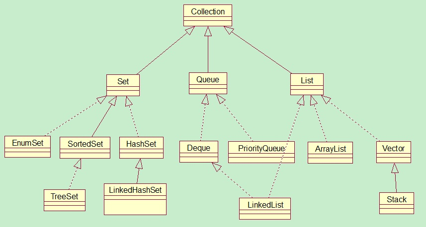
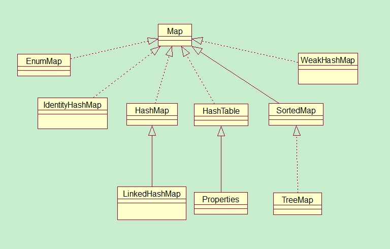

# 集合和集合框架

## 什么是集合？

集合就是一个放数据的容器，准确的说是放数据对象引用的容器。

Java集合主要可以划分为三个部分：
1. Collection（包含 List 和 Set ）
2. Map （键值对）
3. 工具类（Iterator迭代器、Enumeration枚举类、Arrays和VCollections）

<!-- more -->

Java的集合类主要由两个接口派生而来：**Collection** 和 **Map** ，这两个是集合框架的根接口，这两个接口又包含了一些 **子接口** 或 **实现类** 。如下图：





所有的集合框架都包含如下内容：

* **接口**：是代表集合的**抽象数据类型**。比如Collection接口，以及子接口List。
* **实现（类）**：是集合接口的具体实现。从本质上讲，它们是可重复使用的**数据结构**。比如ArrayList是List接口的具体实现。
* **算法**：是实现类对象里的方法，用于执行一些有用的计算，例如：搜索和排序。这些算法被称为多态，因为相同的方法可以在相似的接口上有着不同的实现。比如 Collections 工具类提供了`sort()`、`reverse()`等方法。


(参考：[菜鸟教程](http://www.runoob.com/java/java-collections.html), [极乐科技](https://zhuanlan.zhihu.com/p/24234059))

## 为什么要用集合？

使用集合框架的优点之一是：当遇到一些基本算法时，不必重新实现。一些例如addAll、removeIf等基本方法是Collection接口已经定义好的。

Collections工具类包含很多额外的可在集合上操作的算法，你可以对列表进行排序、打乱、旋转、翻转操作；在集合中查询最大或最小元素，或者任意一个元素的位置；生成不含元素或者含一个元素或同一个元素n份拷贝的集合。

---

# 有序集合——List

List 指有序的集合，List类是一个抽象类。

实现类 ArrayList 和 LinkedList 实现了 List 接口。所以我们平时用的时候，要指定是 ArrayList 还是 LinkedList。

> 我应该用 ArrayList 还是 LinkedList ？
> **链表插入操作很快，但遍历很慢**。因此当应用需要有序集合时，用 ArrayList 可能会更好。但是注意， ArrayList 和 LinkedList 都是线程不安全的。

## ArrayList

ArrayList的声明

```java
//这种是默认创建大小为10的数组，每次扩容大小为1.5倍
ArrayList list=new ArrayList();   

//这种是指定数组大小的创建，没有扩充
ArrayList list=new ArrayList(20);  
```

ArrayList使用示例：

```java
public static void main(String[] args) {
    List<String> groupName = new ArrayList<>();
    groupName.add("jerry");
    groupName.add("calm");
    groupName.add("Superman");

    //输出：groupName的大小：3
    System.out.println("groupName的大小：" + groupName.size());

    //输出：groupName原始的内容[jerry, calm, Superman]
    System.out.println("groupName原始的内容" + groupName);

    //输出：jerry在容器的位置：0
    System.out.println("jerry在容器的位置：" + groupName.indexOf("jerry"));

    //将下标1的内容替换为 Paul
    groupName.set(1,"Paul");

    //输出：groupName替换后的内容[jerry, Paul, Superman]
    System.out.println("\ngroupName替换后的内容" + groupName);
}
```

下面是一些常用方法

| 常用方法 | 简介 |
| :------------- | :------------- |
| add     | 增加，支持直接加在末尾，或者指定位置 |
| contain | 判断容器中是否存在某个对象（而不是对象值相等） |
| get     | 获取指定位置的对象（如果越界会报错）	|
| indexOf | 获取对象所处的位置(从0开始)	|
| remove | 删除，支持按下标或者按对象 |
| set (index, object)  | 替换 |
|  size  | 获取大小 |
| toArray  | 转换为数组 |
|  addAll | 把另一个容器所有对象都加进来 |
| clear | 清空 |
| subList | 取子列表 list1 = list2.subList(start, end);

## LinkedList

使用示例：

```java
List<String> staff = new LinkedList<>();
staff.add("Amy");
staff.add("Bob");
staff.add("Carl");

// 使用Iterator来遍历，可删不能增
Iterator iter = staff.iterator;
String first = iter.next(); // visit first element
String second = iter.next(); //visit second element
iter.remove(); // remove last visited element (second element)

// 使用ListIterator可以遍历，也可以增删
ListIterator<String> lIter = staff.listlterator();
lIter.next();  // visit first element
lIter.add("jerry"); // insert jerry at 2nd position
```

`LinkedList.add()` 方法将对象添加到链表的尾部。但是，常常需要将元素添加到链表的中间。这就要借助迭代器 Iterrator 来实现。

### 为什么这里用 ListIterator ，而不是Iterator

原因是 Iterator 是适用于包括无序集合 Set 在内的所有集合类的，因此不提供`.add()`方法。而子接口 ListIterator，仅仅在 List 集合能用。它提供了 `.add()` 方法，就可以在中间进行插入操作了。

### ListIterator 和 Iterator 的区别：

1. 使用范围不同，Iterator 可以应用于所有的集合，Set、List 和 Map 和这些集合的子类型。而 ListIterator 只能用于 List 及其子类型。
2. ListIterator 有 add 方法，可以向 List 中添加对象，而 Iterator 不能。
3. ListIterator 和 Iterator 都有 hasNext() 和 next() 方法，可以实现顺序向后遍历，但是 ListIterator 有 hasPrevious() 和 previous() 方法，可以实现逆向（顺序向前）遍历。Iterator 不可以。
4. ListIterator 可以定位当前索引的位置，nextIndex() 和 previousIndex() 可以实现。Iterator 没有此功能。
5. 都可实现删除操作。但是 ListIterator set() 方法可以实现对象的修改。Iterator 仅能遍历，不能修改。


## ArrayList、LinkedList、Vector的区别

### ArrayList 和 Vector

**相同点**：Arraylist和Vector是采用数组方式存储数据。
**不同点**：Vector由于使用了synchronized方法-线程安全，所以性能上比 ArrayList 要差。但是 ArrayList 是线程不安全的。

### ArrayList 和 LinkedList

**相同点**：ArrayList 和 LinkedList 在末尾插入都很快。
**不同点**：LinkedList使用 **双向链表** 实现存储，按序号索引数据需要进行向前或向后遍历，插入数据时只需要记录本项前后项即可，因此在中间插入数据较快。ArrayList遍历十分快，LinkedList中间插入特别快。

## List 如何去重

Java 8 使用 Stream:

```java
list = list.stream().distinct().collect(Collectors.toList());
```

---

# 无序集合——Set

Set 中元素是无序的，且不允许重复的元素，<font color="red"> 只能用 Iterator 迭代器取出 Set 中的元素。</font> Set的 `add` 方法首先在集合中查找要添加的对象，如果不存在就将这个对象添加进去。

HashSet 和 TreeSet 实现了 Set 接口，但都是线程不安全的。它们的底层数据结构是 **哈希表**。

> **哈希表(Hashtable)**，也称散列表，是一种数据结构。 哈希表为每个对象计算一个整数，称为 **散列码（hash code）**。

## HashSet

HashSet 依靠元素的 hashCode方法 和 euqals方法 来确保元素的唯一性。

HashSet包含敏感词检测的例子

```java
Set<String> badWords = new HashSet<>();
badWords.add("fuck");
badWords.add("drugs");
badWords.add("shit");
if (badWords.contain(username.toLowerCase())) {
  System.out.println("please choose a different username")
}
```

## TreeSet

如果想要按顺序遍历Set集合，或者要对Set集合中的元素进行排序，可以使用TreeSet。

TreeSet通过compareTo或者compare方法中的来保证元素的唯一性。元素是以二叉树的形式存放的，TreeSet使用了红黑树来对元素排序。

---

# 队列集合——Queue

Queue会记住插入顺序，但只能在尾端插入，头端删除。Deque有两个尾端，头尾都可以插入和删除。上面提到的 LinkedList 就实现了 Deque 接口，是双向链表。

Queue接口的 `add(E e)`方法 和 `offer(E e)`方法都是往队列里添加元素，但二者对插入失败时的处理不同，前者在插入失败时抛出异常让你处理，后则则直接返回false。但在优先队列里这两者无区别，都是调用 offer。

## PriorityQueue 优先队列

PrioriryQueue是 Queue 接口的一个队列实现类。PriorityQueue的排序是基于堆排序的。不允许空值。PrioriryQueue的 add 方法和 offer 方法是一样的。

```java
Queue<Integer> p =  new PriorityQueue<>(10 , (o1,o2) -> o2 - o1));
p.offer(5);  // 往堆里添加元素
p.offer(8);
p.peek();  // 获取堆顶但不删除
p.pool();  // 获取堆顶并删除
```

PriorityQueue构造器支持两个参数，第一个参数是优先队列的大小，第二个参数是一个 Comparator 比较器，可以自己实现比较方法。JDK1.8 可以用 lambda 表达式替代匿名类。

## ConcurrentLinkedQueue

并发情况下安全的先进先出队列。

## BlockingQueue

阻塞队列。获取一个元素时，如队列为空，则获取操作一直阻塞，直到队列中出现一个可用元素。插入一个元素时，如果队列已满，则插入操作一直阻塞，直到队列中元素减少。BlockingQueue在“生产者-消费者”模式中非常有用。

---

# 键值对集合——Map

Map存储键值对。不允许重复的键，但不同键允许有相同的值。用`put()`方法添加新的键值对或者改变原有的值。

## Map的实现类

### 1. Hashtable（遗留类，尽量不用）

Map的一个实现是`Hashtable`，线程安全，速度慢。底层是 **哈希表** 数据结构。是同步的。不允许null作为键和值。

**注意**：Hashtable 是一个“遗留的”容器类，应该尽可能不用。在需要并发的场景，使用 ConcurrentHashMap 。或者用 Collections 工具类的的 synchronizedMap 方法。

```java
HashMap hashMap = new HashMap();
Map map = Collections.synchronizeMap(hashMap);
```

### 2. HashMap （jdk 1.8实现）

Map的另一个实现是`HashMap`，线程不安全，速度快。其底层也是 **哈希表** 数据结构（即链表+数组，在Java8中又加入了红黑树）。是不同步的。允许null作为键和值。替代了Hashtable。

#### 为什么 java8 要加入红黑树？

HashMap使用 **链地址法** 来解决冲突。但是使用链地址法会导致 `get` 的效率从`o(1)`降至`o(n)`，所以在 Java8 中，链表长度超过阈值 8 时，将链表转换为红黑树，这样大大减少了查找时间。

#### hashMap的 Hash 过程


> 为什么要将hash的高16位和低16位异或？
> 让高位也参与计算，减少某些数值的hash冲突。例如，Float类型的 1f, 2f ,3f ,4f 的 hash值 低16位全部都是0，只有高16位不同。因此采用异或让高位也参与计算。

#### hashMap的 put 过程

1. 确定要存入的桶。先使用 hash() 函数获取该对象的 hash 值，高16位和低16位异或后跟 Entry对象数组大小-1 进行与操作，得到应该存入数组的下标。
2. 链表插入。假如该位置为空，就将value值插入，如果该下标不为空，则要遍历该下标上面的对象，使用equals方法进行判断，如果遇到equals()方法返回真则进行替换，否则将其插入。

#### hashMap的 get 过程

1. 根据 key 对象的 hash 值找到 Entry 对象数组的对应下标。
2. 判断Entry的 key 和 给定的 key 是否相同（equals或==），以及 hash 是否也相同，如果不是，访问链表下一个 Entry ，如果是，返回 Entry 的 value，如果遍历完了也没有，返回 null

#### HashMap的使用例子

```java
Map<String, Integer> counts = new HashMap();
counts.put("Alice",1);
counts.put("Jerry",2);
counts.put("Alice",3); //改变原有值

int count = counts.get("Alice"); //获取Alice对应的值，这里是3

//如果Alice对应的值不存在，用get方法会得到空指针异常
//下面这句避免了空指针异常

//获取Alice对应的值，如果值不存在，返回0
int count = counts.getOrDefault("Alice", 0);

//如果word不存在，将word与1形成键值对，否则将word+1
counts.merge(word, 1, Integer::sum);
```

### 3. ConcurrentHashMap

ConcurrentHashMap 是线程安全的 hashMap，其底层也是 哈希表（数组+链表） + 红黑树 实现。

#### ConcurrentHashMap 如何保证线程安全？

JDK1.8 的 ConcurrentHashMap 采用 CAS（compare and swap）+ Synchronized 保证线程安全。 JDK1.7 及以前采用segment的分段锁机制实现线程安全，其中 segment 继承自ReentrantLock，因此采用Lock锁来保证线程安全。

## 4. LinkedHashMap

可以保证HashMap集合有序。存入的顺序和取出的顺序一致。

## 5. TreeMap

可以用来对Map集合中的键进行排序，底层是采用红黑树。

---

# 迭代器 Iterator

每个集合都提供了某种顺序迭代元素的方式。

Collection的父接口 Iterable<T> 定义了一个方法：

```java
Iterator<T> Iterator()
```

这个方法生成一个迭代器，用来访问元素。

## 迭代 List 和 Set

在下面这个例子中，iter是一个迭代器，迭代的对象是 groupName ， while循环用来访问元素。

```java
public static void main(String[] args) {
    List<String> groupName = new ArrayList<>();
    groupName.add("jerry");
    groupName.add("calm");
    groupName.add("Superman");
    groupName.set(1,"Paul");

    // 用迭代器
    Iterator<String> iter = groupName.iterator();
    while (iter.hasNext()){
        String name = iter.next();
        System.out.println(name);
    }
}
```

当然这个例子用 foreach 更简单
```java
//用 foreach
for (String name :
        groupName) {
    System.out.println(name);
}
```
不过 foreach 也有缺点：
* 无法用来进行ArrayList的初始化
* 无法得知当前是第几个元素了，当需要只打印单数元素的时候，就做不到了。必须再自定下标变量。

## 迭代 Map

迭代 Map 稍微有点不同，需要先将 map 放到一个 set 里面。

```java
Map<String,Integer> map = new HashMap<String, Integer>();
Set<Map.Entry<String, Integer>> entry = map.entrySet();
Iterator<Map.Entry<String, Integer>> iter = enrty.iterator();

while(iter.hasNext()){
  Map.Entry<String, Integer> next = iter.next();
}
```

## 遍历过程修改集合内容

使用 Iterator 可以对集合进行遍历，但是 **不能在遍历过程对原集合做增、删、改**，会抛出 ConcurrentModificationException。

```java
while(it.hasNext()){  
    String str = it.next();
    if(str.equals("abc")){
        // 错误，抛出Concurrent Modification Exception
        list.remove(str);  
    }  
 }
```

要对集合进行增删改操作，必须在 Iterrator 对象上操作，而不是原集合 List 上操作，因此，修改如下：

```java
while(it.hasNext()){  
    String str = it.next();
    if(str.equals("abc")){
        // 正确
        it.remove();  
    }  
 }
```


## 快速失败（fail—fast）和 安全失败（fail—safe）

### fail—fast

在用迭代器遍历一个集合对象时，如果遍历过程中对集合对象的内容进行了修改（增加、删除、修改），则会抛出Concurrent Modification Exception。

原理：迭代器在遍历时直接访问集合中的内容，并且在遍历过程中使用一个 modCount 变量。集合在被遍历期间如果内容发生变化，就会改变 modCount 的值。每当迭代器使用 hasNext()/next() 遍历下一个元素之前，都会检测 modCount 变量是否为 expectedmodCount 值，是的话就返回遍历；否则抛出异常，终止遍历。

**注意**：这里异常的抛出条件是检测到 `modCount！=expectedmodCount` 这个条件。如果集合发生变化时修改modCount值刚好又设置为了expectedmodCount值，则异常不会抛出。**因此，不能依赖于这个异常是否抛出而进行并发操作的编程，这个异常只建议用于检测并发修改的bug。**

场景：java.util 包下的集合类都是快速失败（fail—fast）的，不能在多线程下发生并发修改（迭代过程中被修改）。


### fail—safe

采用安全失败（fail—safe）机制的集合容器，在遍历时不是直接在集合内容上访问的，而是先复制原有集合内容，在拷贝的集合上进行遍历。

原理：由于迭代时是对原集合的拷贝进行遍历，所以在遍历过程中对原集合所作的修改并不能被迭代器检测到，所以不会触发Concurrent Modification Exception。

缺点：基于拷贝内容的优点是避免了Concurrent Modification Exception，但同样地，迭代器并不能访问到修改后的内容，即：迭代器遍历的是开始遍历那一刻拿到的集合拷贝，在遍历期间原集合发生的修改迭代器是不知道的。

场景：java.util.concurrent包下的容器都是安全失败（fail—safe），可以在多线程下并发使用，并发修改。

## ArrayList 使用 Iterator 的实际例子

ArrayList和Iterator的例子，要求初始化50个 hero，名字为 hero0,hero1,hero2...hero50， 然后删除 hero8,hero16,hero24...

- 可以用 foreach ， 也可以用 Iterator

```java
public static void main(String[] args) {
    List<String> groupName = new ArrayList<>();

    // 初始化 50 个 hero
    for (int i = 0; i <= 50; i++) {
        groupName.add("hero" + i);
    }

    System.out.println(groupName);

    //迭代groupName的迭代器
    Iterator<String> iter = groupName.iterator();

    List<String> waitToRemove = new ArrayList<>();

    //开始迭代，把8的倍数记录下来
    while (iter.hasNext()){
        String name = iter.next();
        int i = groupName.indexOf(name);
        if (i % 8 ==0 ){
            waitToRemove.add(name);
        }
    }

    groupName.removeAll(waitToRemove);
    System.out.println(groupName);
}
```

这里有两个坑:
* 不能在iterator迭代的过程中，对容器进行增删操作。否则会抛出ConcurrentModificationException
* 不要在一次迭代中进行多次 `iter.next()` 操作

解决办法是：用一个waitToRemove容器，来存放待删除的数据，迭代完成再一并删除。或者用 ListIterator。

---

# Collection 和 Collections的区别

Collection是集合类的上级接口，子接口主要有Set 和List、Map。

Collections是针对集合类的一个帮助类，提供了操作集合的工具方法：一系列静态方法实现对各种集合的搜索、排序、线程安全化等操作。

例如，对List进行反转：

```java
List<Blog> blogList = blogService.findAll();
Collections.reverse(blogList);
```

---

# 将 数组（Array） 转换为 集合（ArrayList）

使用 `Arrays.asList()`方法将数组转换为ArrayList（注意是 Arrays, 不是 Array）

```java
// java.util.Arrays 源码第 3799 行
public static <T> List<T> asList(T... a) {
    return new ArrayList<>(a);
}
```

1. asList 方法 **不适用** 于基本数据类型（byte,short,int,long,float,double,boolean），但支持它们的包装类
2. 该方法将数组与列表链接起来，当更新其中之一时，另一个自动更新
3. 不支持add和remove，也就是说，转换后不能修改，只能读取
4. 之所以会把原数组和转换后的集合链接起来，还不支持修改的原因是，**asList方法返回的是 Arrays 类的内部类 `java.util.Arrays.ArrayList`，而不是集合里面的 `java.util.ArrayList`**。

Arrays.asList方法使用示例：

```java
String[] s = {"aa","bb","cc"};
        List<String> strlist = Arrays.asList(s);
        strlist.forEach(n-> System.out.println(n));
        for(String str:strlist){
            System.out.println(str);
        }
```

在 jdk 1.8 以上，可以用 lambda 替代 foreach 循环

```java
strlist.forEach(n-> System.out.println(n));
strlist.forEach(System.out::println);
```

- lambda的知识可参考 [Lambda表达式](../post/68278ec8.html)

如果你要“真正地”把数组转集合，而不是数组的内部类，应该这么做：

```java
Object[] arr = {obj1, obj2, obj3};
List<Object> objectList = new java.util.ArrayList<Object>(Arrays.asList(arr));
```

---

# Java集合一览

集合|描述
---|---
ArrayList|一种可以动态增长和缩减的索引序列
LinkedList|一种可以在任何位置进行高效地插人和删除操作的有序序列
ArrayDeque|一种用循环数组实现的双端队列
HashSet|一种没有重复元素的无序集合
TreeSet|一种有序集
EnumSet|一种包含枚举类型值的集
LinkedHashSet|一种可以记住元素插入次序的集
**PriorityQueue** |一种允许高效删除最小元素的集合
HashMap|一种存储键 / 值关联的数据结构
TreeMap|一种键值有序排列的映射表
EnumMap|一种键值属于枚举类型的映射表
LinkedHashMap|一种可以记住键 / 值项添加次序的映射表
WeakHashMap|一种其值无用武之地后可以被垃圾回收器回收的映射表
IdentityHashMap|一种用 = 而不是用 equals 比较键值的映射表

# 简要介绍其他集合

## Properties

Properties类实现了可以很容易地使用纯文本格式保存和加载的映射。是 map 的一种实现。 用于配置文件的定义和操作，使用频率非常高，同时键和值都是字符串。是集合中可以和IO技术相结合的对象。(到了IO在学习它的特有和io相关的功能。)

## BitSet

BitSet（位组）类用来存储一系列比特。

## stack、queue、deque、PriorityQueue

不支持从中间添加元素。如果需要用stack、queue、deque且不关心线程安全问题，建议用 ArrayDeque

## WeakHashMap

WeakHashMap类用来与垃圾回收器配合，当键的唯一引用来自Hash表条目时，就删除键值对。
