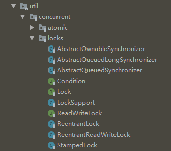

关于并发的理论基础，见另一篇 [聊聊并发和并发模型](../post/3bdfeb29.html)

---

# 在 Java 中创建线程

在 Java 中，线程是 java.lang.Thread 或其子类中的实例。通过 new 一个线程实例并调用 start 方法来启动线程。

```java
Thread thread = new Thread();
thread.start();
```

但是我们总得指定线程做一些事，可以用两种方式来指定。

<!-- more -->

## 方式一：继承 Thread 类

```java
public class MyThread extends Thread {
    @Override
    public void run(){
       System.out.println("MyThread running");
    }
}

Thread myThread = new myThread();
myThread.start();
```

## 方式二：实现 Runnable 方法(推荐)

创建一个类实现 Runnable 方法

```java
class MyRunnable implements Runnable {
    @Override
    public void run(){
       System.out.println("MyRunnable running");
    }
}

MyRunnable myRun = new MyRunnable();
Thread thread = new Thread(myRun， "第二个参数指定线程名字");
thread.start();
```

### 匿名类或lambda表达式方式

直接在 runnable 接口上实现匿名类

```java
// 匿名类
Runnable myRunnable = new Runnable(){
    @Override
    public void run(){
      System.out.println("Runnable running");
    }
}

// lambda
Runnable myRunable2 = ()-> System.out.println("Runnable running")
```

lambda表达式

```java
Thread t = new Thread( ()-> System.out.println("do something"));
```

特别提醒：

- 调用 `.start()` 方法才是启动线程，而调用 `.run()` 方法只是在当前线程上去执行 run 函数，并没有开启新线程。
- `.stop()` 方法已经被标记为 deprecated。因为它无法保证被停止的线程的状态，例如转账方法钱款已经转出，却还没有转入目标账户就被中止了。正确停止线程的方式应该是给定一个 boolean 变量，在方法中将其置 false。可以在 run 方法中加入 while() 循环 ，当主线程将 boolean 置 false， 子线程的 while 不再执行，从而 run 方法结束，线程退出。
- `.suspend()`方法也被标记为 deprecated。因为可能导致死锁：被挂起的线程持有锁，等待恢复，而将其挂起的线程又在等待该锁，导致死锁。

## 方式三：实现 Callable 方法(可回调)

需结合 Future 和 线程池 使用。参见：[Java并发编程之并发工具](../post/a23f9c20.html)

---

# 竞争条件和临界区

当多个线程同时访问一块共享区域的时候，就会产生竞争条件。考虑下面的例子：

```java
public class Counter {

   protected long count = 0;

   public void add(long value){
       this.count = this.count + value;
   }
}
```

从 Java 虚拟机的角度看，add 方法并不是一个原子操作，而是分为三步：

1. 将 this.count 读进 CPU 寄存器
2. 在寄存器里 + 数值
3. 将寄存器的值写回内存

假如有A、B两个线程同时执行 add 方法，那么可能发生：

```
this.count = 0;

A:  将 this.count 读进 CPU 寄存器 (0)
B:  将 this.count 读进 CPU 寄存器 (0)
B:  在寄存器里 + 2
B:  将寄存器的值 (2) 写回内存， this.count 现在是 2
A:  在寄存器里 + 3
A:  将寄存器的值 (3) 写回内存， this.count 现在是 3
```

我们期望的值是5，而结果却是3。如何解决呢？可以用 Java 提供的 **synchronized 同步代码块** 或者 **锁结构** 或者 java.util.concurrent.atomic 里面的 **原子变量** 来解决。

同步代码块

```java
public void add(int val1, int val2){
    synchronized(this.sum1Lock){
        this.sum1 += val1;   
    }
    synchronized(this.sum2Lock){
        this.sum2 += val2;
    }
}
```

---

# 线程安全和资源共享

## 什么是线程安全？

《Java并发编程实战》的作者 Brian Goetz 对线程安全的定义是：**当多个线程访问某个对象时，不管运行时环境采用何种调度方式或者如何交替执行，并且调用方不需要任何额外的同步操作，调用这个对象的行为都能获得正确的结果，那么就称这个对象是线程安全的**。

如果一段代码是线程安全的，那么就不会发生竞争条件。反过来说，对于非线程安全的代码，多个线程同时修改共享资源的时候，就会发生竞争条件。

因此我们得先知道 Java 中哪些资源是共享的，哪些是不共享的。

## 局部本地变量（完全线程安全）

局部变量存储在每个线程自己的栈内存中，不会共享，是线程安全的。

```java
public void someMethod(){

  long threadSafeInt = 0;

  threadSafeInt++;
}
```

## 引用变量（部分安全）

局部引用本身跟局部变量一样，其本身是不共享。但是引用指向的对象就不一定了，因为所有的对象存储在共享的堆里面的，因此不是线程安全的。但如果对象是局部方法里面声明的，那就是安全的。

## 类成员变量（不安全）

很明显成员变量（类变量）不是线程安全的。考虑下面的例子，当两个线程同时执行了 add 方法。结果很难预测。

```java
public class NotThreadSafe{
    StringBuilder builder = new StringBuilder();

    public add(String text){
        this.builder.append(text);
    }
}
```

## Thread Control Escape Rule

Thread Control Escape Rule（线程控制逃逸规则）：如果一个资源从创建、使用、到释放(dispose)这整个过程都由相同的一个线程负责，其控制权不会交给其他线程，那么整个资源就是线程安全的。

这里的资源，可以是一个对象、数组、文件、数据库连接、socket等等。在 Java 中，我们无法手动释放资源，因此释放可以理解为失去该对象的引用或置空(nulling)的过程。

但是注意，有时候尽管一个对象是线程安全的，但是应用不一定是安全的。比如，线程1和线程2分别创建了数据库链接 connection1 和 connection2， connection 本身是安全的，但是通过 connection 去访问数据库，可能造成不安全的后果。比如：

```
Thread 1 checks if record X exists. Result = no
Thread 2 checks if record X exists. Result = no
Thread 1 inserts record X
Thread 2 inserts record X
```

---

# 线程安全和不可变性

竞争条件只发生在多个线程同时写一个资源的过程，读的过程并不会造成竞争条件。因此，我们可以用不可变（Immutable）这个特性，来确保线程安全。具体的做法是：

1. 通过构造器传递值，没有 setter
2. 修改时返回一个新的对象，而不是在该对象上变更值

```java
public class ImmutableValue{

  private int value = 0;

  // 构造器传值
  public ImmutableValue(int value){
    this.value = value;
  }

  public int getValue(){
    return this.value;
  }

  // 如果要修改，直接返回一个新的ImmutableValue对象，而不是在该对象上变更值
  public ImmutableValue add(int valueToAdd){
    return new ImmutableValue(this.value + valueToAdd);
  }

}
```

此时，ImmutableValue对象本身是安全的，但是注意，使用这个对象时，也可能不是安全的。

考虑下面的例子：Calculator 对象使用了 ImmutableValue，当有多个线程同时调用 Calculator 的 setValue 或 add 方法，那 Calculator 的类变量 ImmutableValue 的值无法确定。

```java
public class Calculator{
  private ImmutableValue currentValue = null;

  public ImmutableValue getValue(){
    return currentValue;
  }

  public void setValue(ImmutableValue newValue){
    this.currentValue = newValue;
  }

  public void add(int newValue){
    this.currentValue = this.currentValue.add(newValue);
  }
}
```

需要对 Calculator 类的 getValue(), setValue(), 和 add() 方法添加 synchronized 修饰符，这时候才是真正安全。

---

# 从内存模型看并发

在冯诺依曼计算机架构中，主存和 CPU 中间，往往有 Cache 缓冲，CPU 内部也有用于临时数据处理的寄存器。在Java虚拟机中，内存模型大致可以分为堆和栈。每个线程都有单独的线程栈，不会共享，而所有的对象都存放在共享的堆里。


正因为对象和变量可以存储在不同的内存区域，因此会导致一些问题。最主要的两个是：
1. **可见性问题**：一个线程修改了变量，但是还保存在线程栈中，没有写回内存。另一个线程就看不到这个修改。
2. **竞争条件**：两个线程同时修改类变量，结果不可预期。

在 Java 中，竞争条件通过 synchronized 同步代码块解决，可见性问题通过声明 volatile 关键字解决。

---

# 使用 Lock 类解决竞争条件问题



在 java.util.concurrent.locks 包里面，有一些锁相关类，用于给程序代码加锁。当多个线程访问加锁代码时，只有一个线程能访问临界区。其中用得最多的是 ReentrantLock。

- **提醒**：解锁操作最好放在 finally 块，这样抛出异常时也能正常解锁。此外，如果使用锁就不能用 try-with-resource 了。

```java
class Test{
    // 声明一个锁对象
    Lock lock = new ReentrantLock();

    public void doSomething(){
        // 在临界区加锁
        lock.lock();
        try{
            // do something
        } finally {
            // 临界区结束释放锁
            lock.unlock();
        }
    }

}
```

ReentrantLock支持带参构造函数，表示一个公平锁。先申请锁的线程将会先得到执行。但也不是绝对的，因为调度器有可能选择忽略一个线程。使用公平锁比常规锁要慢，必要时才考虑使用。

```java
ReentrantLock(boolean fair);
```

## 条件对象

有时候，一个线程拿到锁执行权，进入了临界区，却因为某些条件不满足而无法执行，这时候我们应该及时释放锁，直到条件满足了再重试。这个条件，我们就称为条件对象（或条件变量，conditional variable）。比如说，在银行系统中，一个线程获得了从A账户转出1000元的执行权，但是该线程进入到临界区时发现A账户余额不足1000，无法转账，此时应该释放锁，而不是阻塞死等。

在 Java 中，Condition 类用来表示一个条件对象。

```java
class Bank{
    Lock bankLock = new ReentrantLock();
    private Condition sufficientFunds;

    // 在构造器里实例化条件对象
    public Bank(){
       sufficientFunds = bankLock.newCondition();
    }

    // 转账
    public void transfer(){
       bankLock.lock();

       // 余额不足，释放锁
       while(accounts[from] < amount)
           sufficientFunds.await();

       // 余额充足，转账
       // ...
    }

}
```

记住，永远用 while 来判断条件，而不是 if。如果条件满足，调用条件对象的 await() 方法，该线程即释放锁并挂起等待，直到另一个线程调用了 signal() 或 signalAll() 方法。

## 使用读写锁

当很多线程读取数据而很少线程修改数据时，可以考虑使用 ReentrantReadWriteLock（读写锁）。

```java
// 1. 声明一个读写锁
private ReentrantReadWriteLock rwl = new ReentrantReadWriteLock();

// 2.抽取读锁和写锁
private Lock readLock = rwl.readLock();
private Lock writeLock = rwl.writeLock();

// 3. 读取方法加读锁
public double getTotal(){
    readLock.lock();
    try{
        // ...
    } finally {
        readLock.unlock();
    }
}

// 4. 修改方法加写锁
public void transfer(){
    writeLock.lock();
    try{
        // ...
    } finally {
        writeLock.unlock();
    }
}

```

---

# 使用 synchronized

synchronized 也是用于解决竞争条件问题。但语法比 ReentrantLock 简单。

```java
// 用于实例方法
public synchronized void add(int value){
    this.count += value;
}

// 用于静态方法
public static synchronized void add(int value){
      count += value;
  }
```

同步是一种高开销的操作，应该尽量减少同步的内容。把 synchronized 放在方法里，可能太过于粗粒度了，这样会损失一些并发性，synchronized 也可以单独放在临界区。缩小同步控制的范围。

```java
// 用于部分临界区代码块
public void add(int value){
    synchronized(this){
         this.count += value;   
    }
}
```

跟 ReentrantLock 类似，当有条件对象不满足时，进入 synchronized 的线程也是需要立即释放锁并等待条件满足。synchronized 内置了一个条件对象，不用我们显式声明。我们直接在代码中调用 `wait()` 方法就可让当前线程等待，直到其他线程调用了 `notify()` 或 `notifyAll()` 。

```java
public synchronized void add(int value){
    // 条件不满足，等待
    while(accounts[from] < amount)
        wait();

    // 条件满足，执行业务
    this.count -= value;
}
```

---

# 我该使用 synchronized 还是 ReentrantLock ？

《Java核心技术》的作者 Cay S. Horstmann 给我们的建议是，最好两者都不要用，而是用 java.util.concurrent 包提供给我们的并发工具，如阻塞队列。当 concurrent 并发工具都不能满足时，才考虑用 synchronized 或 ReentrantLock。首选 synchronized 因为它编写简单，而且新版JDK自带锁优化能够减少一些锁开销。

当你需要这三样功能之一时，才考虑用 ReentrantLock：
1. 需要公平锁；
2. 需要有多个条件对象；
3. 线程尝试获得锁失败时可选择放弃而去做别的事情

java.util.concurrent.locks.Lock

```java
// 尝试获得锁，成功返回true，失败返回false(根据返回值用if-else语句)
boolean tryLock();

// 在给定实践内不断尝试获得锁
boolean tryLock(long time, TimeUtil unit);

// 获得锁，但不确定地发生阻塞。如果线程被中断，抛出 InterruptedException
void lockInterruptibly();
```

参考：《Java核心技术 卷I》第10版p654

---

# Volatile 关键字

## 可见性问题

由于 CPU 有 Cache 缓存，一个线程修改的数据，保存在某CPU核心的 Cache 缓存里，还未写回主存，运行在另一个CPU核心的线程可能看不到修改的值。这就是可见性问题。

Volatile 用于解决可见性问题，被 Volatile 关键字修饰的变量，永远是储存在主存里面的。线程每次都从主存读取或往主存写入，而不是往 CPU Cache 读写。

之前一直有个疑问，如果其他 CPU Cache 已经缓存了数据，那你及时写回主存又有什么用呢？其他 CPU 从 Cache 读的数据还是旧的值呀？

事实上，对 Volatile 修饰的共享变量进行写操作时，在编译成汇编的代码里会加一个 `lock` 前缀，这个 `lock`引发了两件事情：

1. 将当前 CPU Cache 的数据写回主存
2. 使其他 CPU Cache 缓存了该内存地址的数据无效（CPU会嗅探在总线上传播的数据来检查自己的缓存是不是过期了）

有了第二点保证，就能让其他 CPU 下次要用到该值时，不得不去主存里拿，因为之前缓存的已经失效了。

## 什么时候用 Volatile

很多时候，只使用 Volatile 是不够的，通常都要配合 synchronized 。只有当满足以下条件时，才只使用 Volatile：

1. 对变量的写入操作不依赖变量的当前值（count++就不满足），或者你的程序只有一个线程更新该变量的值(其他线程可访问但不可修改)。
2. 访问变量时不需要加锁
3. 该变量不会与其他状态变量一起纳入不变性条件中

---

# 线程通信（Signaling）

线程通信用于线程与线程之间互相发送信号，或者让线程等待其他线程的信号以协调工作。有两种线程通信的方式，其一是消息队列，其二是共享对象。Java采用的是共享对象的方式。

## 通过共享对象发送信号

线程之间通信最简单的方式就是通过设置一个所有线程都可访问的共享对象变量，通过改变它的值来表示一个信号。例如，线程A对一个共享的 boolean 变量设置为 true，线程B检查该变量值的变化并做出处理。注意，这个共享变量必须要做同步操作，例如 synchronized

```java
public class MySignal{

  protected boolean hasDataToProcess = false;

  public synchronized boolean hasDataToProcess(){
    return this.hasDataToProcess;
  }

  public synchronized void setHasDataToProcess(boolean hasData){
    this.hasDataToProcess = hasData;  
  }

}
```

考虑上面的例子，线程A和线程B分别持有 Mysignal 的引用，线程A 将 hasDataToProcess 设置成 true， 线程B不断查询 hasDataToProcess 的状态，直至其被 线程A 设置成 true 即可开始处理一些事情。线程B不断查询的这个过程，称为 **忙等待（busy wait）**。

```java
while(!sharedSignal.hasDataToProcess()){
  //do nothing... busy waiting
}
```

## wait(), notify() 和 notifyAll()

忙等待会损耗大量 CPU 资源，因此 Java 提供了一些内置的机制，能够让信号未到来之前使线程处于非活跃（inactive）状态。等信号来了之后再唤醒它。这样就不用一直忙等。

---

# 死锁

线程A持有 1 资源，同时需要 2 资源， 线程B 持有 2 资源，同时需要 1 资源，但是 1 资源 和 2 资源都是互斥的。此时，A线程 在等待 B线程 释放 2 资源，B线程在等待 A线程 释放 1 资源，结果谁都无法释放，谁也都得不到资源。这就是死锁。
