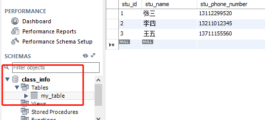

假设电脑已经安装有 MySQL，并在里面有一些表。现在，我们想通过 Java，来访问数据库里的表。

JDBC (Java DataBase Connection) 指的就是通过Java访问数据库。

这是我的数据库情况。



<!-- more -->

# JDBC的连接

首先到 mySQL 的官网，下载 [Connectors/J 驱动](https://dev.mysql.com/downloads/connector/j/)，下载完解压出其中的 jar 包，放到项目的依赖里（IDEA - File - Project Structure - Modules - Dependencies - "+"  选择刚刚解压的jar文件）。

## 初始化驱动

在Java中，使用 `Class.forName`来初始化驱动（这一步在 jdk 1.6 以后已经不是必须）

## 建立数据库连接

建立与数据库的Connection连接，是通过 `DriverManager` 类的`getConnection`方法来实现的，因此首先要创建一个`Connection`实例。

```java
Connection c = DriverManager.getConnection(url,user,psw);
```

`getConnection`方法接收三个参数，连接地址，用户名、密码。或者接收一个参数连接地址，该连接地址里已经URL构造了用户名和密码。

连接地址需要提供：

* **数据库所处于的ip**：127.0.0.1 (本机)
* **数据库的端口号**： 3306 （mysql专用端口号）
* **数据库名称**： class_info
* **编码方式**： UTF-8
* **账号**： root
* **密码**： admin

```java
package com.jerrysheh;

import java.sql.*;

public class go {
    public static void main(String[] args) throws SQLException {
        String base_url = "jdbc:mysql://127.0.0.1:3306/";
        String DB_name = "class_info";
        String Encoding = "UTF-8";
        String user = "root";
        String psw = "9501";
        String SSL = "false";
        String url = String.format("%s \
                                   %s  \
        ?characterEncoding=%s          \
        &user=%s                       \
        &password=%s                   \
        &useSSL=%s"                    \
        ,base_url,DB_name,Encoding,user,psw,SSL);

        Connection c = DriverManager.getConnection(url,user,psw);
        System.out.println("连接成功：" + c);
    }
}
```

这样就与数据库连接成功了。

> 如果没有添加`&useSSL=false`, IDEA 会报一个 WARN

> Tue Mar 20 18:39:15 CST 2018 WARN: Establishing SSL connection without server's identity verification is not recommended. According to MySQL 5.5.45+, 5.6.26+ and 5.7.6+ requirements SSL connection must be established by default if explicit option isn't set. For compliance with existing applications not using SSL the verifyServerCertificate property is set to 'false'. **You need either to explicitly disable SSL by setting useSSL=false, or set useSSL=true and provide truststore for server certificate verification.**

## 获取执行对象 statement

成功连接数据库以后，我们要创建一个可以对数据库进行增删查改等操作的对象，叫做`statement`。

```java
// 注意，IDE提示有多个 statement，这里选择java.sql.Statement
Statement s = c.createStatement();
```

## 执行 SQL 语句

有了可以对数据库进行操作的`statement`后，我们就可以执行数据库语句了。

如果需要返回结果，需要用`ResultSet`对象。

```java
String sql = "select * from my_table";
ResultSet rs = s.executeQuery(sql);
```

关于 `ResultSet` 的用法，可以参考[Oracle官方文档](https://docs.oracle.com/javase/8/docs/api/java/sql/ResultSet.html?is-external=true)

一般我们是用 `rs.next()`去读取

```java
String sql = "select * from my_table";
ResultSet rs = s.executeQuery(sql);

//如果有数据，rs.next()返回true
while(rs.next()){
    System.out.println(rs.getInt("stu_id") + "\t" +
            rs.getString("stu_name") + "\t" +
            rs.getString("stu_phone_number"));
}

```

rs.getInt()方法，可以接收 String 参数，列名，如上面例子所示。 也可以接收 Int 参数， 列号。 如`rs.getInt(2)`就是返回数据库的第二列。

> `rs.getInt(1)` 是 Java 自带 API 里， 唯二的其中一个，1作为起始的，一般都是 0 为起始。 另一个是PreparedStatement，下面将会讲到。

输出
```
1	张三	13112299520
2	李四	13211012345
3	王五	13711155560
```

跟我的数据库表正好匹配

## 关闭数据连接

数据库是有限资源，使用完毕需要断开连接

```java
s.close();
rs.close();
c.close();
```

可以用 java 7 的特性 `try-with-resource` 来自动管理连接，这样就不用每次都去手动关闭。

```java
try (
        Connection c = DriverManager.getConnection(url,user,psw);
        Statement s = c.createStatement();             
     )
        {
            String sql = "select * from my_table";
            s.execute(sql);

        } catch (SQLException e) {
            e.printStackTrace();
        }
```

---

# 增、删、改

CRUD 是最常见的数据库操作，即增删改查
* **C** 增加(Create)
* **R** 读取查询(Retrieve)
* **U** 更新(Update)
* **D** 删除(Delete)

增加

```java
String sql = "insert into hero values(null," + "'提莫'" + "," + 313.0f + "," + 50 + ")";

s.execute(sql);
```

删除

```java
String sql = "delete from hero where id = 5";
s.execute(sql);
```

修改

```java
String sql = "update hero set name = 'name 5' where id = 3";
s.execute(sql);
```

---

# 使用PreparedStatement

和 `Statement` 一样，`PreparedStatement` 也是用来执行sql语句的。其优点是，能设置参数指定相应的值，而不是`Statement`那样使用字符串拼接。

```java
String sql = "insert into hero values(null,?,?,?)";

try ( Connection c = DriverManager.getConnection(url,user,psw);
      PreparedStatement ps = c.prepareStatement(sql);
     ) {
            // 设置参数
            ps.setString(1, "je");
            ps.setFloat(2, 313.0f);
            ps.setInt(3, 50);
            // 执行
            ps.execute();

        } catch (SQLException e) {
            e.printStackTrace();
        }
```

`PreparedStatement`用`setString(1,"je")`这样的方式，来给每一个参数设置值，比如 1,"je"，就是第一个？的值设为je

## 为什么使用PreparedStatement

使用Statement：
```java
String sql = "insert into hero values(null,"+"'提莫'"+","+313.0f+","+50+")";
```

使用PreparedStatement
```java
String sql = "insert into hero values(null,?,?,?)";
```

Statement 采用的是字符串拼接，不仅麻烦，还有被SQL注入的风险

---

# execute、executeQuery 和 executeUpdate 的比较

executeQuery用于查询，返回单个结果集

execute 和 executeUpdate都可以执行增加，删除，修改

不同点：

execute|executeUpdate
---|---
可以执行查询语句，然后通过getResultSet，把结果集取出来|不能执行查询语句
返回boolean，true表示执行的是查询语句，false表示执行的是insert,delete,update等类型|返回int，表示有多少条数据受到了影响

---

# 获取数据表元数据

```java
Connection c = DriverManager.getConnection(url,user,psw);
DatabaseMetaData dbmd = c.getMetaData();

//获取数据库产品名称
dbmd.getDatabaseProductName();

//获取数据库产品版本
dbmd.getDatabaseProductVersion();

//获取驱动版本
dbmd.getCatalogSeparator();

//获取可用的数据库列表
ResultSet rs = dbmd.getCatalogs();

     while (rs.next()) {
        System.out.println("数据库名称:\t"+rs.getString(1));
      }
```

---

# 使用事务

当我们对数据库进行一组操作时，假若其中一条语句有误，其他正确的语句被执行并提交到数据库了，有误的语句没有被执行，那么会导致结果不可预期。

我们希望，这组操作要么全部成功，要么全部失败。不要部分成功部分失败。

这时候可以使用事务。

用`setAutoCommit(false)`来关闭自动提交，这时候语句不会被提交到数据库，直至我们用`commit()`手动提交。
```java
c.setAutoCommit(false);

// 加血的SQL
String sql1 = "update hero set hp = hp +1 where id = 22";
s.execute(sql1);

// 减血的SQL
// 不小心写错写成了 updata(而非update)

String sql2 = "updata hero set hp = hp -1 where id = 22";
s.execute(sql2);

// 手动提交
c.commit();
```

* MYSQL 表的类型必须是INNODB才支持事务

---

# 使用 ORM

ORM （Object Relationship database Mapping）

意思是：对象和关系数据库的映射

简单说，一个对象，对应数据库里的一条记录


首先定义一个 student 类，根据我们的数据库表，这个类应该有三个属性： id、name、phonenumber

student.java
```java
package com.jerrysheh;

public class student {
    int student_id;
    String student_name;
    long student_phone_number;

    public void setStudent_id(int student_id) {
        this.student_id = student_id;
    }

    public void setStudent_name(String student_name) {
        this.student_name = student_name;
    }

    public void setStudent_phone_number(long student_phone_number) {
        this.student_phone_number = student_phone_number;
    }

    public String getStudent_name() {
        return student_name;
    }
}
```

然后在主类里，定义getStudent()，传入id，返回student

这个 getStudent() 做了什么事情呢？

他就是把数据库里查到的每一项，映射给我们 student 对象的每一个属性里去。

比如，数据库里，stu_id 为 1 的 同一行 stu_name 为 “张三”。 那getStudent()做的事情就是，把这个1映射给 student对象的 id 属性， 把 “张三” 映射给student对象的 name 属性。

这样，我们就得到一个表示数据库一行的对象实例了。

这就是ORM技术。

test.java
```java
package com.jerrysheh;

import java.sql.*;

public class go {


    public static student getStudent(int id) throws SQLException{
        String base_url = "jdbc:mysql://127.0.0.1:3306/";
        String db_name = "class_info";
        String Encoding = "UTF-8";
        String user = "root";
        String psw = "9501";
        String SSL = "false";
        String url = String.format("%s%s?characterEncoding=%s&user=%s&password=%s&useSSL=%s",base_url,db_name,
                Encoding,user,psw,SSL);

        student s = null;
        String sql = "select * from my_table";

        try(
                Connection c = DriverManager.getConnection(url,user,psw);
                PreparedStatement ps = c.prepareStatement(sql);
                ResultSet rs = ps.executeQuery(sql)
        ){
            //ps.setInt(1,id);
            if (rs.next()){
                s = new student();
                String name = rs.getString(2);
                long phone_number = Long.parseLong(rs.getString(3));
                s.setStudent_id(id);
                s.setStudent_name(name);
                s.setStudent_phone_number(phone_number);
            }

        } catch (SQLException e){
            e.printStackTrace();
        }
        return s;
    }

    public static void main(String[] args) throws SQLException {
        student s = getStudent(1);
        String name = s.getStudent_name();
        System.out.println(name);
    }
}

```

我们在 main 里实例化了一个 student， 用 `getStudent()` 方法去获取一个student对象。

然后我们用`getStudent_name()`来验证是不是对应数据库里的"张三"。

输出：
```
张三

Process finished with exit code 0
```

果然如此！

## 其他ORM方法

根据ORM映射数据库和ORM的思想，我们可以设计其他几个常用的ORM方法：

把一个student对象插入到数据库中
```java
public static void add(student s)  {

}
```

把一个student从数据库中删除

```java
public static void delete(student s) {

}
```

更新一个student对象的信息
```java
public static void update(student s) {

}
```

最后，我们把所有的student数据查询出来，转换为student对象后，放在一个集合中返回
```java
public static List<student s> list();
```

这样，我们的 ORM 就封装好了。

---

# 使用 DAO

DAO （DataAccess Object）， 数据库访问对象

DAO其实就是把数据库相关的操作都封装在类里面，其他地方看不到JDBC的代码

```java
public interface DAO{
    //增加
    public void add(Hero hero);
    //修改
    public void update(Hero hero);
    //删除
    public void delete(int id);
    //获取
    public Hero get(int id);
    //查询
    public List<Hero> list();
    //分页查询
    public List<Hero> list(int start, int count);
}
```

封装接口，然后设计类，实现这个接口。

这样，我们需要数据库信息时，直接通过 DAO，获取封装好的对象，我们就能直接对对象进行操作。

在 Java 中，比较常用的 ORM 框架有 Hibernate和 iBatis，我们可以直接拿来用。这样，就不用繁琐地跟 JDBC 打交道了。
