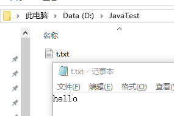

# 文件对象 File

用过 Linux 的一定知道，“一切皆文件”和“一切皆文本流”的思想。在 Java 中，普通文件和文件夹都是文件对象，用`File`表示。

<!-- more -->

## 文件对象的常用方法

new 一个文件对象，用`getAbsoluteFile()`返回这个File对象形式的路径，用`getAbsolutePath()`返回字符串形式的路径。

```java
import java.io.File;

public class IO {
    public static void main(String[] args) {
        //创建文件
        File txt = new File("D:\\JavaTest\\t.txt");
        System.out.println(txt.getAbsoluteFile());

        //创建目录
        File dir = new File("D:\\JavaTest");
        System.out.println(dir.getAbsolutePath());

        //将dir目录作为创建文件的路径
        File xml = new File(dir,"run.bat");
        System.out.println(xml.getAbsolutePath());
    }
}
```

我们用 new 创建的文件，并不一定在物理磁盘上存在，用`exists()`判断是否真实存在。

```java
//如果物理磁盘上存在t.txt，返回 true
File txt = new File("D:\\JavaTest\\t.txt");
        System.out.println(txt.exists());
```

用`isDirectory()`判断是否是一个目录，用`isFile()`判断是否是一个普通文件，用`length()`获取文件长度。

先在 D:\\JavaTest 创建一个 t.txt 文件，然后里面写 hello， 保存



```java
public static void main(String[] args) {
    //创建文件
    File txt = new File("D:\\JavaTest\\t.txt");
    if (txt.exists()){
        System.out.println(txt.length());
    }
}
```

输出 `5`，因为 hello 正好长度是 5 。如果文件在磁盘上不存在，则没有输出。如果是目录，输出 `0`。

* 用`getParent()`以 **字符串** 形式获取文件所在目录，用`getParentFile()`以 **File对象** 形式获取文件所在目录。
* 用`dir.list()`以 **字符串数组** 形式获取目录下所有文件（不包含子文件(夹)），当然，有`dir.listFile()`，相信你知道如何用。
* 用`f.mkdir()`创建文件夹，若父文件夹不存在，则创建无效。用`f.mkdirs()`创建文件夹，若父文件夹不存在，则先创建父文件夹。
* 用`f.delete()`删除文件。用`f.deleteOnExit()`在JVM结束的时候删除文件（通常是临时文件）

## 例子：遍历找出最大文件

遍历文件夹下的文件和目录，并找出最大的文件
```java
public static void main(String[] args) {
    //定义一个文件目录
    File folder = new File("D:\\Documents");

    //列出目录下的所有子文件和子目录，存入File[]数组
    File[] foldersAndFiles = folder.listFiles();
    long length = 0;
    String name = "";

    //空指针异常检查
    if (foldersAndFiles != null){

        //遍历子目录和子文件，记录最大长度的那个
        for (File eachFile :
                foldersAndFiles) {
            if (eachFile.length() > length){
                length = eachFile.length();
                name = eachFile.getName();
            }
        }
    }
    System.out.printf("最大的文件是：%s \n 其大小为：%d",name,length);
}
```

## 例子：遍历输出目录下的文件（包括子目录里的文件）

```java
import java.io.File;
import java.io.IOException;

public class IO {
    public static void main(String[] args)  {
        File parentFolder = new File("D:\\Documents");
        printSub(parentFolder);
    }

    private static void printSub (File parentFolder) throws NullPointerException{
        File[] folders = parentFolder.listFiles();

        //遍历子目录和子文件
        for (File f :
                folders) {

            //如果是文件，打印
            if (f.isFile()){
                System.out.println(f);
            }

            //如果是目录，递归调用这个方法
            if (f.isDirectory()){
                printSub(f);
            }
        }
    }
}
```
---

# 输入输出流

如果说， File 是表示 **文件** 的对象， 那么流就是表示 **数据在Java程序和文件之间流动** （流动可以是流出，也可以是流入）的对象。

## 流的概念

在 Java API 中，可以从Java程序向外部写入字节序列的对象叫`输出流`，相反，可以从外部向Java程序读入字节序列的对象叫`输入流`。

* 输出流：Java → 外部
* 输入流：外部 → Java

这里的外部，通常是指文件，当然也可以是网络，甚至内存。

## InputStream 和 OutputStream

Java中定义了两个抽象类，`InputStream`和`OutputStream`，是 Java IO 的基础。这两个抽象类都有一个抽象方法`read()`和`write()`，用于读入和写出一个字节并返回该字节（当遇到结尾时返回-1）。因此，实现这两个抽象类的子类，都必须重写`read()`或`write()`方法。

```java
abstract int read(){

}

abstract void write(int b){

}
```

> 举个实现的例子，比如 FileInputStream 就实现了从某个文件中读入一个字节。

下面是我们常用的 `read() `实现方法，它读入一个字节数组，并返回实际读入的字节数。或者在碰到流的结尾时返回-1.

```java
int read(byte[] b) {

}
```


`read()`和`write()`方法在执行时是阻塞的（通常是因为网络延迟）。可以用`available（）`方法检查当前可读入的字节数量。

当我们读写完毕后，切记用`close()`方法来关闭IO流，以释放系统资源。

## 例子：向文件写字节

创建文件 -> 判断父目录在不在 ->  写入字节

```java
public static void main(String[] args)  throws IOException {
    File parentFolder = new File("D:\\JavaTest");
    writeByte(parentFolder);
}

private static void writeByte (File parentFolder) throws NullPointerException, IOException{
    //创建新文件
    File txt = new File(parentFolder,"how2j\\jj\\test.txt");

    //判断新文件的父目录在不在，如果不在，用 mkdirs()  创建
    if (!txt.getParentFile().exists()){
        txt.getParentFile().mkdirs();
    }

    //写入字节
    FileOutputStream outputStream = new FileOutputStream(txt);
    byte[] all = {75,79}; // ASCII 75 = K, 79 = O;
    outputStream.write(all);
    outputStream.close();
}
```


---


# 不止字节

继承于`InputStream`和`OutputStream`的实现类可以让我们很方便的读写字节。但是，我们很多文件都是 Unicode 字符编码的，不是单个的字节。因此，Java又定义了`Reader`和`Writer`两个抽象类，专门处理 Unicode 字符。

<font color="red"> 因此，在 Java 中， Stream 结尾的都是字节流， reader 或 writer结尾都是字符流。 两者的区别是：读写的时候一个是按字节读写，一个是按字符。</font>


相比字节，我们更感兴趣的是数字、字符串和对象，而不是一个一个的字节。Java 当然也提供了很多让我们读取常用格式的数据，而不仅仅是字节！


## 缓存流

如果我们自己从硬盘中读取或写入数据，每次都要读写磁盘。如果读写的频率比较高的时候，其性能表现不佳。为了解决这一问题，Java提供了`BufferedReader`和`BufferedWriter`两个缓存流。

当我们要从硬盘读数据的时候，`BufferedReader`缓存流会先从硬盘中一次性读取较多的数据，然后我们的Java程序直接按需从缓存里取出。这样就不用每次都跟硬盘打交道了。

利用 BufferedWriter 写数据到文件例子

1. new 一个 `BufferedWriter`，参数里面 new 一个 `FileWriter`
2. 用 `foreach` 循环，遍历集合
3. 如果有必要，做一下类型转换
4. 写数据，写分隔符
5. 刷新

注意，**FileWrite 接收第二个参数，为 true 时，不覆盖原有内容**。否则原有内容会被覆盖。

```java
// 文件读写
FileWriter fw = new FileWriter("C:\\Users\\JerrySheh\\exception.dat" , true);
BufferedWriter bw = new BufferedWriter(fw);
```

### 完整例子

- 产生5555个随机数
- 写入到文件data.txt中
- 从文件data.txt中读取这5555个随机数，写入到data2.txt中


randomDoubleNumber.java
```java
package com.jerrysheh;

import java.math.BigDecimal;

public class randomDoubleNumber {

    // 产生 range 以内的随机数
    public static double getRandomDoubleNumber(int range){
        BigDecimal b = new BigDecimal(Math.random() * range);
        return b.setScale(2, BigDecimal.ROUND_HALF_UP).doubleValue();
    }
}
```

test.java

```
import java.io.*;
import java.text.DecimalFormat;
import java.util.ArrayList;
import java.util.List;

public class main {
    public static void main(String[] args){
        ArrayList<Double> l = addDataToList(new ArrayList<>());
        writeToFile(l);
        readFromFileAndWrite(l);
    }

    // 添加随机数数据
    public static ArrayList<Double> addDataToList(ArrayList<Double> randomNumberList){
        double d;
        for (int i = 0; i < 5555; i++) {
            d = com.jerrysheh.randomDoubleNumber.getRandomDoubleNumber(1000);
            randomNumberList.add(d);
        }
        return randomNumberList;
    }

    // 数据写入文件
    public static void writeToFile(List<Double> randomNumberList){
        DecimalFormat df = new DecimalFormat("0.00");

        try (BufferedWriter bw = new BufferedWriter(new FileWriter("data.txt"))) {
            for (double dd:
                    randomNumberList) {
                String s = df.format(dd);
                bw.write(s);
                bw.write(",");
                bw.flush();
            }
        } catch (IOException e){
            e.printStackTrace();
        }
    }

    //文件读取数据，写入另一文件
    public static void readFromFileAndWrite(List<Double> randomNumberList){
        try(
                BufferedReader br = new BufferedReader(new FileReader("data.txt"));
                BufferedWriter bw = new BufferedWriter(new FileWriter("data2.txt"))
        ){
            String s = br.readLine();
            String ss[] = s.split(",");
            for (String each:
                 ss) {
                bw.write(each);
                bw.write("\r\n");
                bw.flush();
            }
        } catch (IOException e){
            e.printStackTrace();
        }
    }
}
```

---

# 序列化

## 什么是序列化（Serialization）？

变量从内存中变成可存储或传输的过程称之为序列化（或持久化）。序列化之后，就可以把序列化后的内容写入磁盘，或者通过网络传输到别的机器上。

## Java中的序列化

在 Java 中，java.io.Serializable 是一个标记接口。要序列化一个对象，只需要实现该接口。但是，对象中并不是所有字段都可以被序列化，使用时需要注意。

当然，也有一些字段本身是可以被序列化的，但是我们不希望它被序列化，这时可以使用 `transient` 关键字让它不被序列化。

### 一个支持序列化的类

```java
public class Employee implements java.io.Serializable
{
   public String name;
   public String address;
   public transient int SSN;
   public int number;
   public void mailCheck()
   {
      System.out.println("Mailing a check to " + name
                           + " " + address);
   }
}
```

在 Java 中，我们使用  ObjectOutputStream 类来将一个对象转换成输出流。它的 `writeObject(Object x)` 方法用于序列化一个对象，并将它发送到输出流。

### 序列化过程

```java
public class SerializeDemo
{
   public static void main(String [] args)
   {
      Employee e = new Employee();
      e.name = "Reyan Ali";
      e.address = "Phokka Kuan, Ambehta Peer";
      e.SSN = 11122333;
      e.number = 101;
      try
      {
         FileOutputStream fileOut =
         new FileOutputStream("/tmp/employee.ser");
         ObjectOutputStream out = new ObjectOutputStream(fileOut);
         out.writeObject(e);
         out.close();
         fileOut.close();
         System.out.printf("Serialized data is saved in /tmp/employee.ser");
      }catch(IOException i)
      {
          i.printStackTrace();
      }
   }
}
```

Java约定序列化的文件后缀名为 .ser ，我们将该对象存入磁盘/tmp/employee.ser文件中

### 反序列化过程

```java
public class DeserializeDemo
{
   public static void main(String [] args)
   {
      Employee e = null;
      try
      {

         // 创建一个文件输入流
         FileInputStream fileIn = new FileInputStream("/tmp/employee.ser");

         // 创建一个对象输入流，传入文件输入流对象
         ObjectInputStream in = new ObjectInputStream(fileIn);

         // 从对象输入流中获取序列化的数据
         e = (Employee) in.readObject();

         in.close();
         fileIn.close();
      }catch(IOException i)
      {
         i.printStackTrace();
         return;
      }catch(ClassNotFoundException c)
      {
         System.out.println("Employee class not found");
         c.printStackTrace();
         return;
      }
    }
}
```

此时，Employee对象即被“复活”了。但是注意，变量SSN是 transient 的，因此不会被还原。

## 为什么一个类实现了Serializable接口，它就可以被序列化？

查看 ObjectOutputStream 的源码，可以看到，其 writeObject0方法 中，是通过判断该类是否可以转型为 String、Enum 或 Serializable 来为其决定进行何种序列化方式的。实现Serializable接口就用 writeOrdinaryObject 方式。

如果该类没有实现 Serializable 接口，就抛出 NotSerializableException

```java
private void writeObject0(Object obj, boolean unshared) throws IOException {
      ...
    if (obj instanceof String) {
        writeString((String) obj, unshared);
    } else if (cl.isArray()) {
        writeArray(obj, desc, unshared);
    } else if (obj instanceof Enum) {
        writeEnum((Enum) obj, desc, unshared);
    } else if (obj instanceof Serializable) {
        writeOrdinaryObject(obj, desc, unshared);
    } else {
        if (extendedDebugInfo) {
            throw new NotSerializableException(cl.getName() + "\n"
                    + debugInfoStack.toString());
        } else {
            throw new NotSerializableException(cl.getName());
        }
    }
    ...
}
```
