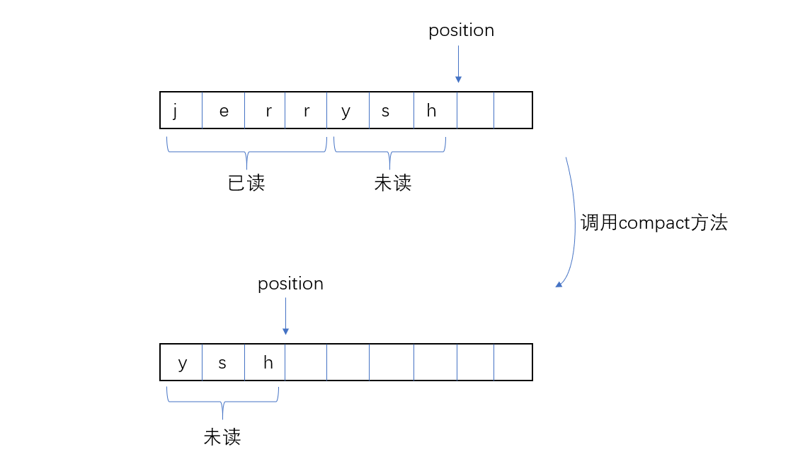
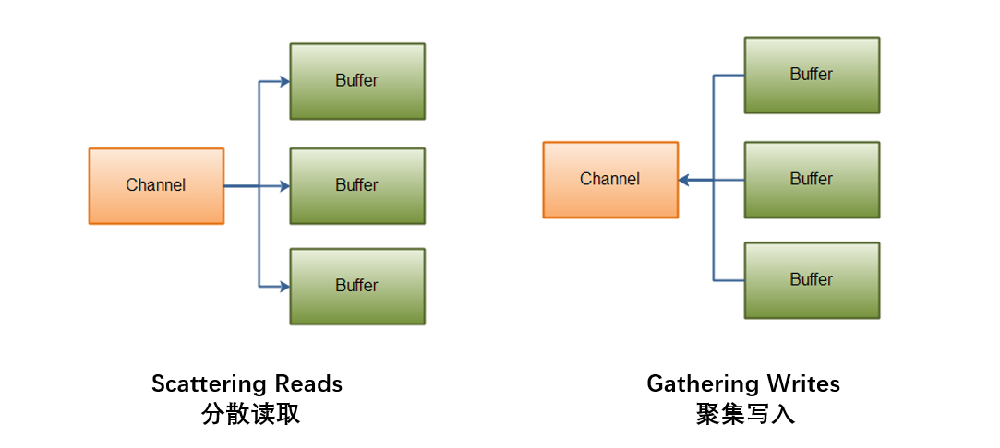

# 什么是 Java NIO

Java NIO， N 可以理解为 New ，也可以理解为 Non-blocking ，是 Java 1.4 之后新的一套区别于标准 Java IO 和 Java Networking 的 API 。NIO 跟传统的 BIO 之间最大的区别在于 NIO 是面向 Channels 和 Buffers 的，一个线程可以通过 Selector 管理多个 Channels ，继而管理多个连接，在线程进行 IO 操作时不会阻塞。

<!-- more -->

# 面向 Channels 和 Buffers

普通的IO，面向的是 byte streams（字节流，如FileOutputStream） 和 character streams（字符流，如FileReader），但是 NIO 面向的是 channels 和 buffers 。对于 Channel 来说，数据总是从 channel 写进 buffer 里，然后 Java 从 buffer 取出使用，或者 channel 读 buffer 里的数据，传输到外界。


Channel 有点像流（Stream），在 Java NIO 中，有以下几种 channel：

- FileChannel
- DatagramChannel （用于通过 UDP 读写数据）
- SocketChannel （用于通过 TCP 读写数据）
- ServerSocketChannel

而 Buffer 就是我们熟悉的缓冲区了。包括：

- ByteBuffer
- CharBuffer
- DoubleBuffer
- FloatBuffer
- IntBuffer
- LongBuffer
- ShortBuffer
- MappedByteBuffer（不展开讲）

一个线程，可以让 channel 把数据读进 buffer 中（操作者是 channel ），当 channel 正在读的时候，线程可以做其他事。一旦数据已经读进 buffer 了，线程可以回来处理这些数据。写的情况也是类似。

## 一个简单的例子

Channel 和 Buffer 配合的工作流程如下：

1. 开一个文件
2. 获取 Channel
3. 设置 buffer
4. 让 Channel 将数据读到 buffer 里
5. 数据进入 buffer
6. 调用 `buffer.flip()`
7. 数据从 buffer 出去
8. 调用 `buffer.clear()` 或 b`uffer.compact()`

```java
// RandomAccessFile 可以自由读写文件的任意位置，不继承字节流或字符流
// 1. 开一个文件
RandomAccessFile aFile = new RandomAccessFile("data/nio-data.txt", "rw");

// 2. 获取 Channel
FileChannel inChannel = aFile.getChannel();

// 3. 设置 buffer，由于我们要读字节，因此是 ByteBuffer
ByteBuffer buf = ByteBuffer.allocate(48);

// 4. 利用 Channel 将数据读到 buffer 里
int bytesRead = inChannel.read(buf);

while (bytesRead != -1) {

    System.out.println("Read " + bytesRead);
    buf.flip();

    while(buf.hasRemaining()){
        System.out.print((char) buf.get());
    }

    buf.clear();
    bytesRead = inChannel.read(buf);
}

aFile.close();
```

注意：

- `buf.flip()` 的作用：当你想从 buffer 里获取数据，应该调用 flip 方法。调用这个方法的时候，buffer 将会从 数据写入模式 切换到 数据读出模式
- `buf.clear()`的作用：当数据全部从 buffer 读出去了，应该调用 clear 或 compact 方法，好让 buffer 重写可以写入。 这两个方法的区别是：clear清除整个缓冲区，compact只清除已经读过的部分。

---

## Capacity, Position 和 Limit

buffer 实际上是一块内存区域可以让你往里面写数据，之后再读到程序里。这块内存区域包含在一个 NIO Buffer 对象里。

在 buffer 中，有 Capacity, Position 和 Limit 这三个概念。position 跟 limit 跟 buffer 是读模式还是写模式有关，而 Capacity 与模式无关。


### Capacity

顾名思义，Capacity 就是容量。也就是 buffer 缓冲区最多能存储多少 bytes （或者 longs，或 chars ，取决于何种类型的 buffer ）

### Position

当你往 buffer 里写一个单位的数据的时候， position 就 +1， position是当前位置指示器。最大值为 Capacity - 1。

当你从 buffer 里读数据时，同样有一个 position 指示器。当调用 flip ，让 buffer 从写模式转换成读模式的时候， position 会被重置为 0

### limit

在 buffer 写模式中， limit 等于 capacity，决定了你能往 buffer 里写多少数据。

在 buffer 读模式中，limit 告诉你缓冲取最多有多少数据可以让你读取。也就是说，一开始写模式写了多少数据，会记录在 position 中，一旦你调用 flip 切换到读模式，limit 就是刚刚的 position。

---

## Buffer 的方法

### flip

当调用 flip方法， position 会被置0，然后 buffer 会切换模式（读->写，或 写->读），limit 也随之改变。

### rewind

rewind 可以让 position 变为 0， 好让你重新读刚刚读过的数据，但是模式不变。limit 的值也不会变。

### clear() 和 compact()

clear清除整个缓冲区，compact只清除已经读过的部分。如果你有一些数据还没读，使用 compact， compact 会把未读的数据放到起始位置，然后把 position 放到最后一个数据的右边。



### mark() 和 reset()

可以用 mark 方法标记 position，然后做一个其他事后，调用 reset， position 会回到刚刚标记的位置。


---


## Scatter（分散） / Gather（聚集）

**channel "scatters" 是指，多个 buffer 从一个 Channel 里读取数据**。分散读取是以数组的形式，总是先填充前面的 buffer，这意味着不支持动态大小。

```java
ByteBuffer header = ByteBuffer.allocate(128);
ByteBuffer body   = ByteBuffer.allocate(1024);

ByteBuffer[] bufferArray = { header, body };

channel.read(bufferArray);
```



**channel "gathers" 是指，多个 buffer 把数据写进一个 Channel**。如果一个 `ByteBuffer` 的 capacity 有128字节，但实际只存储了58字节。Gather 只会往 channel 里写这58字节。然后继续写下一个。

```java
ByteBuffer header = ByteBuffer.allocate(128);
ByteBuffer body   = ByteBuffer.allocate(1024);

//write data into buffers

ByteBuffer[] bufferArray = { header, body };

channel.write(bufferArray);
```

---

## 在不同 Channel 之间转换

Channel 之间可以互相转换，以 FileChannel 为例，提供了 `transferFrom()` 和 `transferTo()` 方法。

```java
RandomAccessFile fromFile = new RandomAccessFile("fromFile.txt", "rw");
FileChannel      fromChannel = fromFile.getChannel();

RandomAccessFile toFile = new RandomAccessFile("toFile.txt", "rw");
FileChannel      toChannel = toFile.getChannel();

long position = 0;
long count    = fromChannel.size();


// 从其他channle转到FileChannel
toChannel.transferFrom(fromChannel, position, count);
// 从FileChannel转到其他channle
fromChannel.transferTo(position, count, toChannel);
```

在有些 `SocketChannel` 的实现中，只会转换 channel 当前有的数据（尽管稍后 SocketChannel 会传来更多数据，但会被忽略）

---

# Selectors

Java NIO 有一个 "selectors" 的概念。 selector 可以监控多个 channels 事件的状态（例如，连接已建立，数据已到达等）。因此，只需一个线程即可管理多个 channels ，继而管理多个 connection。在并发量特别大时，传统的IO由于一个线程只负责一个连接，因此会创建大量线程。而用 NIO 的 selector，你甚至可以只用一个线程管理所有连接。

然而，不要一贯认为传统IO多线程就不好。我们总说操作系统在线程切换时有一定开销，然而现代CPU都是多核处理器，不用多线程相当于浪费。


```java
channel.configureBlocking(false);

/*
第二个参数设置感兴趣的事件，可选项：
SelectionKey.OP_CONNECT
SelectionKey.OP_ACCEPT
SelectionKey.OP_READ
SelectionKey.OP_WRITE
*/
SelectionKey key = channel.register(selector, SelectionKey.OP_READ);


// 第三个参数设置附加对象（可选）
SelectionKey key = channel.register(selector, SelectionKey.OP_READ, theObject);

```

**使用 Selectors 的 channel 必须设置成 non-blocking 模式**。FileChannel 无法设置成 non-blocking 因此无法使用 Selectors。 Socketchannels 则可以。`channel.register` 的第二个参数设定感兴趣的事件，如连接已建立、客户端accept，准备好可读，准备好可写。如果需要设定多个使用，用或语句。

```java
int interestSet = SelectionKey.OP_READ | SelectionKey.OP_WRITE;
```

register 之后会返回一个 `SelectionKey`，通过它来获取有用信息：

```java
Channel  channel  = selectionKey.channel();

Selector selector = selectionKey.selector();    

// 附加对象（可选）
selectionKey.attach(theObject);

Object attachedObj = selectionKey.attachment();
```

## select 方法

Selectors 的 `select()`方法用于返回准备好的 channel 数量。例如，你设置了若干个 SocketChannel 对 read 感兴趣。当你调用 `select()` ，将返回当前准备好可以读取数据的 channel 数量。

```java
int select() // 若无，则阻塞
int select(long timeout) // 若无，超时时间内阻塞
int selectNow() // 立即返回
```

当 select 返回大于0的数字，说明有 channel 准备好了，实际上内容封装在 `Set<SelectionKey>` 里，我们可以取出来然后做相应的动作。完整例子：

```java
Selector selector = Selector.open();

channel.configureBlocking(false);

SelectionKey key = channel.register(selector, SelectionKey.OP_READ);


while(true) {

  int readyChannels = selector.selectNow();

  if(readyChannels == 0) continue;


  Set<SelectionKey> selectedKeys = selector.selectedKeys();

  Iterator<SelectionKey> keyIterator = selectedKeys.iterator();

  while(keyIterator.hasNext()) {

    SelectionKey key = keyIterator.next();

    if(key.isAcceptable()) {
        // a connection was accepted by a ServerSocketChannel.

    } else if (key.isConnectable()) {
        // a connection was established with a remote server.

    } else if (key.isReadable()) {
        // a channel is ready for reading

    } else if (key.isWritable()) {
        // a channel is ready for writing
    }

    keyIterator.remove();
  }
}
```

## wakeup() 和 close()

调用 `select()` 方法的线程会阻塞，用另一个线程调用 `Selector.wakeup()` 方法可以让它立即返回。

调用`Selector.close()`可以关闭 Selector 和所有 SelectionKey ，但 channels 不会被关闭。

---

# 什么时候用 NIO，什么时候用传统 IO ？

NIO可以只使用一个（或几个）单线程管理多个通道（网络连接或文件），但付出的代价是解析数据可能会比从一个阻塞流中读取数据更复杂。

如果需要管理同时打开的成千上万个连接，这些连接每次只是发送少量的数据，例如聊天服务器，实现NIO的服务器可能是一个优势。同样，如果你需要维持许多打开的连接到其他计算机上，如P2P网络中，使用一个单独的线程来管理你所有出站连接，NIO可能是一个优势。

如果你只有少量的连接但是每个连接都占有很高的带宽，同时发送很多数据，传统的IO会更适合。

---

- 参考教程：[java-nio](http://tutorials.jenkov.com/java-nio)
