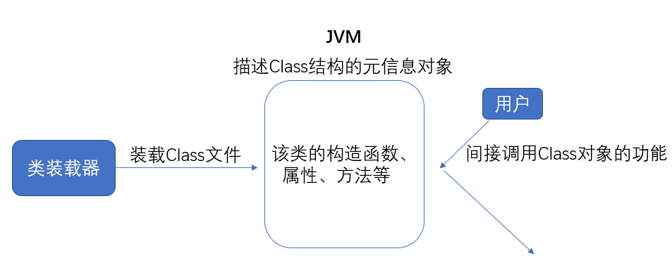

Java 是完全面向对象语言。事实上，我们创建的每一个类，其实也是对象，称为`类对象`。类对象提供了类的元信息，比如这个类有几种构造方法，有多少个属性，有哪些普通方法等。



Java反射机制主要提供了以下功能：
- 在运行时判断任意一个对象所属的类；
- 在运行时构造任意一个类的对象；
- 在运行时判断任意一个类所具有的成员变量和方法；
- 在运行时调用任意一个对象的方法；生成动态代理。

<!-- more -->

---

# 普通对象 VS 类对象

假设我们定义两个类， student类和teacher类

```java
public class student{
    int studentID;
    String name;
    String classroom;

    student(){
        //构造方法
    }

    //以及一些其他方法
}

student Jerry = new student();
student Calm = new student();

public class teacher{
    int teacherID;
    String name;
    long phoneNumber;

    teacher(){
        //构造方法
    }

    //以及一些其他方法
}

teacher Luohao = new teacher();
teacher YangLiang = new teacher();
```

* Jerry 和 Calm 都是 student 类的对象，他们的区别在于：有不同的studentID，name...  
* Luohao 和 YangLiang 都是 teacher 类的对象，他们的区别跟 Jerry 和 Calm的区别类似，有不同的teacherID,不同的name...

然后，我们说 student 和 teacher 都是一个类，他们的区别在于，有不同的属性和方法。

所谓类对象，就是用于描述这种类，都有什么属性，什么方法的对象。

---

# 获取类对象

在 Java 中，获取类对象有三种方法
1. Class.forName
2. student.class
3. new student().getClass()

通常一个JVM下，只会有一个ClassLoader，因此一种类，只会有一个类对象存在。所以以上三种方式取出来的类对象，都是一样的。

```java
Class pClass = Class.forname("student"); //获取一个 student 类的类对象

// 实际上内部会调用这个方法，第二个参数true表示要初始化
Class.forName(className,true,classloader)
```

获取类对象的时候，类属性会被初始化。

第三种方法：

```java
new student().getClass();
```

`getClass()` 是 Object 类的方法，返回的是运行时的类的名字（包名+类名），如果要返回父类，用 `getClass().getSuperclass()`

---

# 反射机制

正常情况下，我们要获取一个对象，直接new

```java
student Jerry = new student();
```

但是，有一种机制，叫`反射机制`。反射机制是这样干的：先拿到 student 类的类对象，然后通过类对象获取构造器对象，再通过构造器对象创建一个对象。


## 通过反射机制创建对象

```java
public static void main(String[] args) {
    try {
        String className = "student";

        //类对象
        Class pClass=Class.forName(className);

        //构造器
        Constructor c= pClass.getConstructor();

        //通过构造器实例化
        student jerry= (student) c.newInstance();

        //给实例对象设置属性
        jerry.studentID="201501010086";

    } catch (Exception e) {
        e.printStackTrace();
    }
}
```

可以看到，通过反射机制，创建对象的流程为：**类对象 -> 构造器对象 -> 实例对象**

## 通过反射机制修改属性的值

```java
public static void main(String[] args) {
    student calm = new student();

    // 对象的name属性设置为 calmDu
    calm.phoneNumber = 13315010086;

    try {
        //获取student类中名字叫做phoneNumber的字段
        Field f1= calm.getClass().getDeclaredField("phoneNumber");

        //修改这个字段的值
        f1.set(calm, 189741710000);

    } catch (Exception e) {
        e.printStackTrace();
    }
}
```

可以看到，我们先用 Field 类，获取 calm 所属类（student类）的 phoneNumber 字段，然后用 Field 的 set方法，修改属性值。

流程为： Field -> set

### getField 和 getDeclaredField 的区别

这两个方法都是用于获取字段。

| getField | getDeclaredField |
| :------------- | :------------- |
| 只能获取public，包括继承来的字段 | 可以获取包括private在内的所有字段，但不能获取继承来的字段 |


> getDeclaredField 这里只能获取到private的字段，但并不能访问该private字段的值,除非加上 `setAccessible(true)`

## 通过反射机制调用方法

首先我们的 student 类里有 setAge 方法和 getAge方法
student.java
```java
public class student {
    String studentID;
    String studentName;
    String studentPhoneNumber;
    int age;

    public student(String studentID, String studentName, String studentPhoneNumber, int age) {
        this.studentID = studentID;
        this.studentName = studentName;
        this.studentPhoneNumber = studentPhoneNumber;
        this.age = age;
    }

    public int getAge() {
        return age;
    }

    public void setAge(int age) {
        this.age = age;
    }
}

```

在测试类中调用这个方法

main.java
```java
import java.lang.reflect.Method;

public static void main(String[] args) throws Exception{
    student jerry = new student("201501010086","jerrysheh","13018910086",20);

    // 获取名字为setAge，参数类型为int类型的方法
    Method m = jerry.getClass().getMethod("setAge", int.class);

    //对 jerry 对象调用这个方法
    m.invoke(jerry,18);

    System.out.println(jerry.getAge());
}
```
可以看到，用反射机制调用方法的流程是：Method -> invoke

---

# 反射机制有什么用？

反射机制可以用来创建对象，修改对象属性的值，调用对象的方法。

但是这些我们传统java面向对象编程也能做到，为什么要用反射呢？

通常来说，需要在学习了 Spring 的依赖注入，反转控制之后，才会对反射有更好的理解。在此之前，我们可以举个栗子简单说明一下反射的强大功能。

## 没有反射机制

假设我们有两个业务类，业务1和业务2，然后我们现在要运行业务1

```java
public class Test {

    public static void main(String[] args) {
        new Service1().doService1();
    }
}
```

好，然后有一天，老板说，全线改到业务2，于是我们不得不改代码

```java
public class Test {

    public static void main(String[] args) {
        //new Service1().doService1();
        new Service2().doService2();
    }
}
```

假如我们的工程非常大，改完代码重新编译运行要1个小时，这有时候是不可接受的。

## 有了反射机制

有了反射机制后，我们可以准备一个配置文件，就叫 spring.txt 吧，在里面写明

```
class=reflection.Service1
method=doService1
```

当需要从调用第一个业务方法，切换到调用第二个业务方法的时候，不需要修改一行代码，也不需要重新编译，只需要修改配置文件spring.txt，再运行即可。

此时代码是这样写的

```java
public class Test {

    @SuppressWarnings({ "rawtypes", "unchecked" })
    public static void main(String[] args) throws Exception {

        //从spring.txt中获取类名称和方法名称
        File springConfigFile = new File("e:\\project\\j2se\\src\\spring.txt");
        Properties springConfig= new Properties();
        springConfig.load(new FileInputStream(springConfigFile));
        String className = (String) springConfig.get("class");
        String methodName = (String) springConfig.get("method");

        //根据类名称获取类对象
        Class clazz = Class.forName(className);
        //根据方法名称，获取方法对象
        Method m = clazz.getMethod(methodName);
        //获取构造器
        Constructor c = clazz.getConstructor();
        //根据构造器，实例化出对象
        Object service = c.newInstance();
        //调用对象的指定方法
        m.invoke(service);

    }
}
```

事实上，这就是 Spring 框架的最基本原理了。

---

# 补充：类装载器 ClassLoader

ClassLoader用于寻找字节码文件，并构造出类在 JVM 内部表示对象的组件。在Java中，ClassLoader把一个类装入JVM的步骤如下：

1. **装载**：查找和导入Class文件
2. **链接**：执行**校验**（检查载入的Class文件正确性）、**准备**（给类的静态变量分配存储空间）和**解析**（将符号引用转化成直接引用）。
3. **初始化**：对类的静态变量和静态代码块进行初始化


JVM从安全角度考虑，装载类时，使用了“全盘负责委托机制”：

- **全盘负责**：当一个 ClassLoader装载一个类时，该类所依赖及引用的类也由该 ClassLoader 载入。
- **委托机制**：先委托父装载器寻找目标类，找不到时才从自己的类路径找。

关于类加载器，可参考: [Java虚拟机（一）JVM 基础和类的加载](https://jerrysheh.github.io/post/3ebede8.html)

---
本篇参考教程：[how2j - 反射机制 ](http://how2j.cn/k/reflection/reflection-usage/1111.html?p=35599)
