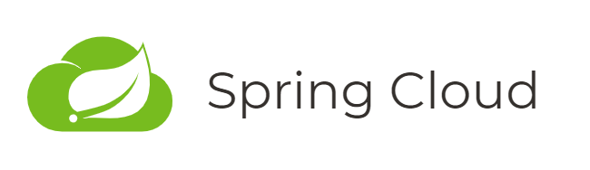
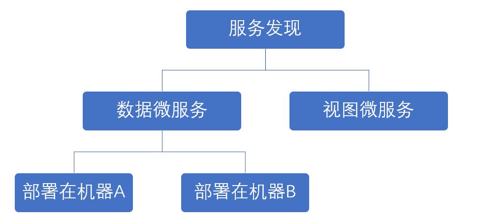
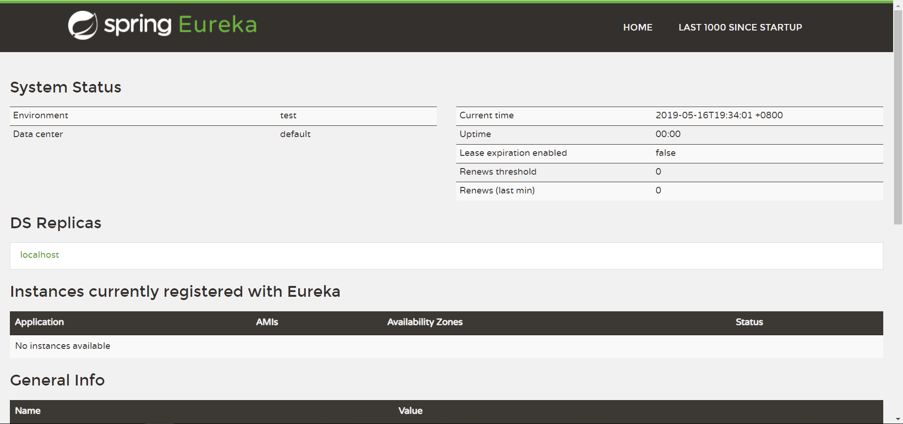

> 微服务是松耦合的分布式软件服务，这些服务执行 **少量的** 定义明确的任务。 ——《Spring微服务实战》

# 对微服务的认识

之前做项目，代码都是在一个工程里面，所有代码写完后，打一个 jar 包或 war 包，就放到服务器上面去跑了，这叫做单体架构。如果项目中有一点点需要修改，我们不得不整个工程重新编译打包，再重新部署。现在，我们决定用分布式和集群的方式，把业务功能拆分成多个子项目（服务），子项目可以单独运行，子项目与子项目之间暴露 http 或 rpc 接口，供外部或内部其他服务调用，**然后，用一套规范的方式把众多子项目管理起来**，这就是微服务架构。

Spring Boot 就是用于快速构建单个微服务的框架，而 Spring Cloud 则是各个微服务的管理者。


<!-- more -->

---

# Spring Cloud 技术概览

采用微服务后，会有很多问题暴露出来。Spring 整合了一套技术用于解决这些问题，这些技术集，即是 Spring Cloud 本身。

1. 如何快速搭建单个微服务？ Spring Boot 快速框架
2. 怎么知道系统中有哪些服务？Eureka 服务发现
3. 多个微服务实例中如何共享配置信息？ Config Server 配置服务
4. 如何让配置信息在多个微服务之间自动刷新？ RabbitMQ 总线 Bus
5. 微服务之间是如何彼此调用的？ Sleuth/zipkin 服务链路追踪
6. 如果某个微服务（集群）不能使用了，调用方如何去处理? 断路器 Hystrix
7. 某个微服务的断路器什么时候开启了？什么时候关闭了？ 断路器监控 Hystrix Dashboard
8. 如果某个微服务本身是个集群，那么如何进行对他们进行聚合监控？ 断路器聚合监控 Turbine Hystrix Dashboard
9. 如何不暴露微服务名称，并提供服务？ Zuul 网关

---

# 我的服务在哪里 - 服务发现（Service Discovery）

**分布式架构中有很多机器，找到机器所在的物理地址即是服务发现**。服务发现的一个好处是，调用方只需知道一个逻辑位置（而不是物理地址）即可以请求服务。而服务提供方可以通过水平伸缩（添加服务器）的方式来扩大服务，而不是想着买一台性能更好的服务器。服务发现的第二个好处是，当服务不可用时，服务发现引擎可以将坏掉的服务移除，然后采取一些其他策略。



## Spring Cloud Eureka 服务发现

[Eureka](https://github.com/Netflix/eureka) 是 Netflix 开源的一个用来 **定位服务** 并做 **负载均衡** 和 **故障转移** 的服务，Spring 将其集成在 Spring Cloud 里面。其本身也是一个微服务。使用 Eureka，即可获得：

1. 定位、发现服务
2. 服务端负载均衡
3. 故障转移

到 [Spring Initializr](https://start.spring.io/) 起一个 Spring Boot 工程，依赖选择 Eureka Server 。

可以看到 pom.xml 里面有 eureka-server 依赖：

```xml
<dependency>
    <groupId>org.springframework.cloud</groupId>
    <artifactId>spring-cloud-starter-netflix-eureka-server</artifactId>
</dependency>
```

在主类里面使用 `@EnableEurekaServer` 注解，标记为一个 Eureka 服务发现。

```java
@SpringBootApplication
@EnableEurekaServer
public class Application {

  public static void main(String[] args) {
    SpringApplication.run(Application.class, args);
  }

}
```

配置文件，注明服务地址，客户端访问地址，以及服务名

```
eureka:
  instance:
    hostname: localhost
  client:
    registerWithEureka: false
    fetchRegistry: false
    serviceUrl:
      defaultZone: http://${eureka.instance.hostname}:${server.port}/eureka/

spring:
  application:
    name: eureka-server
```

运行，打开`127.0.0.1:8761`（端口在配置文件里指定），即可看到 Eureka 服务发现界面



当有其他服务注册进来时，可以在这个面板里看到。

---

# 拆分服务

## 单体架构

在单体架构，所有东西都在一个项目里，举个例子，假设我们有一个提供产品信息的服务。

pojo类

```java
public class Product {
	private int id;
	private String name;
	private int price;
}
```

service层获取 Product 信息

```java
@Service
public class ProductService {

	public List<Product> listProducts(){
    	List<Product> ps = new ArrayList<>();
    	ps.add(new Product(1, "product a", 50));
    	ps.add(new Product(2, "product b", 150));
    	ps.add(new Product(3, "product c", 250));
    	return ps;
	}
}
```

Controller 层调用 Service 的数据，最后返回给 product.html 页面渲染。

## 微服务拆分单体

采用微服务，就要把单体架构拆分。现在，我们把项目拆分成两部分：数据微服务 + 视图微服务

1. 数据微服务：从DAO层取数据，通过 REST 返回 JSON
2. 视图微服务：从数据微服务取数据（而不管数据是哪里来），渲染在 html 上

于是，我们现在启两个 Spring Boot 工程。

### 数据微服务 Spring Boot 工程

很简单，就是把单体架构的视图部分去掉，用 `@RestController` 直接返回 JSON

```java
@RestController
public class ProductController {

	@Autowired ProductService productService;

    @GetMapping("/products")
    public Object products() {
    	List<Product> ps = productService.listProducts();
    	return ps;
    }
}
```

配置文件，主要注明该服务的名称，以及 Eureka 的地址

```
spring:
  application:
    name: product-data-service
eureka:
  client:
    serviceUrl:
      defaultZone: http://localhost:8761/eureka/
```

在启动类注解 `@EnableEurekaClient` 表示这是一个 Eureka 客户端。（还有另一个注解，`@EnableDiscoveryClient` 不局限于 Eureka，还能用在类似的服务发现如Zookeeper、Consul）

```java
@SpringBootApplication
@EnableEurekaClient
public class ProductDataServiceApplication {
    //...
}
```

当然，别忘了pom.xml的 eureka-client 依赖

```xml
<dependency>
    <groupId>org.springframework.cloud</groupId>
    <artifactId>spring-cloud-starter-netflix-eureka-client</artifactId>
</dependency>
```

现在，运行这个工程，可以在 eureka Dashboard 看到该服务已经被注册进来。当然，如果是局域网，我们完全可以在另一台计算机也运行这个工程，可以看到 eureka Dashboard 注册了两个一样的服务，或者在一台计算机两个不同的端口运行同一个服务，这就是简单的负载均衡。

### 视图微服务 Spring Boot 工程

视图微服务将从数据微服务取数据，然后渲染在 products.html 中。

```java
@Controller
public class ProductController {

	@Autowired ProductService productService;

    @RequestMapping("/products")
    public Object products(Model m) {
    	List<Product> ps = productService.listProducts();
    	m.addAttribute("ps", ps);
        return "products";
    }
}
```

**关键是，视图微服务如何从数据微服务中取数据？** 这就需要用到 Ribbon 和 Feign 了。

#### 使用 Ribbon 获取数据并做负载均衡

Ribbon 用于调用其他服务，使用 restTemplate，并进行客户端负载均衡。

客户端负载均衡要在 Spring Boot 启动类声明方法

```java
@Bean
@LoadBalanced
RestTemplate restTemplate() {
    return new RestTemplate();
}
```

Service层要取数据，就交代 Ribbon 去数据微服务取

```java
@Service
public class ProductService {
	@Autowired
    ProductClientRibbon productClientRibbon;

	public List<Product> listProducts(){
		return productClientRibbon.listProdcuts();
	}
}
```

Ribbon 用 restTemplate 去数据微服务取数据

client/ProductClientRibbon.java

```java
@Component
public class ProductClientRibbon {

    @Autowired
    RestTemplate restTemplate;

	public List<Product> listProdcuts() {
        return restTemplate.getForObject("http://PRODUCT-DATA-SERVICE/products",List.class);
    }
}
```

当然，它自己作为一个微服务，也是需要配置的

```
eureka:
  client:
    serviceUrl:
      defaultZone: http://localhost:8761/eureka/
spring:
  application:
    name: product-view-service-ribbon
```

别忘了 pom.xml 的 eureka-client 依赖

#### 使用 Feign 获取数据并做负载均衡

Ribbon 用了 restTemplate，实际上还有另一种更优雅的方式 —— Feign

pom.xml添加

```xml
<dependency>
    <groupId>org.springframework.cloud</groupId>
    <artifactId>spring-cloud-starter-openfeign</artifactId>
</dependency>
```

在启动类声明`@EnableFeignClients`，然后在 client/ProductClientFeign.java 写接口

```java
@FeignClient(value = "PRODUCT-DATA-SERVICE")
public interface ProductClientFeign {

    @GetMapping("/products")
    public List<Product> listProdcuts();
}
```

Service 跟 Controller 跟 Ribbon 方式一样

---

# 服务链路追踪

随着业务的增加，我们的分布式系统中会有越来越多的微服务，服务与服务之间的调用关系也会越来越复杂，很难直接通过代码观察。因此需要借助 **服务链路追踪服务器** 来可视化地展示服务链路。zipkin 就是这样一个东西。

在有互相调用的微服务中（不包括eureka-server微服务）添加 zipkin 依赖：

```xml
<dependency>
    <groupId>org.springframework.cloud</groupId>
    <artifactId>spring-cloud-starter-zipkin</artifactId>
</dependency>     
```

添加配置项:

```
spring.zipkin.base-url: http://localhost:9411
```

在启动类中加上:

```java
    @Bean
    public Sampler defaultSampler() {
        return Sampler.ALWAYS_SAMPLE;
    }
```

启动 zipkin 服务 ：

```
java -jar zipkin-server-2.10.1-exec.jar
```

启动所有微服务，并进行一次调用

访问：http://localhost:9411/zipkin/dependency/ 即可看到调用链

---

# 断路器

## 服务雪崩效应

为了保证微服务高可用，单个服务有时候会集群部署。但由于网络或程序自身的原因，服务并不能保证百分百可靠可用，如果单个服务出现问题，调用这个服务就出现线程阻塞。此时若有大量的请求涌入，servlet容器的线程资源就会被消耗完毕导致服务瘫痪。由于服务与服务之间有依赖，故障会传播，对整个微服务系统造成不可估量的严重后果，这就是常说的服务故障的“雪崩效应”。

为了解决这个问题，有人就提出了一种解决问题的思路，断路器模型。就是每一个调用服务的接口处加一个断路器，默认是关闭的，当对服务调用时，不可用的次数达到一个阀值时，断路器就会打开，通过回调方法迅速返回一个值结束调用，避免出现连锁故障。

## hystrix 断路器

在 pom.xml 中添加 hystrix 的依赖：

```xml
<dependency>
    <groupId>org.springframework.cloud</groupId>
    <artifactId>spring-cloud-starter-netflix-hystrix</artifactId>
</dependency>  
```

注解由原来的
```java
@FeignClient(value = "PRODUCT-DATA-SERVICE")
```

修改为

```java
@FeignClient(value = "PRODUCT-DATA-SERVICE",fallback = ProductClientFeignHystrix.class)
```

当服务不可用时，就调用 ProductClientFeignHystrix 来进行反馈信息。

ProductClientFeignHystrix 的实现代码如下，实现了断路的 Feign 接口。

```java
@Component
public class ProductClientFeignHystrix implements ProductClientFeign{
    public List<Product> listProdcuts(){
        List<Product> result = new ArrayList<>();
        result.add(new Product(0,"数据微服务不可用",0));
        return result;
    }
}
```

在配置文件中启用 hystrix

```
feign.hystrix.enabled: true
```

---

# 配置中心 ConfigServer

一个微服务可能是用集群的方式部署，有多个实例。当需要修改配置信息时，要手动对集群的每一个微服务实例进行修改，显然很麻烦。为了解决这一问题，我们把配置信息放在一个公共的地方，比如 git 上面，然后通过 **配置服务器（ConfigServer）** 获取。每一个微服务实例再从 ConfigServer 上获取配置。

这样，只要修改 git 上的信息，同一个集群里的所有微服务都立即获取相应信息了。

ConfigServer 本身是一个微服务，启动后，我们还需要对客户端微服务进行修改，才能感应到配置服务器。

---

# 消息总线 Bus

虽然有了 ConfigServer，但是每次修改配置信息，我们都需要重启 ConfigServer 和客户端微服务实例。我们希望一旦 git 上的配置信息修改之后，就可以自动地刷新到微服务里，而不需要手动重启。

RabbitMQ 是一个消息队列中间件，Spring Cloud 通过 RabbitMQ 来进行消息广播，以达到有配置信息发生改变的时候，广播给多个微服务的效果。

---

# 服务网关 Zuul

当系统中微服务数量越来越多，而且这些服务实例数通常是动态的，对于客户端而言很难发现动态改变的服务实例的访问地址信息。我们引入 API Gateway 作为轻量级网关，服务调用时是通过网关进行转发，而非直接调用。API Gateway 中也会实现相关的认证逻辑从而简化内部服务之间相互调用的复杂度。

Zuul 是 Netflix 出品的一个基于 JVM 路由和服务端的负载均衡器。Spring Cloud Zuul 是 Spring 提供的 API Gateway 技术，提供动态路由，监控，弹性，安全等的边缘服务。

---

# 小结

可以看到，我们用 Eureka 做服务发现，将一个单体应用拆分成了 数据微服务 和 视图微服务 两个服务，并复制 数据微服务 的两份 jar 包，分别部署做负载均衡。视图微服务用 Ribbon 或 Feign 方式（推荐）从 数据微服务 取数据。这一切，都要通过服务注册与发现 Eureka。

在微服务集群中，我们用 ConfigServer 共享配置信息，并通过 RabbitMQ 消息总线进行广播刷新。

当系统中的服务越来越多，我们借助 **zipkin服务链路追踪器** 来观察服务之间的调用关系。且服务之间并不直接调用，而是通过 API Gateway 服务网关进行路由转发。

当 Feign 远程调用取数据发现对方服务不可用时，就会触发 Hystrix 断路器进行反馈，避免了服务雪崩效应。
