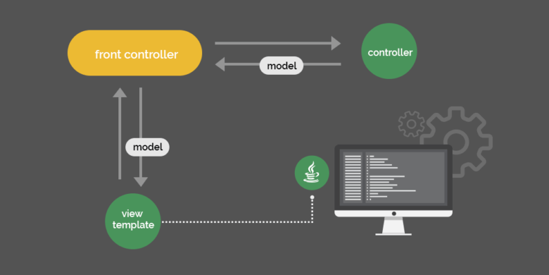
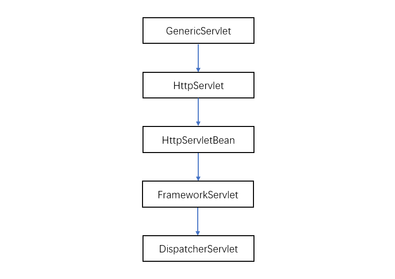

我们通过 Spring Boot 来创建一个 Web 应用，发挥作用的是 Spring MVC 框架。当我们在IDE里敲入以下代码时，究竟发生了什么呢？

```java
@GetMapping("/")
public String hello() {
    return "login";
}

@PostMapping("/login")
public ModelAndView login(LoginData loginData) {
    if (LOGIN.equals(loginData.getLogin())
      && PASSWORD.equals(loginData.getPassword())) {
        return new ModelAndView("success",
          Collections.singletonMap("login", loginData.getLogin()));
    } else {
        return new ModelAndView("failure",
          Collections.singletonMap("login", loginData.getLogin()));
    }
}
```

<!-- more -->

---

# 从基本的 Servlet 谈起

一个 Spring MVC 应用运行后，当我们在浏览器访问 http://localhost:8080/ 时，发生了什么？我们知道，Spring Boot 内置了一个 Tomcat，而 Tomcat 作为应用服务器，它是一个 Servlet 容器，所有发送给 Tomcat 的 HTTP 请求都会被 Java Servlet 进行处理。

Servlet 是 Java Web 应用的核心组件。一个 HTTP servlet 用于处理接收、处理一个 HTTP 请求，并进行响应。

我们自然会猜想，Spring Web 应用程序的入口，应该是一个 Servlet，事实也确实如此。

---

# DispatcherServlet

DispatcherServlet 就是 Spring Web 应用程序的入口，它就是一个servlet。

## 为什么需要 DispatcherServlet

对于我们开发者来说，我们关心的是业务逻辑，而不是繁琐无聊的样板代码，什么是样板代码呢？例如：

- 将一个 HTTP request 映射到一个处理该 request 的方法
- 将 HTTP request 的 data 和 header 转换为 DTO（data transfer objects ）或者 实体类（domain objects）
- model-view-controller 之间的相互连接
- 将处理完毕的 DTO 或 实体类转换回 HTTP 的 response

我们需要框架来帮我们简化这些繁琐的工作，而 Spring 的 DispatcherServlet 正是干这件事的。

同时，DispatcherServlet 是可扩展的，它允许我们为许多任务添加适配器（adapters），例如：

- 将一个 HTTP request映射到到一个可以处理该 request 的方法或类（这部分在 HandlerMapping 接口）
- 对不同的 request 做不同的处理，包括常规的 Servlet，复杂的 MVC 工作流，或者 POJO bean 里的方法（这部分在 HandlerAdapter 接口）
- 根据不同的模板引擎做不同的处理（这部分在 ViewResolver 接口）
- 解析多请求，例如多文件上传，或者你自己写的MultipartResolver解析器
- 解析 cookie、session、 Accept HTTP header 等（叫做locale）

---

# 处理 HTTP request的过程

DispatcherServlet 的继承关系：



## GenericServlet

GenericServlet 不直接针对 HTTP ，它只是定义了一个 service() 方法，用于接收请求以及产生响应。

```java
public abstract void service(ServletRequest req, ServletResponse res)
  throws ServletException, IOException;
```

## HttpServlet

HttpServlet是专注于 HTTP 请求的 Servlet。它是一个抽象类，其中的 service() 方法用于区分不同的 HTTP 方法（如 GET、POST）

```java
protected void service(HttpServletRequest req, HttpServletResponse resp)
    throws ServletException, IOException {
    String method = req.getMethod();
    if (method.equals(METHOD_GET)) {
        // ...
        doGet(req, resp);
    } else if (method.equals(METHOD_HEAD)) {
        // ...
        doHead(req, resp);
    } else if (method.equals(METHOD_POST)) {
        doPost(req, resp);
        // ...
    }
}
```

## HttpServletBean

HttpServletBean 是 Spring 能够感知的类。它从 web.xml 或 WebApplicationInitializer 等配置文件中获取初始化参数，并注入到 Servlet bean 属性当中，可以理解成为 DispatcherServlet 进行初始化。

## FrameworkServlet

FrameworkServlet 实现了 ApplicationContextAware 接口，在 Web context（上下文）中整合了 Servlet 的功能。 但 FrameworkServlet 自己也能创建一个 web context。

在其父类 HttpServletBean 中，对 Servlet 注入了一些初始化参数。一旦一个类出现在 contextClass 初始化参数当中，这个类的一个实例就会被创建。否则，就用默认的XmlWebApplicationContext。鉴于 XML 配置有点“过时”，在 Spring Boot 中默认使用的是注解方式，即AnnotationConfigWebApplicationContext

（这一段看不太懂，参考原文：https://dzone.com/articles/how-spring-mvc-really-works）

## DispatcherServlet

### 1.统一请求的处理（Unifying the Request Processing）

DispatcherServlet 用于统一所有请求的处理。如果说，HttpServlet.service()提供了一个底层的视角来区分HTTP请求的方法，那对 Spring MVC 来说，这些方法只是一个参数罢了。

在 HttpServlet 中区分了很多 HTTP 方法，但在 FrameworkServlet 中这些方法又被统一到 processRequest() 方法进行处理，之后才是 doService() 做具体的业务服务。

```java
@Override
protected final void doGet(HttpServletRequest request,
  HttpServletResponse response) throws ServletException, IOException {
    processRequest(request, response);
}
@Override
protected final void doPost(HttpServletRequest request,
  HttpServletResponse response) throws ServletException, IOException {
    processRequest(request, response);
}
// …
```

### 2.扩展请求（Enriching the Request）

之后，DispatcherServlet 实现了 doService() 方法，它不仅仅处理 web context，还包括 locale resolver，theme resolver, theme source 等等。

```java
request.setAttribute(WEB_APPLICATION_CONTEXT_ATTRIBUTE,
  getWebApplicationContext());
request.setAttribute(LOCALE_RESOLVER_ATTRIBUTE, this.localeResolver);
request.setAttribute(THEME_RESOLVER_ATTRIBUTE, this.themeResolver);
request.setAttribute(THEME_SOURCE_ATTRIBUTE, getThemeSource());
```

当然， doService()也准备了输入和输出的映射。Flash map是一种基本的模式，用于从一个请求传递参数到另一个请求，这在重定向的时候非常有用。

```java

FlashMap inputFlashMap = this.flashMapManager
  .retrieveAndUpdate(request, response);
if (inputFlashMap != null) {
    request.setAttribute(INPUT_FLASH_MAP_ATTRIBUTE,
      Collections.unmodifiableMap(inputFlashMap));
}
request.setAttribute(OUTPUT_FLASH_MAP_ATTRIBUTE, new FlashMap());
```

之后，doService()调用 doDispatch() 进行请求调度。

### 3.调度请求（Dispatching the Request）

Dispatch()方法最主要的用途是寻找适合的 handler，handler 可以是任意 Object 而不局限于某些接口。这意味着 Spring 需要为 handler 找到合适的适配器（adapter），从而知道如何与 handler “沟通”。

Spring 用 HandlerMapping 接口来找到与 request 匹配的 handler，HandlerMapping 有多种不同的实现。例如，SimpleUrlHandlerMapping  就能够根据 URL 找到合适的处理这个 request 的 bean 。

```
/welcome.html=ticketController
/show.html=ticketController
```

最广泛使用的 HandlerMapping 是 RequestMappingHandlerMapping。它能够将 `@RequestMapping` 注解映射到一个 `@Controller` 类中。

## 处理请求（Handling the Request）

当 Spring 通过 HandlerMapping 找到 request 对应的 handler 时，HandlerAdapter 的 .handler() 方法将决定如何处理这个 request,之后：

1. 将数据写进 response object，然后返回 null
2. 返回一个 ModelAndView object 用于被DispatcherServlet渲染

```java
@Nullable
ModelAndView handle(HttpServletRequest request,
                    HttpServletResponse response,
                    Object handler) throws Exception;
```

> 问：HandlerMapping不是已经可以帮助我们匹配到具体的handle（或者说控制器）了吗?为什么还需要HandlerAdapter？

> 答：这是因为使用了 **适配器模式**， 有很多种控制器(Controller) 一种是带 `@Controller` 注解的， 还有一种是写一个servlet 当做controller, 所以用适配器做适配，HandlerAdapter 有几个子类，每个子类都是适配某一种类型的控制器，有了 HandlerAdapter，你只需要调用 handle 方法，屏蔽了不一致的细节，否则在DispatcherServlet里面要写很多if else if else。

事实上，有多种 handler 类型。例如，SimpleControllerHandlerAdapter 处理一个  Spring MVC controller 的实例:

```java
public ModelAndView handle(HttpServletRequest request,
  HttpServletResponse response, Object handler) throws Exception {
    return ((Controller) handler).handleRequest(request, response);
}
```

注意，HandlerAdapter返回了一个 ModelAndView object，但是并没有渲染它。

另一个例子，SimpleServletHandlerAdapter 用于适配一个标准的 Servlet

```java
public ModelAndView handle(HttpServletRequest request,
  HttpServletResponse response, Object handler) throws Exception {
    ((Servlet) handler).service(request, response);
    return null;
}
```

Servlet 并不知道 ModelAndView ，它只是处理了 request 请求，然后把处理结果写进 response object，但是返回了一个空的 ModelAndView

而在我们开发的角度，Controller 是一个包含了一些 `@RequestMapping` 注解的 POJO 类。所以任何的 handler 其实都是包含在 HandlerMethod 实例里面的方法而已。Spring 用 RequestMappingHandlerAdapter 类来适配这种 handler 类型。

## 处理参数并返回值

在编写 Spring MVC 程序时，我们发现 Controller 中并没有用 HttpServletRequest 或者 HttpServletResponsearguments 作为方法的参数，而是用具体的实体类，或者路径变量（path parameter）等。同时还能发现，我们并不返回一个 ModelAndView 实例，而是返回一个视图名字，或者 POJO（将被转为JSON）。

事实上，RequestMappingHandlerAdapter 确保了从 HttpServletRequest 方法获取中的参数被解析。以及它会从方法的返回值创建一个 ModelAndView object。

RequestMappingHandlerAdapter 的核心代码如下，上述转换就发生在这里。

```java
ServletInvocableHandlerMethod invocableMethod
  = createInvocableHandlerMethod(handlerMethod);
if (this.argumentResolvers != null) {
    invocableMethod.setHandlerMethodArgumentResolvers(
      this.argumentResolvers);
}
if (this.returnValueHandlers != null) {
    invocableMethod.setHandlerMethodReturnValueHandlers(
      this.returnValueHandlers);
}
```

还有一些其他的比如 HandlerMethodArgumentResolver 、HandlerMethodReturnValueHandler，做的都是类似的转换的工作。

例如，当你在 controller 的 hello() 方法返回一个 string，ViewNameMethodReturnValueHandler 会处理这个值。而当你返回一个 ModelAndView ，则是 ModelAndViewMethodReturnValueHandler 来处理。

## 渲染视图（Rendering the View）

到这一步，Spring已经处理了 HTTP request 并得到一个 ModelAndView object，之后，DispatcherServlet 的 render() 方法将使用 LocaleResolver 实例设置 response 的 locale (cookie、session、 Accept HTTP header等) 。 Spring 会根据你用的是哪种模板引擎进行对应的渲染和解析，例如 ThymeleafViewResolver 用于渲染Thymeleaf模板引擎。在 render() 方法执行结束之后，HTML 页面就可以被发送到用户的浏览器进行显示了。

---

# REST 支持

除了传统的 MVC 场景，我们也可以用 Spring MVC 框架来创建 REST web 服务。接收参数时，我们可以用 `@RequestBody` 注解来声明接收一个 POJO （通常是JSON转换成实体类），也可以在方法上面加 `@ResponseBody` 来声明这个方法返回一个 POJO（Spring会帮你转换成 JSON）

```java
import org.springframework.web.bind.annotation.RequestBody;
import org.springframework.web.bind.annotation.ResponseBody;

@ResponseBody
@PostMapping("/message")
public MyOutputResource sendMessage(
  @RequestBody MyInputResource inputResource) {
    return new MyOutputResource("Received: "
      + inputResource.getRequestMessage());
}
```

Spring 框架是通过 HttpMessageConverter 来完成 DTO 到 REST representation 的转换的。例如，其中一个实现类 MappingJackson2HttpMessageConverter 就用来在 model object 与 JSON 之间互相转换，内部用的是 Jackson 库。

Spring 还可以在类上声明  `@RestController` 注解来简化REST API的创建过程。这可比在每一个方法都加上`@ResponseBody`方便得多。

```java
import org.springframework.web.bind.annotation.RestController;

@RestController
public class RestfulWebServiceController {
    @GetMapping("/message")
    public MyOutputResource getMessage() {
        return new MyOutputResource("Hello!");
    }
}
```

---

参考：[How Spring MVC Really Works](https://dzone.com/articles/how-spring-mvc-really-work)
