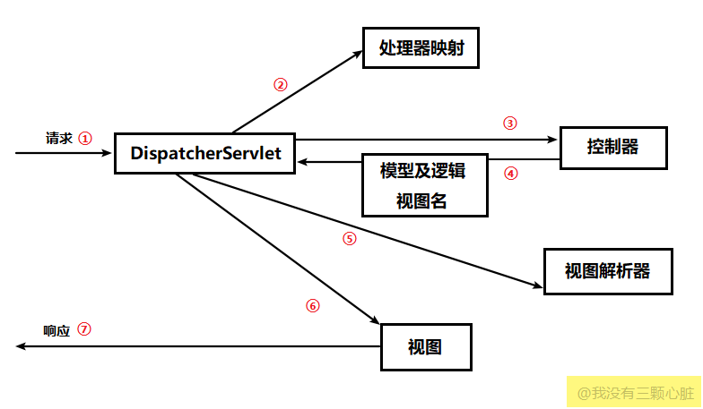

在 [从MVC到Spring Boot](../post/6200df85.html) 这一篇中，搭建了 Spring Boot 的 Hello World 程序。这一篇继续学习基于 Spring MVC 框架的应用程序。应用程序由Spring Boot搭建。

<!--more-->

---

# Spring MVC 的执行流程

在 Spring MVC 框架中，控制器实际上由两部分组成：

1. **前端控制器（DispatcherServlet）**：用于拦截所有用户请求和处理通用代码
2. **控制器（Controller）**： 实现实际的业务逻辑。



## 1. DispatcherServlet

用户请求统一被前端控制器 DispatcherServlet 捕获。DispatcherServlet 解析URL，得到URI，这个 URI 会被交给 Handle Mapping（处理器映射）。

## 2. Handle Mapping

Handle Mapping 会根据请求所携带的 URL 信息来进行决策，获取该 Handle 的所有相关对象，封装成 HandleExcutionChain 对象返回，DispatcherServlet 根据获得的 Handle，选择一个合适的 HandleAdapter。

## 3. Handle

HandlerAdapter 是处理器适配器，Spring MVC通 过HandlerAdapter 来实际调用处理函数。简单地说，就是让 HandlerAdapter 去调用 Handle 实际处理的方法，比如我们编写的 hello 方法。

```java
public ModelAndView handleRequest(javax.servlet.http.HttpServletRequest httpServletRequest, javax.servlet.http.HttpServletResponse httpServletResponse) throws Exception {
    // 处理逻辑
    ....
}
```

一般，Controller 是 Handler，但 Handler 不一定是 Controller。

> 填充 Handle 传入参数的过程中，Spring帮我们做了很多工作，包括：消息转换（json/xml -> 对象）、数据转换（String -> Integer）、数据格式化、数据验证等。

## 4. ModelAndView

Handle 处理完毕之后，会返回一个 Model， 仅仅有 Model 是不够的，用户看到一般是 View，因此把 Model 返回给 DispatcherServlet。

## 5. View Resolver

DispatcherServlet 会根据传过来的 Model，通过视图解析器（View Resolver）匹配一个适当的视图实现。

## 6. View

视图使用 Model 数据渲染出结果，这个输出结果会通过响应对象传递给客户端。


---

# 配置注解

- `@SpringBootApplication`：表示这是一个Spring Boot应用程序，它其实包含了`@ComponentScan`、`@Configuration`和`@EnableAutoConfiguration`等多个注解。
- `@Configuration`： 表示这是一个Java配置（相当于xml配置）
- `@EnableAutoConfiguration`：顾名思义，开启自动配置
- `@ComponentScan`：扫描包。默认扫描跟`@SpringBootApplication`所在类同级目录以及子目录。

---

# URL路由

- `@Controller`： 表示是一个处理HTTP请求的控制器(即MVC中的C)，该类中所有被 `@RequestMapping` 标注的方法都会用来处理对应URL的请求。

## 返回字符串和对象

- `@ResponseBody`：返回的是数据（Data），而不是视图（View）。如果数据是 Java 对象而不是字符串或基本数据类型，那么返回的就是 json 格式的（Spring MVC集成了jackson帮我们序列化）。

```java
@Controller
public class IndexController {
    @RequestMapping("/hello")
    @ResponseBody
    public String hello() {
        return "hello";
    }
}
```

或者用 `@RestController`，是 `@Controller` 和 `@ResponseBody` 的合体

```java
@RestController
public class IndexController {
    @RequestMapping("/api/city")
    public String hello() {
        City city = cityService.getCity();
        return city;
    }
}
```

- `@RequestMapping`： 浏览器请求映射路由，可以标记在方法上，也可以标记在类上。（详细用法可参考[CSDN](https://blog.csdn.net/walkerjong/article/details/7994326)）

`@RequestMapping`还可以细分为以下几个Mapping：

- `@GetMapping`： 浏览器 GET 方法请求映射路由
- `@PutMapping`
- `@PostMapping`
- `@DeleteMapping`

## 返回 HTML 页面

在 pom.xml 增加 thymeleaf 依赖(thymeleaf是一种比jsp更好的模板引擎)

```xml
<dependency>
  <groupId>org.springframework.boot</groupId>
  <artifactId>spring-boot-starter-thymeleaf</artifactId>
</dependency>

<dependency> <!-- 为了让Thymeleaf能够正确的识别HTML5 -->
  <groupId>net.sourceforge.nekohtml</groupId>
  <artifactId>nekohtml</artifactId>
  <version>1.9.22</version>
</dependency>
```

> Thymeleaf 遇到没有闭合的HTML标签会报错，可以在 application.properties 文件增加一行 `spring.thymeleaf.mode=LEGACYHTML5` 以支持HTML5

```java
@Controller
public class AppController {
    @GetMapping("/")
    public String index() {
        return "index";
    }

    @GetMapping("/home")
    public String create() {
        return "home";
    }
}

```

在 resource/templates 目录下放置 index.html 和 home.html，访问 127.0.0.1:8080/ 将跳转到 index.html，访问 127.0.0.1:8080/home 将跳转到 home.html

如果我们的项目变大了，有数十个 html 文件，我们要写很多个这样的样板方法，可以用 java config 简化样板方法

MvcConfig.java

```java
@Configuration
public class MvcConfig implements WebMvcConfigurer {

    public void addViewControllers(ViewControllerRegistry registry) {
        registry.addViewController("/home").setViewName("home");
        registry.addViewController("/").setViewName("index");
        registry.addViewController("/hello").setViewName("hello");
        registry.addViewController("/login").setViewName("login");
    }

}
```

---

# PathVariable 和 RequestParam

## 使用PathVariable获取路径变量

```java
@GetMapping("/users/{username}")
public String userProfile(@PathVariable String username) {
    return String.format("user %s", username);
}
```

可以使用下列形式来匹配正则表达式，语法`{变量名:正则表达式}`，不匹配的URL将不会被处理，直接返回404

```java
@GetMapping("/users/{username:[a-z0-9_]+}")
```

> [a-z0-9_]+是一个正则表达式，表示只能包含小写字母、数字和下划线。

当有多个路径变量时，用`@PathVariable(value = "..")`

```java
@PostMapping("api/rate/{userId}/{productId}/{rating}")
public void rate(@PathVariable(value="userId") Integer userId,
                 @PathVariable(value = "productId") Integer productId,
                 @PathVariable(value = "rating") Integer rating){

}
```

## 使用 RequestParam 获取参数

有时候我们需要处理 URL 中的参数 ，比如`127.0.0.1:8080/userinfo?key1=value1&key2=value2`

```java
@RestController
public class EditPetForm {

    @GetMapping("/blogs")
    public String setupForm(@RequestParam("id") int blogId) {
        return String.format("blog id = %d", blogId);
    }

}
```

访问 127.0.0.1:8080/blogs?id=66， 可以看到浏览器显示了 blog id = 66

- 使用`@RequestParam(name = "id", required = false, defaultValue = "1")`，当参数不存在的时候，默认为1

## 如何选择

两种方式都能获取用户输入：
- 通过`@PathVariable`，例如/blogs/1
- 通过`@RequestParam`，例如blogs?blogId=1

建议：
- 当URL指向的是某一具体业务资源（或者资源列表），例如博客、用户时，使用`@PathVariable`
- 当URL需要对资源或者资源列表进行过滤、筛选时，用`@RequestParam`

例如用`/blogs?state=publish`而不是`/blogs/state/publish`来表示处于发布状态的博客文章

## 其他注解

- `@RequestHeader`：获得请求头信息，作为方法参数

```java
@RequestMapping("/requestheaderTest")
public void requestheaderTest(
              @RequestHeader("User-Agent") String userAgent,
              @RequestHeader("Accept") String[] accepts) {
  // do something
}
```

- `@CookieValue`：获取Cookie信息，作为方法参数
- `@SessionAttributes`：允许我们有选择地指定 Model 中那些属性转存到 HttpSession 中。，一般注解在类上。
- `@ModelAttribute`：将请求参数绑定到 Model 对象

---

# 使用Thymeleaf模板渲染


## 后台发送数据给模板引擎

使用`Thymeleaf`作为模板引擎，在需要动态获取的地方用Thymeleaf标签替代。如

```html
<h2 th:text="${title}">博客标题</h2>
<span th:text="${createdTime}">
```

在HTML中增加命令空间，避免IDE错误提示

```html
<html xmlns="http://www.w3.org/1999/xhtml"
      xmlns:th="http://www.thymeleaf.org">
    ...
</html>
```

首先需要在 Controller 做一些工作

```java
@GetMapping(value = "/bookList")
public String getBookList(ModelMap map){
    List<book> bl = bookService.findAll();
    map.addAttribute("bookList", bl);
    return "bookList";
}
```

也可以简化为

```java
@GetMapping(value = "/bookList")
public String getBookList(ModelMap map){
    map.addAttribute("bookList", bookService.findAll());
    return "bookList";
}
```

这个 Controller 接收一个 ModelMap ，`map.addAttribute()`的第一个参数是属性名字，第二个参数是属性值，这个值就是 `bookService.findAll()`的返回结果。

这样就会把 `bookService.findAll()` 的结果（ `List<book>` 类型，在`addAttribute`方法里面刚刚给它命名为`bookList`了）传给 bookList.html

> 在Servlet编程中，如果希望在页面中动态渲染信息，一般需要往HttpRequest中添加属性，然后在JSP中获取。其实Model的属性实际上也是放在HttpRequest的属性中，但是Spring MVC提供了更高层的抽象，帮你屏蔽了HttpRequest，你看到的只有直接以MVC中M（即Model）。

在模板中用`th:each`来遍历这个 List<book>

```html
<table class="table table-striped">
    <thead>
    <tr>
        <th>博客</th>
        <th>标题</th>
        <th>内容</th>
    </tr>
    </thead>
    <tbody>
    <tr th:each="blog: ${blogList}">
        <th scope="row" th:text="${blog.blogId}"></th>
        <td th:text="${blog.blogTitle}"> </td>
        <td th:text="${blog.blogContent}"></td>
    </tr>
    </tbody>
</table>
```

有时候我们会想点击某个标题跳转到详细页面，用`th:href`属性

```html
<a href="#" th:href="@{'/blogs/'+${blog.id}}" th:text="${blog.title}"></a>
```

## 从前端模板接收数据

当用户进入 /create 路由，会跳转到创建博客的页面，`createBlog()`方法给前端传入了一个 blog 对象

```java
/**
 * 添加博客
 */
@GetMapping(value = "/create")
public String createBlog(Blog blog){
    return BLOG_CREATE_PAGE;
}
```

创建博客页面有一个表单（form），表单提交数据

```html
<form role="form" method='post' action="#" th:action="@{/blog/create/post}" th:object="${blog}" >
    <div class="form-group">
        <label for="blogTitle">微博标题</label>
        <input type="text" class="form-control" id="blogTitle" th:field="*{blogTitle}" placeholder="输入文章标题">
    </div>
    <div class="form-group">
        <label for="blogContent">微博内容</label>
        <textarea class="form-control" rows="10" id="blogContent" th:field="*{blogContent}" placeholder="输入文章内容"></textarea>
    </div>
    <div align="center" class="form-group">
        <button type="submit" class="btn btn-default">提交</button>
    </div>
</form>
```

- `th:action="@{/blog/create/post}"`表示要提交的路由
- `th:object="${blog}"`表示接收从刚刚的路由传入的对象
- `th:field="*{blogTitle}"`和 `th:field="*{blogContent}"`表示当按下提交按钮，这两个输入框的内容将会绑定为 blog 对象的 blogTitle属性 和 blogContent 属性。然后传回给后端。

```java
/**
 * 处理添加请求
 */
@PostMapping(value = "/create/post")
public String postBlog(@ModelAttribute(value="blog") Blog blog){
    blogService.addBlog(blog.getBlogTitle(),blog.getBlogContent());
    return "redirect:/blog/";
}
```

后端接收 blog 对象，进行处理。

- 更多关于Thymeleaf的内容：[使用Thymeleaf模板引擎](../post/7c6dd7fa.html)

---

# ModelMap 和 ModelAndView 区别

在控制器方法中，我们传入了一个 ModelMap 参数，或者 ModelAndView 。区别如下：

- ModelMap的实例是spirng mvc框架自动创建并作为控制器方法参数传入，用户无需自己创建。

```java
public String xxxxmethod(String someparam,ModelMap model)
{
     //省略方法处理逻辑若干
     //将数据放置到ModelMap对象model中,第二个参数可以是任何java类型
      model.addAttribute("key",someparam);
         ......
     //返回跳转地址
      return "path:handleok";
}
```

- ModelAndView的实例是由用户手动创建的，这也是和ModelMap的一个区别。

```java
public ModelAndView xxxxmethod(String someparam)
{
     //省略方法处理逻辑若干
      //构建ModelAndView实例，并设置跳转地址
      ModelAndView view = new ModelAndView("path:handleok");
      //将数据放置到ModelAndView对象view中,第二个参数可以是任何java类型
      view.addObject("key",someparam);
    ......
     //返回ModelAndView对象view
      return view;
}
```

ModelAndView 实际上包含了两个 object ：

1. **Model**：用于渲染页面的 k-v 键值对数据
2. **View**：填充了Model里面的数据的页面模板

---

# @ModelAttribute与@RequestBody的区别

- **@RequestBody**: 用于接收json，如ajax请求的data参数，在接收后直接转换成Pojo。支持 POST、PUT 等多种HTTP方法。
- **@ModelAttribute**: 在 GET 请求中，用于直接接收URL的参数，如url?id=123&name=456 在接收后直接转换成Pojo。 在 POST 请求中， 用于接收POST提交的内容。

注： GET 请求参数还可用 `@RequestParam` 来获取。

```java
/**
 *  添加商品
 * @param product
 * @return
 */
@PutMapping("")
public Integer addProduct(@RequestBody Product product){
    productService.addProduct(product);
    return product.getId();
}
```


---

# 使用 PageHelper 分页

PageHelper 是 Mybatis 的一个分页插件。

获取最新版本：https://mvnrepository.com/artifact/com.github.pagehelper/pagehelper-spring-boot-starter

添加分页依赖

pom.xml
```xml
<dependency>
    <groupId>com.github.pagehelper</groupId>
    <artifactId>pagehelper-spring-boot-starter</artifactId>
    <version>1.2.10</version>
</dependency>
```

控制器

```java
/**
 *  获取某个分类下所有在售商品
 * @param cateId 分类ID
 * @return
 */
@GetMapping(value = "{cate_id}/product")
@ResponseBody
public PageInfo<Product> getProductByCateId(@PathVariable(value = "cate_id") Integer cateId,
                                        @RequestParam(value = "start", defaultValue = "1") int start,
                                        @RequestParam(value = "size", defaultValue = "9") int size){
    PageHelper.startPage(start,size,"id desc");
    List<Product> products = categoryService.getProductByCateId(cateId);
    PageInfo<Product> page = new PageInfo<>(products);
    return page;
}
```

---

# 全局配置

在项目 resource 目录下，修改`application.properties`文件。

```
## 服务器配置
server.port = 8089
server.context-path=/test

## 数据源配置
spring.datasource.url=jdbc:mysql://localhost:3306/springbootdb?useUnicode=true&characterEncoding=utf8
spring.datasource.username=root
spring.datasource.password=123456
spring.datasource.driver-class-name=com.mysql.jdbc.Driver

## Mybatis 配置（仅xml方式）
mybatis.typeAliasesPackage=org.spring.springboot.domain
mybatis.mapperLocations=classpath:mapper/*.xml

## thymeleaf 配置
spring.thymeleaf.suffix=.html
spring.thymeleaf.prefix=classpath:templates
spring.thymeleaf.encoding=UTF-8
spring.thymeleaf.cache=false
spring.thymeleaf.mode=LEGACYHTML5

# JPA 相关配置
# 配置在日志中打印出执行的 SQL 语句信息
spring.jpa.show-sql=true
```
