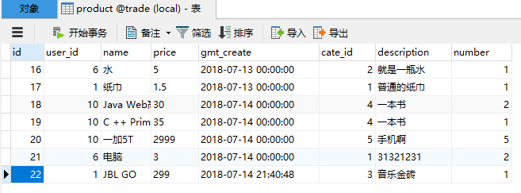
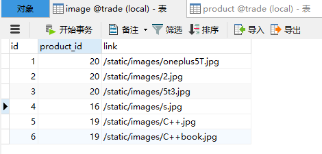
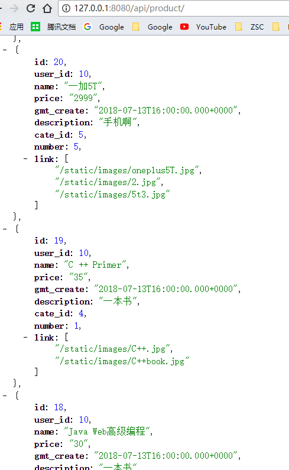

在 [使用 Mybatis 简化 JDBC 操作](../post/f251f1b.html) 中，简单描述了 Mybatis 的使用。这一篇主要记录下如何集成 Spring boot

---

# Spring Boot 集成 Mybatis 简明过程

创建一个 Spring Initalizr 工程，依赖选择 web、MySQL、Mybatis

在application.properties填入以下内容

```
spring.datasource.url=jdbc:mysql://127.0.0.1:3306/neu?characterEncoding=UTF-8&useSSL=false
spring.datasource.username=root
spring.datasource.password=YourPassword
spring.datasource.driver-class-name=com.mysql.jdbc.Driver
```

- 创建pojo包，创建 Student 实体类，跟数据库对应

```java
public class Student {
    Integer id;
    String name;
    String major;
    Integer grade;

    // 省略 getter setter
}
```

- 创建mapper包，创建StudentMapper接口

 > 在SpringBootApplication类中，添加`@MapperScan("io.jerrysheh.student.mapper")`注解，即可不用在 mapper 包下面的每一个接口都注解Mapper了。

```java
@Mapper
public interface StudentMapper {

    @Select("SELECT * FROM student")
    List<Student> findAll();
}
```

如果有多个参数，用 `@Param` 注解

```java
@Update("update user set password=#{password} WHERE id=#{id}")
void updatePassword(@Param("password") String password, @Param("id") Integer id);
```

- 创建Controller包，创建StudentController

```java
@RestController
public class StudentController {

    @Autowired
    StudentMapper studentMapper;

    @GetMapping("/listStudent")
    public void listStudent(){
        List<Student> studentList = studentMapper.findAll();
        for (Student student:
             studentList) {
            System.out.println(student.getName());
        }
    }
}
```

这样，运行后访问 `127.0.0.1:8080/listStudent` ，可看到控制台输出数据库查到的所有 student 名字。

## xml 方式

有时候为了将SQL和Java代码隔离 ，会将 SQL 抽到 xml 里面，配置方法如下：

在application.properties填入以下内容(重要！！！)

```
mybatis.mapper-locations=classpath:mapper/*.xml
mybatis.type-aliases-package=com.jerrysheh.fun.entity
mybatis.configuration.map-underscore-to-camel-case=true
```

在 resources 目录下创建 mapper 文件夹，再创建 productmapper.xml 文件

```xml
<?xml version="1.0" encoding="UTF-8" ?>
<!DOCTYPE mapper PUBLIC "-//mybatis.org//DTD Mapper 3.0//EN" "http://mybatis.org/dtd/mybatis-3-mapper.dtd" >

<mapper namespace="com.jerrysheh.fun.mapper.ProductMapper">

    <select id="selectAll" resultType="com.jerrysheh.fun.entity.Product">
        SELECT * FROM fun_product;
    </select>

    <insert id="addProduct" >
        insert into fun_product(product_name, product_price) values (#{productName}, #{productPrice})
    </insert>
</mapper>
```

> 注意：namespace一定要填写对应的 mapper 接口，不能只到 package

编写单元测试

```java
@SpringBootTest
public class test {

    @Autowired
    ProductMapper productMapper;

    @Test
    public void test(){
        List<Product> productList = productMapper.selectAll();
        productList.forEach(System.out::println);
    }

}
```

---

以下为Mybatis知识点

# 井字符和美元符的区别

\#相当于对数据加上双引号，$相当于直接显示数据

\#方式能够很大程度防止sql注入。$方式无法防止Sql注入。

---

# 动态SQL

虽然我们使用了注解，但是还是在注解接口CategoryMapper中使用了原生 SQL 语句。

```java
@Insert(" insert into category_ ( name ) values (#{name}) ")
public int add(Category category);
```

其实，我们可以提供一个类，专门用来生成SQL语句

CategoryDynaSqlProvider.java

```java
package com.jerrysheh.mapper;
import org.apache.ibatis.jdbc.SQL;

public class CategoryDynaSqlProvider {
    public String list() {
        return new SQL()
                .SELECT("*")
                .FROM("category_")
                .toString();

    }
    public String get() {
        return new SQL()
                .SELECT("*")
                .FROM("category_")
                .WHERE("id=#{id}")
                .toString();
    }

    public String add(){
        return new SQL()
                .INSERT_INTO("category_")
                .VALUES("name", "#{name}")
                .toString();
    }
    public String update(){
        return new SQL()
                .UPDATE("category_")
                .SET("name=#{name}")
                .WHERE("id=#{id}")
                .toString();
    }
    public String delete(){
        return new SQL()
                .DELETE_FROM("category_")
                .WHERE("id=#{id}")
                .toString();
    }
}
```

然后修改我们的CategoryMapper接口

```java
package com.jerrysheh.mapper;

import com.jerrysheh.pojo.Category;
import org.apache.ibatis.annotations.*;

import java.util.List;

public interface CategoryMapper {

    @InsertProvider(type=CategoryDynaSqlProvider.class,method="add")
    public int add(Category category);

    @DeleteProvider(type=CategoryDynaSqlProvider.class,method="delete")
    public void delete(int id);

    @SelectProvider(type=CategoryDynaSqlProvider.class,method="get")
    public Category get(int id);

    @UpdateProvider(type=CategoryDynaSqlProvider.class,method="update")
    public int update(Category category);

    @SelectProvider(type=CategoryDynaSqlProvider.class,method="list")
    public List<Category> list();
}
```

这样就可以动态生成SQL语句了

- 注解中的 `type=` 填入我们的动态生成SQL类CategoryDynaSqlProvider.class
- `method=`填入CategoryDynaSqlProvider类里的方法

---

# @Results结果映射

如果 javabean 的属性字段 跟 数据库字段一一对应，名字保持一致，则直接可以：

```java
@Select("select *from Demo where id=#{id}")  
public Demo selectById(int id);  
```

但如果不对应，就要用`@Result`修饰返回的结果集，而`@Results`注解将指定的数据库列与指定JavaBean属性映射起来。

```java
@Select("SELECT * FROM `wx_message_config` WHERE `content_key_words` IS NOT NULL AND LENGTH(content_key_words) > 0")
@Results({
        @Result(property = "msgType", column = "msg_type"),
        @Result(property = "eventType", column = "event_type"),
        @Result(property = "eventKey",column = "event_key"),
        @Result(property = "contentKeyWords",column = "content_key_words")
})
List<WxMessageConfig> queryAllKeyWords();

@Select("SELECT * FROM `wx_message_config` WHERE `id` = #{id}")
@Results({
        @Result(property = "msgType", column = "msg_type"),
        @Result(property = "eventType", column = "event_type"),
        @Result(property = "eventKey",column = "event_key"),
        @Result(property = "contentKeyWords",column = "content_key_words")
})
WxMessageConfig queryKwById(int id);
```

这样会导致写很多重复内容，可以用 `@ResultMap(“id”) `

```java
@Select("SELECT id, name, password FROM user WHERE id = #{id}")
@Results(id = "userMap", value = { @Result(column = "id", property = "id", javaType = Integer.class),
        @Result(column = "name", property = "name", javaType = String.class),
        @Result(column = "password", property = "password", javaType = String.class) })
User findById(Integer id);

@Select("SELECT * FROM user")
@ResultMap("userMap")
List<User> fingAll();
```

---

# 一对多查询

假设有一张 商品表 和 一张 图片表， 一个商品对应多张图片





那么如何取出一个商品，包含商品的所有属性，以及对应的所有图片呢？

## 实体类

商品的所有字段，同时，要添加一个 `List<String>` 表示多张图片的集合

```java
public class Product {
    private Integer id;
    private Integer user_id;
    private String name;
    private String price;
    private Date gmt_create;
    private String description;
    private Integer cate_id;
    private Integer number;

    // 关键！
    private List<String> link;

    // 省略 getter setter
}
```

图片的所有属性，用 String 表示图片地址

```java
public class Image {
    private Integer id;
    private Integer product_id;
    private String link;
}
```

## Mapper接口

在图片的Mapper接口中，根据商品id找到对应的所有图片

```java
// 根据商品id找图片
@Select("SELECT link from image WHERE product_id = #{product_id}")
List<String> getImageLinksByProductId(Integer product_id);
```

在商品的Mapper接口中，通过 `@Results` 和 `@Many` 来进行关联

```java
// 取出在售的所有商品，最新的排前面
@Select("select * from product WHERE number > 0 ORDER BY id DESC")
@Results({
        // 这里要对id进行限定，否则 id 会为 null
        @Result(property = "id", column = "id"),

        // 将 image 的 link 和 product 的 id 绑定，通过 @Many 查询 返回 List
        @Result(property = "link", column = "id", javaType = List.class, many = @Many(select = "com.zsc.tradeplatform.mapper.ImageMapper.getImageLinksByProductId")),
})
List<Product> getAll();
```

## 控制器

```java
@ResponseBody
@GetMapping("/api/product")
    public List<Product> getAllProduct(){
        return productService.getAllProduct();
    }
```

访问 `127.0.0.1:8080/api/product` 查看结果


