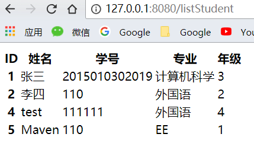

# 什么是 Thymeleaf

Thymeleaf的官方定义为

> Thymeleaf is a modern server-side Java template engine for both web and standalone environments。

简单地讲，Thymeleaf 是一种现代的Java服务器端模板引擎。可以达到和JSP一样的效果，但是比起JSP对于前端测试更加友好。JSP需要运行起来才能看到效果，而 Thymeleaf 本身就是html格式，无需服务器也能看到效果。

- 官方网站: https://www.thymeleaf.org/
- 官方文档：https://www.thymeleaf.org/documentation.html

<!-- more-->

---

# Spring Boot 集成 Thymeleaf 简明过程

在 Spring Initalizr 过程中选择 Thymeleaf 组件，然后在工程templates目录下创建 html 文件即可

如果 Spring Initalizr 过程中忘记添加，可以在 pom.xml 下面添加依赖：

```xml
<dependency>
    <groupId>org.springframework.boot</groupId>
    <artifactId>spring-boot-starter-thymeleaf</artifactId>
</dependency>
```

---

# 一个简单的例子

## 控制器端

```java
@GetMapping("/findStudent/{id}")
public String findStudent(@PathVariable Integer id, Model m){

    // 通过 Mybatis 查询一个学生信息
    Student s = studentMapper.findById(id);

    // 给 Model 添加属性，其中第一个参数属性名，第二个参数属性值
    m.addAttribute("name", s.getName());
    return "findStudent";
}
```

- 注意不要加`@ResponseBody`注解
- return 的内容是模板引擎的名字

## 前端

findStudent.html，放在 templates 目录下

```html
<!DOCTYPE HTML>
<html xmlns:th="http://www.thymeleaf.org">
<head>
    <title>hello</title>
    <meta http-equiv="Content-Type" content="text/html; charset=UTF-8" />
</head>
    <body>
    <p th:text="${name}" >name</p>
    <p th:text="'Hello！ ' + ${name} + '!'" >hello world</p>
    <p th:text="|Hello！ ${name}!|" >hello world</p>
    </body>
</html>
```

- `${name}`就是后台`m.addAttribute("name", s.getName());`中设置的name。

---

# 对象

如果后台传过来的是一个对象，如：

```java
m.addAttribute("student", s);
```

在 Thymeleaf 中直接取属性

```html
<p th:text="${s.name}" ></p>
```

或者也可以取方法

```html
<p th:text="${s.getName()}" ></p>
```

或者用`th:object`先给出对象，再用`*{}`的方式取出属性

```html
<div class="showing" th:object="${student}">
  <p th:text="*{name}" ></p>
</div>
```

---

# 对象集合

如果后台传过来的是一个对象集合，如：

```java
// 查找所有学生
@GetMapping("/listStudent")
public String listStudent(ModelMap map){
    List<Student> allStudents = studentMapper.findAll();
    map.addAttribute("allStudents", allStudents);
    return "listStudent";
}
```

在 Thymeleaf 中，用 `th:each` 来遍历。

```html
<table class="table table-striped">
    <thead>
    <tr>
        <th>ID</th>
        <th>姓名</th>
        <th>学号</th>
        <th>专业</th>
        <th>年级</th>
    </tr>
    </thead>
    <tbody>
    <tr th:each="oneStudent: ${allStudents}">
        <th scope="row" th:text="${oneStudent.id}"></th>
        <td th:text="${oneStudent.name}"> </td>
        <td th:text="${oneStudent.getNumber()}"></td>
        <td th:text="${oneStudent.major}"></td>
        <td th:text="${oneStudent.grade}"></td>
    </tr>
    </tbody>
</table>
```

效果：



---

# 条件语句

在控制器端有个 boolean 变量

```java
@RequestMapping("/test")
public String test(Model m) {
    boolean testBoolean = true;
    m.addAttribute("testBoolean", testBoolean);
    return "test";
}
```

 Thymeleaf 前端用`th:if`来表示

 ```html
 <p th:if="${testBoolean}" >如果testBoolean 是 true ，本句话就会显示</p>
 <p th:if="${not testBoolean}" >取反</p>
 ```

或者用三元表达式

如果testBoolean为真显示A，否则显示B

```html
<p th:text="${testBoolean}?'A':'B'" ></p>
```

---

# 日期

控制器端

```java
Date now = new Date();
m.addAttribute("now", now);
```


前端

```html
<div class="showing date">
    <h2>格式化日期</h2>
    直接输出日期 ${now}:
    <p th:text="${now}"></p>
    默认格式化 ${#dates.format(now)}:
    <p th:text="${#dates.format(now)}"></p>
    自定义格式化 ${#dates.format(now,'yyyy-MM-dd HH:mm:ss')}:
    <p th:text="${#dates.format(now,'yyyy-MM-dd HH:mm:ss')}"></p>
</div>
```

---

# 包含另一个HTML

 假如我们的网站，每一个页面都需要包含页脚 foot.html

 写一个页脚 foot.html ，把需要被包含的字段用 `th:fragment` 字段。

 ```html
 <html xmlns:th="http://www.thymeleaf.org">
<footer th:fragment="footer1">
   <p >All Rights Reserved</p>
</footer>
<footer th:fragment="footer2(start,now)">
   <p th:text="|${start} - ${now} All Rights Reserved|"></p>
</footer>
</html>
 ```

page.html

在 page.html 用`th:replace`引用

```html
<div class="showing">
    <div th:replace="include::footer1" ></div>
    <div th:replace="include::footer2(2015,2018)" ></div>
</div>
```

---

# 引入 CSS 和 js

通过 `th:href="@{/static/css/style.css}"` 和 `th:src="@{/static/js/mybeautiful.js}"` 这种`@`语法引入 css 和 js 文件。

例子：

```html
<link rel="stylesheet" type="text/css" media="all" href="../../webapp/static/css/style.css" th:href="@{/static/css/style.css}"/>
<script type="text/javascript" src="../../webapp/static/js/thymeleaf.js" th:src="@{/static/js/mybeautiful.js}"></script>
```
---
