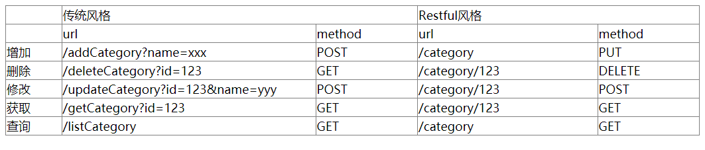

# 什么是 RESTful ？

REST这个词由 Roy Thomas Fielding 在他2000年的博士论文中提出。全称是 Representational State Transfer ，这个词省略了主语 Resource，因此翻译成中文是：资源表述性状态转化。

## 资源（Resource）

之前在 [HTTP之旅](../post/1707ee78.html) 一文中提到过，一个 Web 页面包含了很多对象，这些对象可以是 html ，可以是 JSON、XML，或者可以是图片、嵌入的视频，还可以是java小程序等等。这些对象都可以称为资源。我们通过 `统一资源定位符（URI）`去定位资源。

## 表述性（REpresentational）

正如上面提到的，资源可以用各种形式来进行表述，我们可以使用最适合资源使用者的任意形式来表述资源。资源具体呈现出来的形式，就是资源的表述性（REpresentational）。

## 状态转化（State Transfer）

HTTP协议是无状态协议。这意味着，资源的所有的状态都保存在服务器端。因此，如果客户端想要操作服务器，必须通过某种手段，让服务器端发生"状态转化"（State Transfer）。

客户端用到的手段，只能是HTTP协议。具体来说，就是HTTP协议里面，四个表示操作方式的动词：GET、POST、PUT、DELETE。它们分别对应四种基本操作：GET用来获取资源，POST用来新建资源（也可以用于更新资源），PUT用来更新资源，DELETE用来删除资源。

简单总结：资源通过 URL 进行识别和定位，然后通过行为(即 HTTP 方法)来定义应该完成怎样的功能。

<!--more-->

## 实例说明

在HTTP协议中，有GET、POST、HEAD、PUT、DELETE、OPTIONS、TRACE、CONNECT 众多方法，我们可以通过不同的HTTP方法来对应CRUD的操作。

例如：

HTTP方法|CRUD操作
---|---
GET| 查询(Retrieve)
POST| 更新(Update)
PUT| 增加(Create)
DELETE | 删除(Delete)

尽管通常来讲，HTTP 方法会映射为 CRUD 动作，但这并不是严格的限制，有时候 PUT 也可以用来创建新的资源，POST 也可以用来更新资源。实际上，**POST 请求非幂等的特性(即同一个 URL 可以得到不同的结果)** 使其成一个非常灵活地方法，对于无法适应其他 HTTP 方法语义的操作，它都能够胜任。

在使用 RESTful 风格之前，我们如果想要增加一条商品数据通常是这样的:

```
/addCategory?name=xxx
```

但是使用了 RESTful 风格之后就会变成:

```
/category
```

这就变成了使用同一个 URL ，通过约定不同的 HTTP 方法来实施不同的业务，这就是 RESTful 风格所做的事情了。



> 图片引自 how2j.cn

---

# Springboot 实战

RESTful API设计

请求类型|URL|说明
---|---|---
GET|/students|查询所有学生
POST|/students|创建一个学生
GET|/students/{id}|根据id查询一个学生
PUT|/students/{id}|根据id更新一个学生
DELETE|/students/{id}|根据id删除一个学生

实体类 Student.java

```java
public class Student {
    Integer id;
    String name;
    String number;
    String major;
    Integer grade;
    // 省略 setter getter
}
```

控制器

```java
@RestController
@RequestMapping(value = "/students")
public class StudentAPIController {

    @Autowired
    StudentMapper studentMapper;

    // 查询所有学生
    @GetMapping("/")
    public List<Student> getStudentList(){
        return studentMapper.findAll();
    }

    // 增加学生
    @PostMapping("/")
    public Student addStudent(@ModelAttribute Student student){
        studentMapper.addStudent(student);
        return student;
    }

    // 查询学生
    @GetMapping("/{id}")
    public Student getStudent(@PathVariable Integer id){
        return studentMapper.findById(id);
    }

    // 删除学生
    @DeleteMapping("/{id}")
    public String deleteStudent(@PathVariable Integer id){
        studentMapper.deleteById(id);
        return "redirect:/";
    }

    // 更新学生
    @PutMapping("/{id}")
    public Student updateStudent(@PathVariable Integer id, @ModelAttribute Student student){
        studentMapper.updateStudent(student);
        return student;
    }

}
```

---

# 封装统一的返回样式

在返回 REST 数据时，可能请求成功也可能失败，成功需要返回请求的信息，失败需要返回失败原因，如下：

请求失败：

```JSON
{
    statusCode: 401,
    messages: "未登录",
}
```

请求成功：

```JSON
{
    statusCode: 200,
    messages: "ok",
    content: "response contents"
}
```


---

参考

- http://www.cnblogs.com/wmyskxz/p/9104368.html
- http://blog.didispace.com/springbootrestfulapi/
- [理解RESTful架构](http://www.ruanyifeng.com/blog/2011/09/restful.html)
- [RESTful API 设计指南](http://www.ruanyifeng.com/blog/2014/05/restful_api.html)
