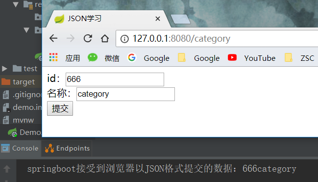

JSON（JavaScript Object Notation）是一种轻量级的数据交换格式，通常用于在客户端和服务器之间传递数据。

JSON 类似下面这样：

```
{"id":4,"name":"梅西","pwd":"6666"}
```

JSON 的优点：

- 轻量级交互语言
- 结构简单
- 易于解析

<!--more-->

---

# JavaScript Json语法

前面提到，JavaScript对象分为：
- 内置对象(Number,String,Array,Date,Math)
- 自定义对象

JSON就属于自定义对象，只不过是以JSON这样的数据组织方式表达出来。

## json对象

定义一个JSON对象

```html
<script>
var student = {"name":"jerry","id":6606};
var person = {"name":"张三","age":30};

//输出：[object Object]
document.write("这是一个JSON对象: " + student1);

//输出：jerry
document.write("student1对象的name元素: " + student1.name);

//输出：30
document.write("person对象的name元素: " + person.age);
</script>
```


## json数组

一对`{}`括号表示一个json对象，一个json数组用`[]`括号表示。

```html
<script>

var heros=
[
    {"name":"盖伦","hp":616},
    {"name":"提莫","hp":313},
    {"name":"死哥","hp":432},
    {"name":"火女","hp":389}
]

//输出：4
document.write("JSON数组大小"+heros.length);

//输出：火女
document.write( "第4个英雄是:" +  heros[3].name);

</script>
```
## 字符串转json对象

JavaScript方式

```JavaScript
var s1 = "{\"name\":\"盖伦\"";
var s2 = ",\"hp\":616}";

// s3是字符串{"name":"盖伦","hp":616}
var s3 = s1+s2;

// j1是json对象
var j1 = eval("("+s3+")");
```

JQuery方式

```JavaScript
var gareen = $.parseJSON(s3);
```

---

# 从前端发送 Json 数据到后台

可以使用 Ajax 提交 json 数据到后台

前端 category.html，放在 templates 文件夹里面

```HTML
<!DOCTYPE html>
<html lang="en">
<head>
    <meta charset="UTF-8">
    <title>JSON学习</title>
    <!-- 菜鸟教程 -->
    <script src="http://how2j.cn/study/jquery.min.js"></script>
</head>

<body>
<!-- 一个表单-->
<form>
    id：<input type="text" id="id" value="123"/><br/>
    名称：<input type="text" id="name" value="category xxx"/><br/>
    <input type="button" value="提交" id="sender">
</form>

<div id="messageDiv"></div>


<script>
    $('#sender').click(function () {
        var id = document.getElementById('id').value;
        var name = document.getElementById('name').value;
        var category = {"name": name, "id": id};

        //使用 JSON.stringify() 来将一个JSON对象转换成了一串字符串
        var jsonData = JSON.stringify(category);
        var page = "category";

        //在AJAX中，我们设置了 dataType 和 contentType 来告知后台我们传输的是一个JSON数据
        $.ajax({
            type: "put",
            url: page,
            data: jsonData,
            dataType: "json",
            contentType: "application/json;charset=UTF-8",
            success: function (result) {
            }
        });
        alert("提交成功，请在springboot控制台查看服务端接收到的数据");

    });
</script>
</body>
</html>
```

后台 Springboot

```java
@Controller
public class categoryController {

    //用于访问 http://127.0.0.1:8080/category
    @GetMapping("/category")
    public String Category() {
        return "category";
    }

   // 用于在 http://127.0.0.1:8080/category 点击表单的提交按钮
    @PutMapping("/category")
    public void addCategory(@RequestBody Manager manager) throws Exception {
        System.out.println("springboot接受到浏览器以JSON格式提交的数据：" + manager.getAge() + manager.getName());
    }
}
```

效果：



---

# Java中使用 json 库

Java中处理 json 格式的数据可以用 `orj.json` 包 或者 net.sf.json-lib 的 `json-lib` 包，但是提供的方法还是比较基础的。

因此可以采用一些开源框架，比如Google的 Gson、 阿里巴巴的 fastjson、 还有 jackson 。

这里以 Google 的 Gson 为例。

- 依赖包下载地址：[mvnrepository](http://mvnrepository.com/artifact/com.google.code.gson/gson/2.8.2)
- 项目地址：[github](https://github.com/google/gson)


## 基本数据类型（及包装类）和 Json 互转

```java
// Serialization
//基本数据类型转 Json
Gson gson = new Gson();
gson.toJson(1);            // ==> 1
gson.toJson("abcd");       // ==> "abcd"
gson.toJson(new Long(10)); // ==> 10
int[] values = { 1 };
gson.toJson(values);       // ==> [1]

// Deserialization
// Json 转基本数据类型
int one = gson.fromJson("1", int.class);
Integer one = gson.fromJson("1", Integer.class);
Long one = gson.fromJson("1", Long.class);
Boolean false = gson.fromJson("false", Boolean.class);
String str = gson.fromJson("\"abc\"", String.class);
String[] anotherStr = gson.fromJson("[\"abc\"]", String[].class);
```

## 对象和 Json 互转

```java
// 定义一个类
class BagOfPrimitives {
  private int value1 = 1;
  private String value2 = "abc";
  private transient int value3 = 3;
  BagOfPrimitives() {
    // no-args constructor
  }
}

//实例化对象
BagOfPrimitives obj = new BagOfPrimitives();

// Serialization
//对象转Json
// ==> json is {"value1":1,"value2":"abc"}
Gson gson = new Gson();
String json = gson.toJson(obj);  

// Deserialization
// Json转对象
// ==> obj2 is just like obj
BagOfPrimitives obj2 = gson.fromJson(json, BagOfPrimitives.class);

```

- 数组、集合等其余转换可参考 [UserGuide](https://github.com/google/gson/blob/master/UserGuide.md)
- 一篇不错的参考博客：[CSDN](https://blog.csdn.net/u014242422/article/details/53414212)

---

# 使用 Gson 解析嵌套的json对象

## 序列化（Serialization）

所谓序列化指的是将　Java 对象　映射成　json 数据。

首先由一个java类 UserNested，里面包含另一个java类 UserAddress

```java
// UserNested.java
public class UserNested {
    String name;
    String email;
    boolean isDeveloper;
    int age;
    UserAddress userAddress;
}

// UserAddress.java
public class UserAddress {
    String street;
    String houseNumber;
    String city;
    String country;
}
```

使用 Gson

test.java

```java
// 内部对象
UserAddress userAddress = new UserAddress(
    "Main Street",
    "42A",
    "Magdeburg",
    "Germany"
);

// 外部对象
 UserNested userObject = new UserNested(
    "Norman",
    "norman@futurestud.io",
    true,
    22,
    userAddress
);

Gson gson = new Gson();
String userWithAddressJson = gson.toJson(userObject);
```

输出结果：

```json
{
    "age": 22,
    "email": "jerrysheh@gmail.com",
    "isDeveloper": true,
    "name": "jerry",

    "userAddress": {
        "city": "Magdeburg",
        "country": "Germany",
        "houseNumber": "42A",
        "street": "Main Street"
    }
}
```


Gson 中只能根据 "{}" 标志来创建一个新对象。


## 反序列化（deserialization）

反序列化就是把 **json 数据** 映射成 **java 对象**

原始数据

```json
{
    "name": "Future Studio Steak House",
    "owner": {
        "name": "Christian",
        "address": {
            "city": "Magdeburg",
            "country": "Germany",
            "houseNumber": "42A",
            "street": "Main Street"
        }
    },
    "cook": {
        "age": 18,
        "name": "Marcus",
        "salary": 1500
    },
    "waiter": {
        "age": 18,
        "name": "Norman",
        "salary": 1000
    }
}
```

手动创建相匹配的 javabean

```java
// resuaurant.java
public class Restaurant {
    String name;

    Owner owner;
    Cook cook;
    Waiter waiter;
}

// Owner.java
public class Owner {
    String name;

    UserAddress address;
}

// Cook.java
public class Cook {
    String name;
    int age;
    int salary;
}

// Waiter.java
public class Waiter {
    String name;
    int age;
    int salary;
}
```

> 其实可以用内部类的形式，这样只需要写一个 bean，更加简明。 **注意**：如果使用内部类，需要声明为 static ，否则 Gson 无法解析。

转化

```java
String restaurantJson = "{ 'name':'Future Studio Steak House', 'owner':{ 'name':'Christian', 'address':{ 'city':'Magdeburg', 'country':'Germany', 'houseNumber':'42', 'street':'Main Street'}},'cook':{ 'age':18, 'name': 'Marcus', 'salary': 1500 }, 'waiter':{ 'age':18, 'name': 'Norman', 'salary': 1000}}";

Gson gson = new Gson();

Restaurant restaurantObject = gson.fromJson(restaurantJson, Restaurant.class);
```

---

# 使用 IDEA / Android Studio 的 GsonFormat 插件

使用 GsonFormat 插件，可以快速根据 json内容 生成 javabean

项目地址：https://github.com/zzz40500/GsonFormat

## 使用方法

1. 在 IDEA 中， file -> setting -> plugins -> 搜索 "GsonFormat" -> 安装并重启IDE
2. 创建一个装 javabean 的包（必须），然后创建一个 javabean 类 (包名和类名可随意取)
3. Alt + S， 或者 Alt + Insert，选择 GsonFormat
4. 复制粘贴你的 json ，点击右上角 format 进行排版
5. 点击确定即自动生成 bean
