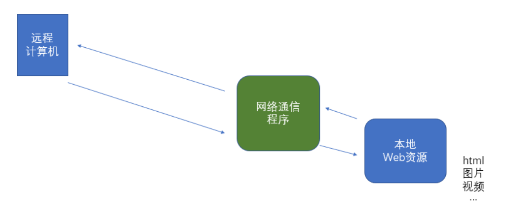
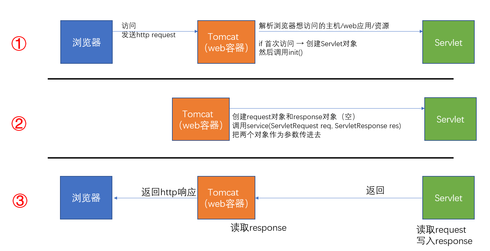
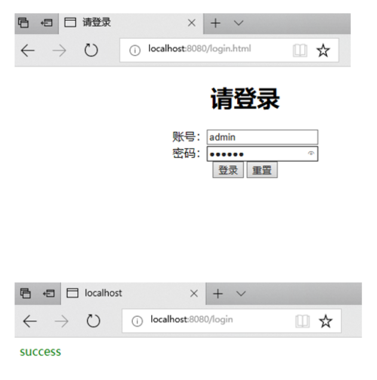

在聊 Servlet 之前，先讲讲什么是 Web服务器 和 应用服务器。

# Web服务器

无论何种 Web 资源，想被远程计算机访问，都必须有一个与之对应的网络通信程序，当用户来访问时，这个网络通信程序读取 Web 资源数据，并把数据发送给来访者。



<!-- more -->

Web服务器就是一个网络通信程序，它用于完成底层网络通迅。具体来说，它将某个主机上的资源映射为一个URL供外界访问。

使用 Web服务器，Web 应用的开发者只需要关注 Web 资源怎么编写，而不需要关心资源如何发送到客户端手中，从而极大的减轻了开发者的开发工作量。

---

# 应用服务器 - Tomcat

我们的 Web 应用要运行起来，是需要部署在应用服务器上而不是Web服务器。因为web服务器只负责资源映射，而程序业务逻辑需要另外的容器来处理。

应用服务器一般装载着我们的后端应用程序，帮助我们接收请求、处理请求、响应请求。Tomcat 就是一种常见的应用服务器，但也具有web服务器的功能，所以直接访问也可以。

通常，Tomcat 装载着我们的 Servlet 对象。那什么是 Servlet 呢？下文会讲到。

> 在实际的生产环境中，由于负载均衡，cdn加速等原因，我们还是需要在应用服务器的前端再加一个web服务器来提高访问效率，常用的有 Nginx, Apache 这样的服务器。

---

# Servlet

## Servlet 是什么

简而言之，Servlet 就是一个接口，它规定了一个后端逻辑初始化的时候做什么、业务逻辑是什么、销毁的时候做什么。

```java
public interface Servlet {
    void init(ServletConfig var1) throws ServletException;

    ServletConfig getServletConfig();

    void service(ServletRequest var1, ServletResponse var2) throws ServletException, IOException;

    String getServletInfo();

    void destroy();
}
```

如果想开发一个Java程序向浏览器输出数据，需要完成以下2个步骤：

1. 编写一个Java类，实现servlet接口(然而现实情况是，servlet开发者已经帮我们实现了一个httpServlet的抽象类，我们只需继承httpServlet并重写doGet和doPost方法)。
2. 把开发好的Java类部署到web服务器(tomcat)中。

按照一种约定俗成的称呼习惯，通常我们也把实现了Servlet接口的java程序，称之为Servlet。

## Servlet的运行过程

Servlet程序由Web服务器调用，web服务器收到客户端的Servlet访问请求后：

1. Web服务器首先检查是否已经装载并创建了该Servlet的实例对象。如果是，则直接执行第4步，否则，执行第2步
2. 装载并创建该Servlet的一个实例对象
3. 调用Servlet实例对象的init()方法
4. 创建一个用于封装HTTP请求消息的`HttpServletRequest对象`和一个代表HTTP响应消息的`HttpServletResponse对象`，然后调用Servlet的`service()`方法并将请求和响应对象作为参数传递进去。
5. Web应用程序被停止或重新启动之前，Servlet引擎将卸载Servlet，并在卸载之前调用Servlet的`destroy()`方法。

也就是说，web容器只有在首次访问时才创建Servlet，然后调用Servlet的`init()`方法。之后web容器创建请求（request）对象和响应（response）对象（响应对象此时为空），并将这两个对象作为参数，传入Servlet的`service()`方法。经`service()`方法处理后，将结果写入响应信息（此时响应对象已有内容）。最后，由web容器取出响应信息回送给浏览器。

实际上，在执行`doGet()`或者`doPost()`之前，都会先执行`service()`，由`service()`方法进行判断，到底该调用`doGet()`还是`doPost()`



# Servlet与普通Java类的区别　

Servlet是一个供其他Java程序（Servlet引擎）调用的Java类，它不能独立运行，它的运行完全由Servlet引擎来控制和调度。

针对客户端的多次Servlet请求，通常情况下，**服务器只会创建一个Servlet实例对象**，也就是说Servlet实例对象一旦创建，它就会驻留在内存中，为后续的其它请求服务，直至web容器退出，servlet实例对象才会销毁。

在Servlet的整个生命周期内，Servlet的 **init方法只被调用一次**。而对一个Servlet的每次访问请求都导致Servlet引擎调用一次servlet的service方法。对于每次访问请求，Servlet引擎都会创建一个新的`HttpServletRequest`请求对象和一个新的`HttpServletResponse`响应对象，然后将这两个对象作为参数传递给它调用的Servlet的·方法，service方法再根据请求方式分别调用doXXX方法。

如果在`<servlet>`元素中配置了一个`<load-on-startup>`元素，那么 Web 应用程序在启动时，就会装载并创建Servlet的实例对象、以及调用Servlet实例对象的`init()`方法。

---

# 实战

## 配置

### 新建IDEA工程

1. 新建一个IDEA Maven工程
2. 在 pom.xml 添加 servlet-api 依赖 （依赖到 [mvnrepository](http://mvnrepository.com/artifact/javax.servlet/javax.servlet-api/4.0.0) 或 [search.maven.org](https://search.maven.org/) 找）
3. 右键工程名字，Add Framework Support，选择 Web
 Application
4. Edit Configurations，配置 Tomcat 服务器
5. Deployment 选择 Artifacts

遇到问题可参考：

- [IntelliJ IDEA 构建maven，并用Maven创建一个web项目](https://www.cnblogs.com/Wenlawliety/p/6606614.html)
- [IntelliJ idea 2017创建Web项目后web文件夹下没有WEB-INF的解决方法](http://blog.csdn.net/xwx617/article/details/79269939)

## 后端：GET

src/main/java 下，new 一个 servlet

helloServlet.java
```java
import javax.servlet.annotation.WebServlet;
import javax.servlet.http.HttpServlet;
import javax.servlet.ServletException;
import javax.servlet.http.HttpServletRequest;
import javax.servlet.http.HttpServletResponse;
import java.io.IOException;
import java.io.PrintWriter;

@WebServlet("/hello")
public class helloServlet extends HttpServlet {
    private String message;

    public void init() throws ServletException{
        message = "hello world!!";
    }

    @Override
    public void doGet(HttpServletRequest request, HttpServletResponse response) throws IOException {

        // 设置响应内容类型
        response.setContentType("text/html");

        // 实际的逻辑是在这里
        PrintWriter out = response.getWriter();
        out.println("<h1>" + message + "</h1>");
    }
}
```

访问 `localhost:8080/hello`，能看到 hello world!!

- `@WebServlet("/hello")`是一个注解，我们用这种方式来表示该 Servlet 的路径是 ./hello 。更原始的，我们可以在项目工程下找到 web.xml 文件，在这里面配置映射路径。（参考：[WEB PROJECT](http://how2j.cn/k/idea/idea-web-project/1352.html)）

## 后端：POST

src/main/java 下，new 一个 servlet

postServlet.java

```java
@WebServlet("/login")
public class postServlet extends HttpServlet {
    protected void doPost(HttpServletRequest request, HttpServletResponse response) throws ServletException, IOException {
        request.setCharacterEncoding("UTF-8");  // 解决中文问题
        String name = request.getParameter("name");
        String password = request.getParameter("password");

        String html = null;

        if ("admin".equals(name) && "123456".equals(password))
            html = "<div style='color:green'>success</div>";
        else
            html = "<div style='color:red'>fail</div>";

        response.setContentType("text/html; charset=UTF-8");// 解决中文问题    
        PrintWriter pw = response.getWriter();
        pw.println(html);
    }
}
```

- 使用`request.setCharacterEncoding("UTF-8");`和` response.setContentType("text/html; charset=UTF-8");`解决中文问题
- `"字面量".equals(str)`是个好习惯
- 用`PrintWriter`类来写html

## 前端：HTML

web目录下，new 一个 login.html

login.html

```html
<!DOCTYPE html>
<html lang="en">
<head>
    <meta charset="UTF-8">
    <title>请登录</title>
</head>
<body>
    <div align="center">
        <h1>请登录</h1>
            <form action="login" method="post">
                账号：<input type="text", name="name"> <br>
                密码：<input type="password", name="password"> <br>
                <input type="submit", value="登录">
                <input type="reset", value="重置">
            </form>
    </div>
</body>
</html>
```

- `<meta charset="UTF-8">`解决中文问题
- `action`属性表示要提交的服务器页面地址为 ./login
- `method`属性表示HTTP方法（get or post）

参考：[Head First HTML](../post/65acdb59.html)

访问 `localhost:8080/login.html`，能看到登录表单

输入admin，123456，可以看到网页跳转到 success



## 跳转

登录成功或是失败后，分别会跳转到不同的页面。 跳转分为`服务端跳转`和`客户端跳转`。

### 服务端跳转(forward)

forward 是服务器请求资源,服务器直接访问目标地址的URL,把那个URL的响应内容读取过来,然后把这些内容再发给浏览器.浏览器根本不知道服务器发送的内容从哪里来的,所以它的地址栏还是原来的地址。<font color="red"> 因此，用户看到的网址没有变化 </font>。 在这个过程中，控制权并没有转交给另一服务器对象。

```java
request.getRequestDispatcher("success.html").forward(request, response);
```

### 客户端跳转(redirect)

redirect是服务端根据逻辑,发送一个状态码,告诉浏览器重新去请求那个地址.所以地址栏显示的是新的URL.

```java
response.sendRedirect("fail.html");
```

- 用户看到的网址变为 127.0.0.1:8080/fail.html

## Web.xml

在项目中有一个 Web.xml 文件，这个文件是一些配置参数。

```xml
<?xml version="1.0" encoding="UTF-8"?>
<web-app xmlns:xsi="http://www.w3.org/2001/XMLSchema-instance" xmlns="http://xmlns.jcp.org/xml/ns/javaee" xsi:schemaLocation="http://xmlns.jcp.org/xml/ns/javaee http://xmlns.jcp.org/xml/ns/javaee/web-app_3_1.xsd" id="WebApp_ID" version="3.1">
  <display-name>JspDemo</display-name>
  <welcome-file-list>
    <welcome-file>login.jsp</welcome-file>
  </welcome-file-list>
  <context-param>  
    <param-name>database_driver</param-name>  
    <param-value>com.mysql.jdbc.Driver</param-value>
  </context-param>
  <context-param>  
    <param-name>database_url</param-name>  
    <param-value>jdbc:mysql://localhost:3306/sms?serverTimezone=GMT%2B8&amp;characterEncoding=UTF-8</param-value>
  </context-param>
  <context-param>  
    <param-name>database_user</param-name>  
    <param-value>root</param-value>
  </context-param>
  <context-param>  
    <param-name>database_pwd</param-name>  
    <param-value>123456</param-value>
  </context-param>
</web-app>
```

然后我们可以在 Java 中取出这些参数

```java
this.driver = request.getSession().getServletContext().getInitParameter("database_driver");
this.url = request.getSession().getServletContext().getInitParameter("database_url");
this.user = request.getSession().getServletContext().getInitParameter("database_user");
this.pwd = request.getSession().getServletContext().getInitParameter("database_pwd");
```

---

# Request常用方法

获取信息

方法|释义
---|---
request.getRequestURL()|浏览器发出请求时的完整URL，包括协议 主机名 端口(如果有)"
request.getRequestURI()|浏览器发出请求的资源名部分，去掉了协议和主机名"
request.getQueryString()| 请求行中的参数部分，只能显示以get方式发出的参数，post方式的看不到
request.getRemoteAddr()|浏览器所处于的客户机的IP地址
request.getRemoteHost()| 浏览器所处于的客户机的主机名
request.getRemotePort()| 浏览器所处于的客户机使用的网络端口
request.getLocalAddr()| 服务器的IP地址
request.getLocalName()| 服务器的主机名
request.getMethod()| 得到客户机请求方式，一般是GET或者POST
request.getHeader()|获取头信息
request.getHeaderNames()| 获取所有头信息

获取参数

方法|释义
---|---
request.getParameter() | 是常见的方法，用于获取单值的参数
request.getParameterValues() | 用于获取具有多值得参数，比如注册的时候提交的爱好，可以使多选的。
request.getParameterMap() | 用于遍历所有的参数，并返回Map类型。

---

# respoonse 常用方法

方法|释义
---|---
response.setContentType("text/html");|设置相应格式
response.setContentType("text/html; charset=UTF-8");| 设置编码格式，服务器端使用 UTF-8 编码，同时通知浏览器使用UTF-8
response.setCharacterEncoding("UTF-8"); |仅仅是服务器端设置UTF-8，浏览器编码由浏览器自己决定
response.sendRedirect("fail.html");| 302 客户端跳转

可以用以下方法设置不使用缓存

```java
response.setDateHeader("Expires",0 );
response.setHeader("Cache-Control","no-cache");
response.setHeader("pragma","no-cache");
```

---

# Servlet的线程安全问题

当多个客户端并发访问同一个Servlet时，web服务器会为每一个客户端的访问请求创建一个线程，并在这个线程上调用Servlet的service方法，因此service方法内如果访问了同一个资源的话，就有可能引发线程安全问题。

线程安全问题只存在多个线程并发操作同一个资源的情况下，所以在编写Servlet的时候，如果并发访问某一个资源(变量，集合等)，就会存在线程安全问题。

解决方案：让Servlet去实现一个`SingleThreadModel`接口，如果某个Servlet实现了`SingleThreadModel`标记接口，那么Servlet引擎将以单线程模式来调用其service方法。

对于实现了`SingleThreadModel`接口的Servlet，Servlet引擎仍然支持对该Servlet的多线程并发访问，其采用的方式是产生多个Servlet实例对象，并发的每个线程分别调用一个独立的Servlet实例对象。

实现SingleThreadModel接口并不能真正解决Servlet的线程安全问题，因为Servlet引擎会创建多个Servlet实例对象，而真正意义上解决多线程安全问题是指一个Servlet实例对象被多个线程同时调用的问题。

事实上，在Servlet API 2.4中，已经将`SingleThreadModel`标记为Deprecated（过时的）。  

## 标记接口

在Java中，把没有定义任何方法和常量的接口称之为标记接口，经常看到的一个最典型的标记接口就是"Serializable"，这个接口也是没有定义任何方法和常量的，标记接口在Java中有什么用呢？主要作用就是给某个对象打上一个标志，告诉JVM，这个对象可以做什么，比如实现了"Serializable"接口的类的对象就可以被序列化，还有一个"Cloneable"接口，这个也是一个标记接口，在默认情况下，Java中的对象是不允许被克隆的，就像现实生活中的人一样，不允许克隆，但是只要实现了"Cloneable"接口，那么对象就可以被克隆了。
