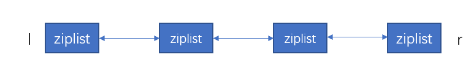
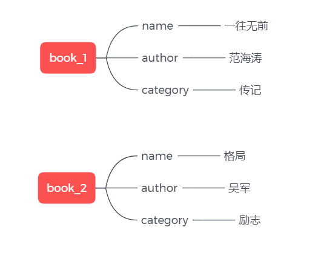
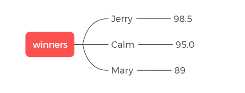

# 什么是Redis

[Redis](https://redis.io/) 是 Remote Dictionary Service (远程字典服务)的简称，是一个开源的、使用内存存储数据的中间件。通常用作于内存数据库、缓存、消息中间件。

Redis 用于缓存比较多。我在公司接触过的几个项目中无一不是把 Redis 当缓存用，引入 Redis 的原因也很简单：有些数据是频繁查询但不经常更新的，这样的数据可以丢一份在 Redis 里，当查询请求进来时，直接从 Redis 里读取，这样就减轻了数据库的压力。在并发高的场景下非常有用。

此外，Redis 还可以用作于分布式锁。

<!-- more -->


# Redis 的五种基本数据结构

字典服务的本质是 key-value 存储，我们给 Redis 一个 key，他返回一个 value 给我们，就这么简单。只不过说， Redis 的 value 可以是不同的数据结构，它可能是字符串，可能是链表，也可能是哈希表。

要体验 Redis 的功能，可以使用官方提供的 [在线 redis 环境](https://try.redis.io/) 进行试用。

## string

string存储字符数组，是一个动态的字符串，类似于Java的 `ArrayList<Char>`。常见的用法是把对象用 Json 序列化为字符串（又想起那句，Web开发的本质是拼接字符串hhh），再丢到 Redis 进去。查询的时候从 Redis 取出，再反序列化为对象。

```java
// 这里使用 fastjson 序列化和反序列化对象
User user = ...
String userStr = JSON.toJSONString(user);
redisClient.set("user"，userStr);

String u = redisClient.get("user");
User user = JSON.parseObject(u, User.class);  
```

在字符较少时，string会预留空间减少内存的频繁分配，小于1MB时，扩容是加倍现有空间（256KB -> 512KB），大于1M时，每次扩容增加1MB空间（3MB -> 4MB）。单个string最大支持512MB。


## list

list 是双端链表，类似于 Java 的 `LinkedList<String>`。提供了 `rpush`、`lpush`、`lpop`、`rpop` 等操作方式，可用作队列或栈。可以发现，操作 List 时，第一个字母 `l` 或 `r` 指定了要从左边还是右边开始读取。


Redis 的 list 常用来做异步队列。将后续需要处理的数据序列化为字符串丢进列表，随后，另一个线程遍历列表依次读取数据进行处理。

list 的写入：

```
> rpush books python java cpp
```

list 的读取：

```
# 获取list下标为1的内容，需要遍历列表，越往后越慢，O(n)慎用
> lindex books 1

# 获取所有元素，需要遍历列表，O(n)慎用
> lrange books 0 -1

# 保留下标为 1 到下标为 -1 之间的元素，O(n)慎用
> ltrim books 1 -1

# 获取长度
> llen books
```

list 的删除

```
# 删除books队列最右边一个元素
> rpop books
```

事实上，list不是简单的 Linkedlist，当元素较少的时候，Redis 会用连续的内存存储元素，这个结构称为 `ziplist`（压缩列表）。当元素变大后，再起一个 `ziplist`，两个 `ziplist` 之间串起来，这样的结构称为 `quicklist`。`quicklist` 既满足快速插入删除性能，又不会有太大空间冗余。




## hash

hash 类似于 Java 的 `HashMap<String,String>`，value只可以存储 string 。



Java HashMap 的 rehash 需要一次完成， map 很大时比较耗时，而 Redis hash 的 rehash 是 **渐进式** 的。rehash 时会保留新旧两个 hash 结构，后续慢慢将旧hash一点点搬迁到新hash。

```
# 存
> hset book_1 name "一往无前"
> hset book_1 author "范海涛"
> hset book_1 category "传记"

# 取
> hget book_1 name
"一往无前"
```

## set

set 类似于 Java 的 `HashSet<String>`，同样也是只能存储 string，set保证了里面存储的内容没有重复。内部实现相当于一个特殊的 hash，只不过只有 key，所有 value 都是 null。

## zset

zset 类似于 Java 的 `SortSet<String>` 和 `HashMap<String,String>` 的结合体，其本质是一个 set， 但同时还为 set 里的每一个元素维护了一个 score 权重值，用来排序。底层是用 `跳跃表` 的数据结构实现。zset 就是一种有权重的 set 。



zset 的应用场景可以是粉丝列表，value 是 user_id， score 是关注时间，这样我们就可以将某用户的粉丝列表按关注时间排序展示出来了。或者是考生成绩， value 是 学生ID， score 是成绩，这样就可以按成绩排序了。

```
# 存
> zadd winners 98.5 "Jerry"
> zadd winners 95.0 "Calm"
> zadd winners 89 "Mary"

# 范围取
> zrange 0 -1
> zreverange 0 -1
```

# 通用规则

五种基本数据结构中，除 string 外，剩下的都是容器型结构。他们遵循两个规则：

1. **create if not exists**：如果容器不存在，那就创建一个
2. **drop if no elements**：如果容器没有元素了，那就销毁，释放内存

---

参考：
- 《Redis 深度历险》 钱文品
