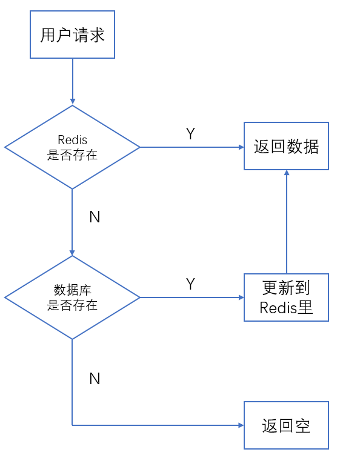

Redis常用作于缓存，但实际上它的用途不止于此：

1. 缓存
2. 分布式锁
3. 延时队列
4. 位图

<!-- more -->

---

# Redis用于缓存

在互联网应用中，Redis常作为数据库的缓存。典型的使用流程如下：

---

# Redis用于分布式锁

在分布式应用中，多个服务不在同一个应用里面，因此无法在代码里面实现锁操作，这时候可以引入 Redis 作为分布式锁。但是使用 Redis 作为多个服务公共的锁，可能存在以下几个问题：

1. **锁超时**：Redis的分布式锁不能解决超时问题，不要用来做时间较长的任务；
2. **单点/多点问题**：当机部署的Redis可能挂掉，锁会丢失；多机部署的Redis若主机获得锁后挂掉，另一个服务可以在从机获得；
3. **可重入性**：在应用中对 set 进行包装，使用 Threadlocal 和 引用计数 来解决重入问题。

---

# Redis用于延时队列

Redis的 list 数据结构是链表，可以当队列使用。A服务往 redis 的 list 不断 push 数据，B服务随时 pop 取出处理。

但是，相较于专业的消息队列中间件，如 MQ、Kafka等， Redis 的消息队列显得不那么靠谱，如果对消息的可靠性有要求，不建议将 Redis 当队列用。

---

# Redis用于位图

位图其实就是普通的字符串（byte数组）。可以用 get/set 直接获取整个位图的内容，也可以用 getbit/setbit 将 byte数组 当作 位数组 来使用。

一个使用场景是，用户一年的签到记录，签了是1，未签是0，将一个字符串当作位数组，其实就可以搞定。
