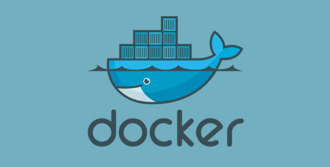
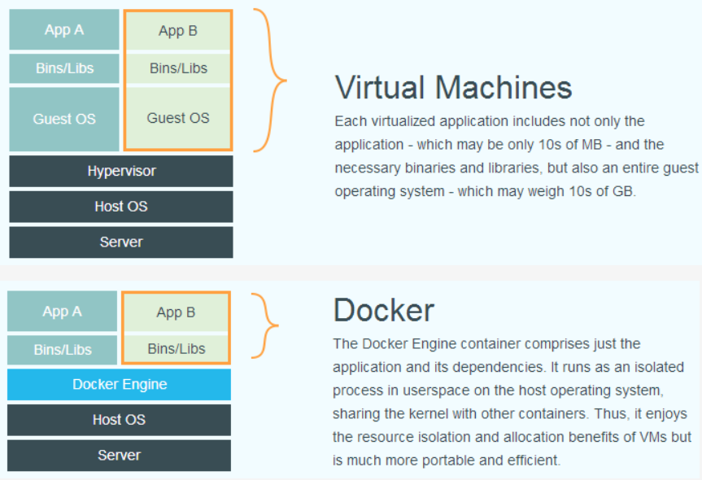
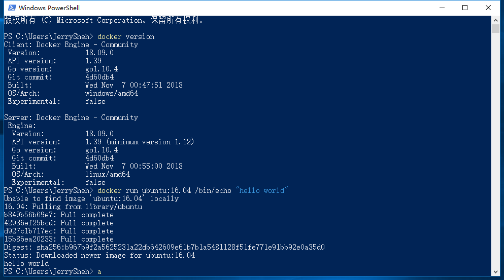
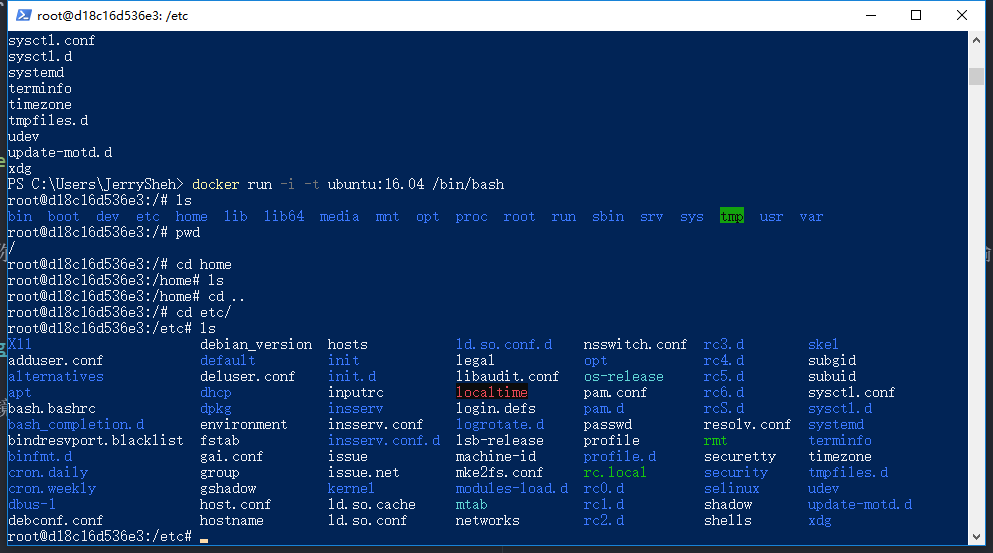

# 前言

很早之前就听过 Docker 这个名词，知道大概是类似于VM（虚拟机）但又比VM更好的一种新技术，但一直觉得这玩意离我太远。直至在一次又一次地折腾本地虚拟机、云服务器（从VPS到微软云到腾讯云），一次一次地搞崩重新安装之后，我突然想起 Docker 这玩意来，于是这一次决定一探究竟。**作为一名开发者，还是不要太拒绝新东西**。

<!-- more -->

# 什么是 Docker

知乎上有一个高赞回答通俗地解释了 [Docker 是什么](https://www.zhihu.com/question/28300645/answer/67707287)，我的理解是，一台大型服务器（云计算机器）可以看成是一艘大货轮，计算资源就是货轮的荷载。而 Docker 是集装箱，我们只需要把我们的应用规整地打包到集装箱里面，这样我们就无需关心集装箱外部的环境了（一个应用在 Ubuntu 下部署和在 CentOs 下部署配置往往不同，而 Docker 屏蔽了这些不同）。这样，当换一艘货轮，我们只要把集装箱迁走，而不需要对货物进行拆卸重组，省时省力。

在初步理解 Docker 概念的时候，看到国外的一篇文章[Docker Use Cases](https://rominirani.com/docker-use-cases-ca12afba75b0)（[中文翻译](https://blog.csdn.net/qq_37788081/article/details/79044119)），里面提到，**Docker 是一个便携的应用容器**。我们可以在 Docker 里面运行几乎任何 Linux 应用，数据库、Node.js服务、Web服务等等。**Docker 并不在乎你的应用程序是什么、做什么，Docker 提供了一组应用打包、传输和部署的方法，以便你能更好地在容器内运行任何应用。**

# Docker用在哪里？

## 快速搭建环境，尝试新软件

很多新技术要去使用前可能要搭建环境并测试，而 Docker 让你用一条命令搭建好特定的环境。比如，Docker 只需要一条命令便可以运行 MySQL 数据库：

```
docker run -d -p 3306:3306 tutum/mysql
```

普通用户大概需要一天的时间去搭建 Gitlab 平台，而 Docker 则只需要一条命令。

## 避免“我机器上可以运行”

有时候一个项目，在开发电脑上运行得好好的，到测试机器或生产环境就会出现各种各样的问题（通常是环境和依赖问题）。Docker 镜像并不会因为环境的变化而不能运行，也不会在不同的电脑上有不同的运行结果。可以给测试人员提交含有应用的 Docker 镜像，这样便不再会发生“在我机器上是可以运行的”这种事情。


# 虚拟机和 Docker 的区别

StackOverFlow 有一个问答 [How is Docker different from a virtual machine? [closed]
](https://stackoverflow.com/questions/16047306/how-is-docker-different-from-a-virtual-machine) 解释了 VM 和 Docker 的区别。其中最重要的一点是，Docker用了 runC(libcontainer) 技术，让运行在 Docker 中的应用能够在共享操作系统上的资源。例如，假如我们有 1GB 的容器镜像要跑在5台机器上，如果我们用5台虚拟机，就分别需要5个1GB。而使用 Docker，仍然只需要1GB因为它们共享了操作系统资源。

下面这张图片介绍了 VM 和 Docker 的区别：



# Docker 架构

Docker的引擎结构：


Docker的架构：


## Docker 核心概念

- **镜像（image）**：包含完整的操作系统环境，类似于我们在微软官网或者Ubuntu官网下载的 .iso 系统镜像文件。只不过，Docker 的镜像里面包含了配置好的应用，并且是轻量级的。Docker 提供了一个很简单的机制来创建镜像或者更新现有的镜像，用户甚至可以直接从其他人那里下载一个已经做好的镜像来直接使用。
- **仓库(repository)**：集中存放镜像文件的场所。有专门的仓库注册服务器（Registry），存放着多个仓库，每个仓库中又包含了多个镜像，每个镜像有不同的标签（tag）。**仓库类似于 git，而仓库注册服务器类似于 github**。
- **容器(container)**：容器是从镜像创建的运行实例，可以对容器进行启动、删除、开始、停止。可以把容器看做是一个简易版的 Linux 环境（包括root用户权限、进程空间、用户空间和网络空间等）和运行在其中的应用程序。

详细可参阅[Docker官方文档](https://docs.docker.com/get-started/)。

# Docker 安装

到 [docker官网](https://www.docker.com/) 下载对应系统的 docker 安装程序。用 Windows 开发，下载[
Docker Desktop (Windows)](https://hub.docker.com/editions/community/docker-ce-desktop-windows)。**注意：Docker 需要 Hyper-V，因而只有专业版 Windows 10 才能正常安装，但是家庭版也能绕过，如果很不幸你是家庭版，参考[这篇文章](https://www.jianshu.com/p/1329954aa329)**。安装过程参考官网：https://hub.docker.com/editions/community/docker-ce-desktop-windows

安装完毕后，打开任意终端，输入

```
docker version
```

看到版本信息，即安装成功。

# 运行 Docker 应用

把 Docker 想象成虚拟机，你可以在 Docker 里面运行任何应用。

例如，在win10 Powershell 或 CMD 输入：

```
docker run ubuntu:16.04 /bin/echo "hello world"
```

意思是，在 ubuntu:16.04 的环境下（尽管你现在在用着Windows），运行 `/bin/echo` 这个程序，`echo` 在linux系统里是输出文字，这里我们输出`hello world`。



可以看到，我们电脑上没有 ubuntu:16.04 镜像，于是 docker 自动从网上拉取，完成后执行我们的程序。

用以下命令来交互式：

```
docker run -i -t ubuntu:16.04 /bin/bash
```

- **-i**:允许你对容器内的标准输入 (STDIN) 进行交互。
- **-t**:在新容器内指定一个伪终端或终端。

现在，我们跟得到了一个真实的 ubuntu 系统一样，可以命令行操作。这太酷了吧！



---

# docker-compose

docker-compose 是一个用来把 docker 自动化的东西。有了 docker-compose ，你可以把所有繁复的 docker 操作全都一条命令，自动化的完成。

参考：

- [菜鸟教程](http://www.runoob.com/docker/docker-tutorial.html)
- [CSDN](https://blog.csdn.net/itguangit/article/details/80222387)
